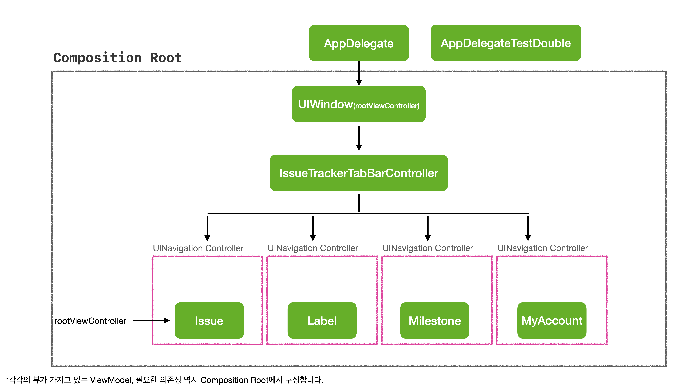

# 홍승현(Noah)

<i>Last updated: 2023.08.28</i>

      

 

**저는 `______` 하는 엔지니어입니다.**

1. 끊임없이 학습하고 개선하는
2. 테스트 가능한 구조를 만드는 것에 관심이 많은
3. 객체지향적인 코드를 작성하는
4. 함께 자라는 것에 관심이 많은
5. 토이 프로젝트를 통해 다른 사람들과 꾸준히 협업하는

|             |                                                       |
|:-----------:|-------------------------------------------------------|
| **GitHub**  | <a href="https://github.com/noah0316" target="_blank"> https://github.com/noah0316 </a> |
|  **Blog**   | <a href="https://noah-ios.dev" target="_blank">https://noah-ios.dev</a> |
| **Email** | <dev.noah0316@gmail.com>                              |

# Expereiences
## URL 아카이빙 서비스 Havit
 

<a href="https://www.havit.app/" target="_blank">서비스 페이지</a>  
 

|              |                                                                      |
|-------------:|----------------------------------------------------------------------|
|   **period** | 22.01 ~ current                                                      |
| **position** | 컨텐츠 미리보기 기능 개발 / 네트워크 중복 요청 문제 해결 / 협업을 위한 자동화 시스템 구축                |
|     **tech** | MVVM, Swift Concurrency, Link Presentation, Git Hooks, Shell script        |

#### 컨텐츠 미리보기 기능 개발
**[관련 기술: Apple Link Presentation Framework]**
- **문제**: Web의 metadata를 가져오기 위해 서버에 크롤링을 요청한 정보에 대해 응답시간 지연 문제 발생
- **배경**: 서버의 크롤링 라이브러리 성능 문제로, 자체적인 Web의 metadata 접근 필요
- **해결**:
  1) Apple에서 제공하는 LinkPresentation 프레임워크를 WWDC 발표를 먼저 학습한 후에 적용해 Web의 metadata 접근하여 기능구현
  2) 서버 상태에 의존하지 않고, 컨텐츠 미리보기에 들어가는 미디어를 기기 자체에서 로드하도록 구현
  3) 동일한 URL에 대해 이전에 캐시한 데이터를 활용하면 효율적으로 사용할 수 있을 것이라 판단하여 캐싱 메커니즘 구현하여 사용성 향상
- **결과**: 컨텐츠 미리보기에 들어가는 미디어를 기기 자체에서 로드하여 매 실행 시 평균 0.8초 절약  
(50회 테스트 평균, 캐싱 되지 않은 컨텐츠 기준)

#### 네트워크 중복 요청 문제 해결
**[관련 기술: Swift Concurrency, XCTest]**
- **문제**: 사용자가 컨텐츠 저장 시 불특정 컨텐츠가 중복으로 저장되는 문제 발생
- **원인**: 콘텐츠 저장 네트워크 요청시 중복 터치 요청에 대해 [throttle operator](https://developer.apple.com/documentation/combine/fail/throttle(for:scheduler:latest:))를 이용해 작성된 로직, throttle time interval이 초과할 경우 컨텐츠가 중복으로 저장
- **측정**: XCTest Framework를 이용하여 네트워크 작업 동시 요청에 대한 테스트 코드 작성 후 테스트 케이스 실패 확인 
- **해결**:
  1) Swift Concurrency의 비동기 작업의 단위인 Task를 감싸고 있는 객체에 열거형을 이용해 loading, done 상태 부여
  2) Task를 감싸고 있는 객체를 메모리 캐시에 저장하고, 캐시에 객체가 있다면 중복된 네트워크 요청을 방지하고, 작업이 끝나면 캐시를 비우도록 구현
  3) actor type을 이용해 여러 스레드에서 동시에 접근하지 못하도록 구현
- **결과**: 네트워크 작업 동시 요청에 대한 테스트 통과 및 서버 모니터링 결과 컨텐츠 중복 저장 현상 해결
- **개인 기술 블로그 정리**: <a href="https://noah-ios.dev/duplicate-network-request/" target="_blank">링크</a>

### 협업을 위한 자동화 시스템 구축

#### SwiftLint GitHooks 적용
**[관련기술: GitHooks]**
- **문제**: SwiftLint BuildPhase에 적용 후 실수로 Build를 돌리지 않고, commit을 하는 경우 컨벤션이 검증되지 않은 코드가 merge 될 수 있는 위험 발생
- **해결**: 쉘 스크립트를 빠르게 처음부터 학습하여 GitHooks 코드 새로 작성
- **결과**: 코드 리뷰 과정에서 코드 스타일에 대한 리뷰를 줄여 코드 리뷰 병목현상 방지에 기여

- **개인 기술 블로그 정리**: <a href="https://noah-ios.dev/swiftlint-githooks/" target="_blank">링크</a>

#### Notion GitHub Issue 동기화
**[관련기술: GitHub Actions, Docker, JavaScript]**

- **문제**: GitHub에 익숙하지 않은 팀원들(디자인, 기획)이 개발 진행상황을 확인하기 어려운 문제 발생
- **해결**: 
  1) 개발 작업을 GitHub에 Issue로 등록하면 협업 시 자주사용하는 도구인 Notion에 동기화 되도록 구현
  2) Node-JS application을 도커라이징하여 Notion 데이터베이스와 GitHub Issue 연동을 Github Actions에서 개발자가 쉽게 구성할 수 있도록 구현
- **결과**: 효율적인 이슈 및 태스크 공유로 팀원들과 진행 상황 공유 및 커뮤니케이션에 기여
- **프로젝트**<a href="https://github.com/noah0316/notion-github-issue-sync" target="_blank"> GitHub 링크</a>

## Issue Tracker

 

<a href="https://github.com/codesquad-2023-group04/issue-tracker" target="_blank">프로젝트 GitHub 링크</a>

|              |                                                                      |
|-------------:|----------------------------------------------------------------------|
|   **period** | 23.05 ~ 23.06                                                        |
| **position** | 관심사의 분리, 단방향 의존성 구성 / 의존성 그래프 구성 / 개발한 기능에 대한 테스트 코드 작성          |
|     **tech** | MVVM, Clean Architecture, Combine, XCTest        |

#### 관심사의 분리, 단방향 의존성
- **문제**: 생성과 사용이 분리되어있지 않아 유지보수가 어려우며, 코드의 복잡도 증가
- **해결**: 
  - 각각의 레이어를 프로토콜로 나누고, 생성과 사용을 분리하여 각각의 레이어에 대한 모듈을 독립적으로 테스트할 수 있도록 구성
  - 구현이 아닌 추상화에 의존하도록 의존성을 역전하여 의존성을 주입 받아 사용할 수 있도록 구성
  - 모듈 간의 결합도를 낮추어 테스트가 가능한 구조로 설계하기 위해 모듈의 의존성이 단방향으로 이어질 수 있도록 구성

#### 의존성 그래프 구성
- **문제**: 의존관계 역전이 쓰인 코드에서 객체를 생성해서 주입해 주는 지점에 대한 고민 존재

- **해결**: 컴파일 타임에 앱에 필요한 의존성을 구성할 수 있도록 앱의 시작 점이라고 할 수 있는 AppDelegate에서 앱의 의존성 트리인 Composition Root를 구성
- <a href="https://github.com/codesquad-2023-group04/issue-tracker/blob/team-04/iOS/IssueTracker/IssueTracker/Application/AppDelegate.swift#L14C8-L14C8" target="_blank">**코드 링크**</a>

#### AppDelegateTestDouble 구성
- **문제**: AppDelegate에서 실행하는 로직이 사이드 이펙트가 되어 단위 테스트에 영향을 끼칠 수 있는 위험 존재
- **해결**: 프로젝트의 엔트리 포인트인 main.swift를 구성하여 테스트 타겟 실행 시에 기존의 AppDelegate 대신 불릴 AppDelegateTestDouble을 구성 및 프레임워크가 호출하는 생성자를 private 접근 제어자를 적용하여 휴먼에러를 방지
- <a href="https://github.com/codesquad-2023-group04/issue-tracker/blob/team-04/iOS/IssueTracker/IssueTrackerTests/IssueTrackerAppDelegateTests/AppDelegateTests.swift#L11" target="_blank">**코드 링크**</a>

#### ViewModel 테스트 코드 작성
- **문제**: 눈에 보이는 View(UI)를 직접 실행해서 테스트해야 하는 생산성 저하 요인 존재
- **해결**: View를 추상화한 모델인 ViewModel을 작성한 후 ViewModel을 테스트하기 위해 ViewModel에 대한 입력 출력 포트를 만든 후에 이에 대한 테스트 코드 작성하여 테스트를 통해 View의 동작 검증
- <a href="https://github.com/codesquad-2023-group04/issue-tracker/blob/team-04/iOS/IssueTracker/IssueTrackerTests/IssueTrackerViewModelTests/Issue/IssueListViewModelTest.swift" target="_blank">**코드 링크**</a>

# Communities
#### Swift Community
- <a href="https://letswift.kr/2022/" target="_blank">Let'Swift 2022</a> 공식 앱 개발
  - MultipeerConnectivity를 이용한 사용자 찾기 및 거리 계산: <a href="https://github.com/letswiftconf/LetSwift/pull/159" target="_blank">PR 링크</a>
- Let'Swift 2023 행사 기획

#### Society
- (21.09 ~ 22.01) IT 창업 동아리 SOPT iOS(Swift) 파트 수료
- (22.03 ~ 22.06) IT 창업 동아리 SOPT iOS(Swift) 파트 수료
- (21.01 ~ 21.09) 대학생 프로그래밍 교육 동아리 멋쟁이사자처럼 명지대 대표

#### Open Source
- <a href="https://github.com/noah0316/notion-github-issue-sync" target="_blank">Notion GitHub Issue Sync</a>:   
GitHub Actions를 사용해 GitHub issue와 Notion 데이터베이스를 동기화하는 Docker Application

# Education

### 명지대학교 컴퓨터공학과 졸업예정

### <a href="https://www.codesquad.kr/" target="_blank">CodeSquad</a>
**(23.01 ~ 23.06) 코드스쿼드 마스터즈 모바일 iOS 코스 수료**

# Recommendations

\- ***[From. 장진호-Pete (위대한 상상 - 요기요)](https://www.linkedin.com/in/jinho-jang-620085117/)***

개발자 홍승현 님을 추천합니다.  
승현 님은 제가 알고 있는 신입 개발자 중 가장 탄탄한 기본기를 보유하고 계신 분 입니다.  
코드 한 줄 한 줄에 명확한 의도와 근거를 담으려 노력하고, 객체 간의 인터페이스를 적절하게 설정합니다.   
모든 프로그래밍의 기본인 컴퓨팅 리소스 관리도 놓치지 않으며, 본인이 짠 코드를 동료가 바라볼 때의 시각도 함께 고려합니다.   
승현 님은 제가 생각하는 신입 개발자의 이상적인 모습을 많이 갖고 있습니다.  
저에게 채용 결정권이 있다면 승현 님의 채용을 고민하지 않을 것입니다.

_귀한시간 내주셔서 감사합니다._

 

iOS Engineer, <a href="https://github.com/noah0316">@Noah</a>

