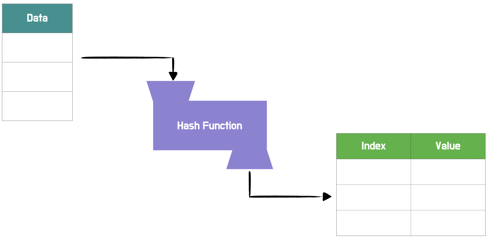
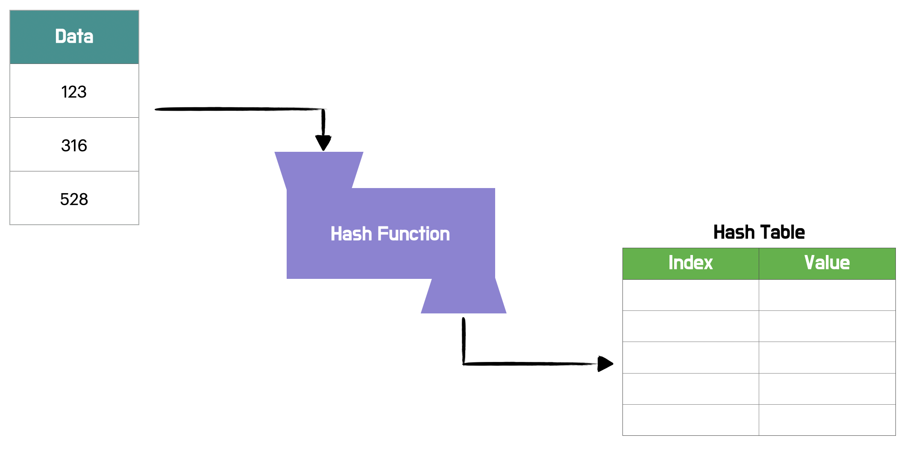
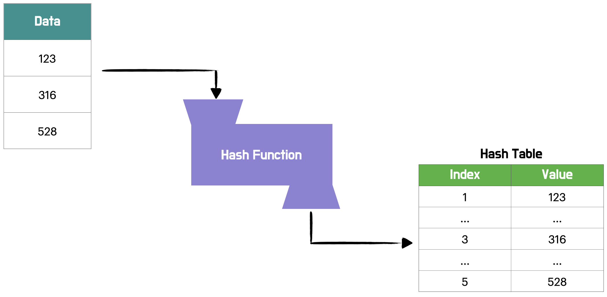
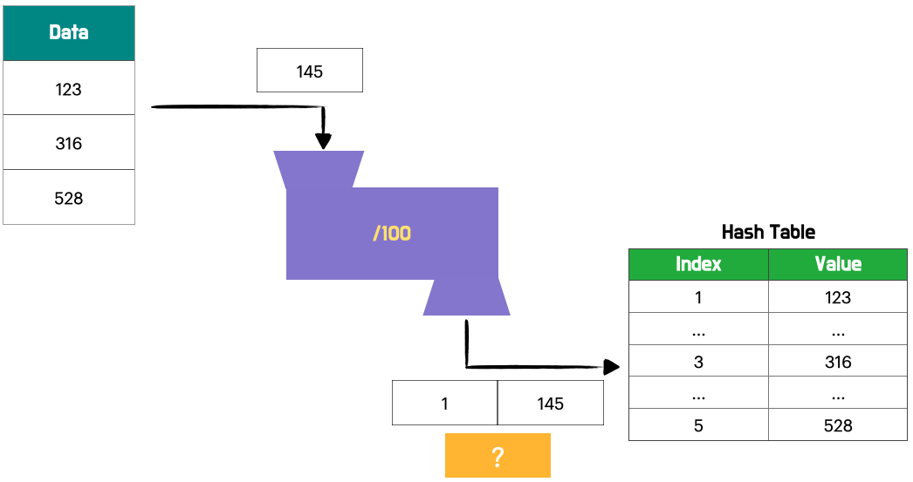
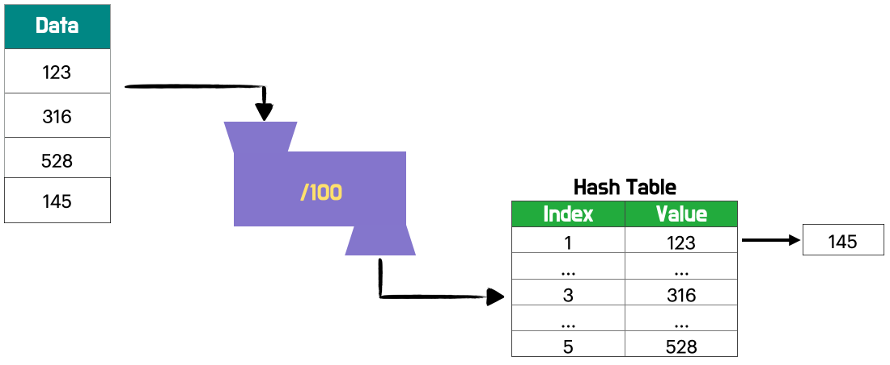
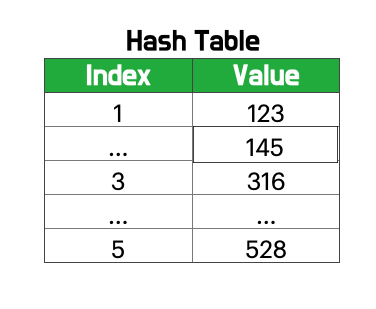

안녕하세요 Noah입니다 :)

오늘은 Hash algorithm의 개념에 대해 간략하게 알아보려 합니다.

**Hash**는 Key-value를 쌍으로 데이터를 저장하는 자료구조입니다.  
리소스를 포기하고 속도를 취한 자료구조이며, **Space-Time trade off**의 대표적인 알고리즘에 속합니다.

Hash algorithm은 O(1)의 시간 복잡도를 **지향**합니다.

Hash

Data를 Hash function을 거쳐 테이블에 넣어야 합니다.  
이때 똑같은 데이터가 올 때마다 똑같이 분류되어야 하는 규칙이 필요합니다.  
그 규칙성을 정의한 곳이 바로 **Hash Function**입니다.

위와 같은 데이터가 있을 때 Hash Function을 거쳐

값이 다음과 같이 되었다면

Hash Function은 어떤 **분류 규칙**이 있었을까요?

Hash Function은 /100이라는 규칙을 가지고 있었습니다.  
Data는 Hash Function의 규칙에 의해 **Hash Code**를 가지게 되고,  
그 값에 의해 **Hash Table**의 해당 **인덱스**로 들어가게 됩니다.

Hash Table에서 index에 해당하는 부분을 index 혹은 key라고 하며,  
value에 해당하는 부분을 Hash Value 혹은 value라고 합니다.

### Hashing process

1. 데이터들이 Hash Function의 규칙에 의해 Hash Code를 가지게 된다.

2. Hash Code를 통해 Hash Table 안에 규칙에 의해 들어간다.

이 모든 과정을 Hashing이라고 합니다.

Hash는 리소스를 이용해 속도를 높인다고 하였는데, 여기서 정확한 Hash의 성격이 나옵니다.  
123이라는 데이터가 Hash Table 안에 있나 없나를 확인하고 싶다면  
123을 Hash Function에 의해 변환을 시킵니다.

1이라는 Hash Code를 Hash Function을 통해 뽑아내고,  
1이라는 Hash Code에 해당하는 index에 123이라는 값이 Hash Table에 있나 없나를 확인할 수 있습니다.

하나하나 검사할 필요 없이 해당 Hash Code가 가리키는 index에 가면  
해당 값이 있는지 없는지를 확인할 수 있습니다.
이러한 방식이면 **O(1)의 시간복잡도**를 가지게 됩니다.

하지만 Hash algorithm도 문제점을 가지고 있습니다.
바로 **충돌(collision)문제** 인데요.

충돌의 예로 다음과 같은 예를 들 수 있습니다.  
만약 145가 다음 Data로 들어온다면?

Collision Example

위와 같이 충돌이 발생합니다.

이러한 충돌 관련 문제를 해결하기 위해 많은 방법을 고안해냈으며,  
지금까지도 많은 논문이 쓰이고 있습니다.

우리는 그 중 충돌에 대처하는 방법들에 대해 간단하게 살펴보겠습니다.

### Chaining

첫 번째로 체이닝이라는 기법입니다.  
해당 index에 값이 있으면 그 뒤에 리스트와 같은 자료구조를 이용해  
Chain처럼 연결하는 것입니다. 마치 그림과 같이 말이죠.

Chaining

하지만 계속 사용하다 보면 리스트가 커져 리스트를 순회하여 값을 탐색하는 데 시간이 오래 걸린다는 단점이 있습니다.

### Open Addressing

Open Addressing은 충돌이 발생했을 경우,  
Hash Function으로 얻은 Hash Code에 해당하는 주소가 아닌,  
다른 주소에 데이터를 저장하는 방법입니다.

- **Linear Probing**  
   Linear Probing 방식은 충돌이 일어나면,  
   인덱스의 위치를 이동하며
  충돌이 일어나지 않을 때까지 빈 Slot을 찾아 값을 저장합니다.

Linear Probing

Hash Code 충돌로 원래 위치의 다음 위치,  
그 다음 위치 순으로 입력되다보니  
특정 Hash Code에 값이 모이게 되면 Open Addressing의 효율성이 크게 떨어집니다.

- **Quadratic Probing**  
  Quadratic Probing은 고정 폭으로 다음 위치로 이동하는 Linear Probing과는 달리  
   다음 위치로 이동하는 폭이 제곱수로 늘어난다는 특징을 가지고 있습니다.

만약 table이 꽉 찬다면 table resizing이 필요합니다.  
table의 크기들을 늘려준 다음 Data를 Hash Function을 이용해 재정렬합니다.

잘 짜인 Hash Function을 이용하면 Hash Table 안에 잘 정리가 됩니다.  
**잘 짜인 Hash Function**이란 **충돌이 잘 발생하지 않으며**, **Hash Code가 모이지 않고**,  
들어오는 Data를 테이블의 곳곳에 골고루 잘 분배할 수 있는 Hash Function을 말합니다.

여기까지 Hash 알고리즘의 개념과 충돌(Collision)문제 해결에 대해 간략하게 알아보았습니다😄

혹시 제가 잘못 알고 있는 부분이 있거나, 오타 혹은 궁금한 점 있으시면 댓글로 알려주시면 감사하겠습니다!!😎

> 참고
>
> - [해싱, 해시함수, 해시테이블](https://ratsgo.github.io/data%20structure&algorithm/2017/10/25/hash/)
> - [해시-해시테이블-해싱 5분만에 이해하기 - Gunny](https://www.youtube.com/watch?v=xls6jEZNA7Y)
