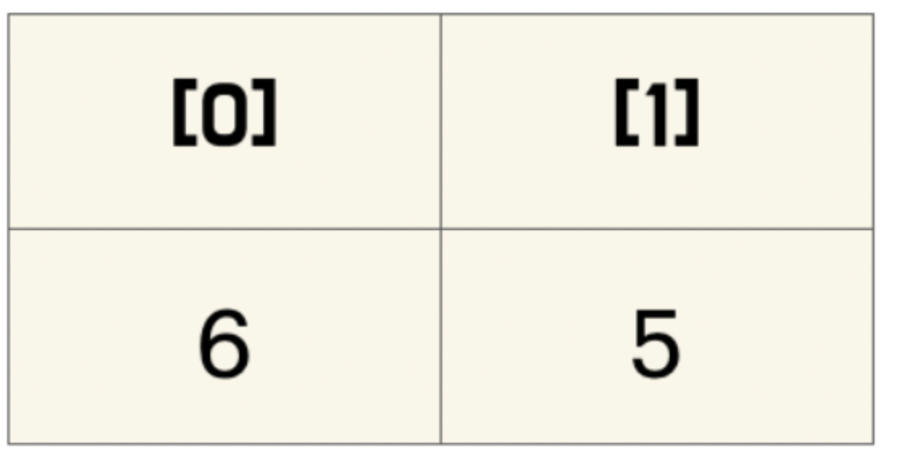

안녕하세요 Noah입니다 :)

이번 시간에는 [**Sorting 알고리즘 톺아보기 1부**](https://noah0316.github.io/Algorithms/2021-07-05-selection-sort/)보다 조금 더 난이도가 있는 **Sorting 알고리즘**을 다루는

**Sorting 알고리즘 톺아보기 2부**를 진행하도록 하겠습니다 😄

<br>

이번 시간에 살펴볼 **Sorting 알고리즘**은 **Merge Sort**입니다.

**Merge Sort**는 **Computer Science**의 **divide and conquer** 전략을 대표적으로 사용한  
**Sorting 알고리즘**입니다.

## Merge Sort

먼저 **Merge Sort**가 데이터를 정렬하는 모습부터 먼저 살펴보겠습니다.

<p align="center">

<center>Merge Sort</center>
</p>

정렬되는 모습을 살펴보면 그룹이 분할되고, 그룹끼리 더 큰 그룹으로 합쳐지는 모습을 살펴볼 수 있습니다.

```swift
func mergeSort(_ array: [Int]) -> [Int] {
    guard array.count > 1 else { return array }

    let middleIndex = array.count / 2

    let leftArray = mergeSort(Array(array[0..<middleIndex]))

    let rightArray = mergeSort(Array(array[middleIndex..<array.count])) // 4

    return merge(leftPile: leftArray, rightPile: rightArray)
}

let array = mergeSort([6, 5, 3, 1, 8, 7, 2, 4])
print(array)
// [1, 2, 3, 4, 5, 6, 7, 8]
```

**Merge Sort**를 **Swift**를 이용해 **Top Down 방식**으로 구현하면 위와 같습니다.

**mergeSort**라는 함수는 자기가 자신을 호출하는 **재귀 함수**로 구현되어있습니다.  
**merge** 함수는 **이해의 편의**를 도모하기 위해 뒤에서 소개하도록 하겠습니다.

**재귀 함수**는 기본적으로 **종료 조건**과 조건에 부합할 경우 자신을 호출하는 형식으로 구성되어있습니다.  
마치 영화 인셉션에서 다룬 **"꿈을 꾸는 꿈"** 같이 말이죠!

이 포스트에서는 **재귀 함수에 대한 기본적인 이해**가 있다고 가정하고 포스팅을 진행하도록 하겠습니다.

**mergeSort**함수에는 다음과 같은 배열이 주어진다고 가정하겠습니다.

<p align="center">

</p>

**guard문** 의 조건대로 하면 **array**가 들어오면 **element**가 **하나**만 남을 때까지 계속 **분할**이 진행됩니다.

**leftArray**는 왼쪽의 **partial array**를 말하며 **rightArray**는 오른쪽의 **partial array**를 말합니다.

**코드**를 **함께 진행**해보며 따라가 보도록 하겠습니다.

<p align="center">

</p>
<br>

맨 처음 **mergeSort**함수에 들어오면 아래의 **guard문**을 만납니다.

<p align="center">

</p>

**array**의 크기가 **1보다 클 때만** 이후의 **코드를 진행**하고 1보다 크지 않다면 **현재 배열을 반환**합니다.  
현재 배열의 크기가 1보다 크기 때문에 **middle index**를 정하는 코드를 만나게 됩니다.

<br>

<p align="center">

</p>

`array.count / 2`를 해주기 때문에 **middleIndex**는 **현재 4**가 됩니다.  
그림에서는 편의상 **mid**라고 하겠습니다.  
<br>

<p align="center">

</p>

<br>

<p align="center">

</p>

이제 첫 번째 재귀 호출을 진행하는데요,  
현재 **array**의 0번 인덱스부터 **middleIndex - 1**까지  
**partial array**를 인자로 전달하여 **mergeSort를 호출**합니다.

다음과 같이 **partial array**가 전달되겠죠?

<p align="center">

</p>

현재 array의 모습은 아래와 같습니다.

<p align="center">

</p>

함수를 호출해줬으니 다시 **코드를 진행**하겠습니다.

<br>

<p align="center">

</p>

현재 **array의 길이**는 **4**이기 때문에 이후의 코드를 진행합니다.  
현재 배열의 크기가 1보다 크기 때문에 **middleIndex**를 정하는 코드를 만나게 됩니다.  
<br>

<p align="center">

</p>

<br>

<p align="center">

</p>

`array.count / 2`를 해주기 때문에 **middleIndex**는 현재 2가 됩니다.

<br>

<p align="center">

</p>

이제 다시 이 코드를 만나 **재귀 호출**을 진행합니다.  
**0번** index부터 **middleIndex - 1**까지 **partial array**를 인자로 하여 **mergeSort()**를 호출합니다.

<p align="center">

</p>

함수를 호출해줬으니 다시 코드를 진행하겠습니다.

<p align="center">

</p>

현재 배열의 **크기가 1**보다 크기 때문에 이후의 코드를 진행해 **middleIndex**를 정하는 코드를 만나게 됩니다.

<br>

<p align="center">

</p>

<p align="center">

</p>

`array.count / 2`를 해주기 때문에 **middleIndex**는 현재 **1**이 됩니다.

<br>

<p align="center">

</p>

이제 다시 이 코드를 만나 **재귀 호출**을 진행합니다. **0번** index부터 **middleIndex - 1**까지  
**partial array**를 인자로 하여 **mergeSort()**를 호출합니다.

<p align="center">

</p>

전달된 **partial array**는 위와 같으며 현재 **진행 모습**은 아래와 같습니다.

<br>
<p align="center">

</p>

<br>

함수를 호출해줬으니 다시 코드를 진행하겠습니다.

<p align="center">

</p>

현재 배열의 크기는 **1보다 크지 않기** 때문에 해당 재귀 함수는 **현재 array인 `[6]`을 반환**하고 종료됩니다.

이제 현재 **스택의 상단**에 위치한 **leftArray 상수**에는 방금 반환받은 **array인 `[6]`**이 들어가고  
<br>

<p align="center">

</p>

<p align="center">

</p>

**middleIndex**부터 `array.count - 1`까지 **partial array**를 인자로 하여 **mergeSort()**를 호출합니다.

<p align="center">

</p>

현재 진행 상황은 다음과 같습니다.

<p align="center">

</p>

함수를 호출해줬으니 다시 코드를 진행하겠습니다.

<p align="center">

</p>

현재 **배열의 크기**는 **1보다 크지 않기** 때문에 해당 **재귀 함수는** 현재 array인 **`[5]`를 반환**하고 종료됩니다.  
이제 현재 스택의 상단에 위치한 **rightArray 상수**에는 **`[5]`**가 들어갑니다.

현재 **leftArray에는 `[5]`, rightArray에는 `[6]`**이 들어가 있습니다.

**분할**을 해줬으니 이제 다음 코드를 만나 **정복** 부분에 들어갑니다.

<p align="center">

</p>

**정복 부분**인 **merge 함수**에서는

<p align="center">

</p>

하단에 위치한 **배열의 요소를** 하나씩 보면서 **작은 숫자를 순서대로** **array에 넣어 반환**합니다.

따라서 **merge()**를 호출한 뒤에 **array**의 모습은 다음과 같습니다.

<p align="center">

</p>

이제 **정렬된** **partial array**를 갖게 되었습니다. 이제 **merge 함수**까지 호출해주었으니,  
코드가 종료되어 스택 상단에 위치한

<p align="center">

</p>

해당 **array를 인자**로 **mergeSort를 호출했던 곳**에서

<p align="center">

</p>

두 번째 **mergeSort()**를 호출합니다.  
빠른 진행을 위해 두 번째 **mergeSort()**를 호출하여 **merge**까지 진행된 후의 그림을 보여드리겠습니다.

방식은 앞서 진행한 방식과 동일합니다.

<p align="center">

</p>

현재 이곳의 **leftArray**에는 `[5, 6]`이 **rightArray**에는 `[1, 3]`이 들어가있습니다.

이 array들을 인자로 하여 **정복** 부분에 들어갑니다.

<p align="center">

</p>

**정복** 부분에 해당하는 **merge()**를 호출하면 배열의 요소를 하나씩 보면서  
**작은 숫자**를 순서대로 **merge()**를 호출한 **array**에 넣게 됩니다.

따라서 **merge()**를 호출한 뒤에 **array**의 모습은 다음과 같습니다.

<p align="center">

</p>

위와 같은 방식으로 **분할과 정복**이 일어나며 **반대편** 역시 위와 **같은 방식**을 통해  
**분할**과 **정복**의 과정을 거치게 되면

<p align="center">

</p>

다음과 같이 두 개의 정렬된 **partial array**를 가지게 되며 마지막 **merge 함수**를 거치게 되면

<br>

<p align="center">

</p>

위와 같이 **정렬된 하나의 array**를 갖게 됩니다.

<p align="center">

</p>

위에서 진행한 일련의 과정을 애니메이션으로 보면 다음과 같습니다.

이제 **분할과 정복**이 어떻게 이루어지는지 살펴보았으니,

**정복**에 해당하는 **merge 함수** 내부에서는 **어떠한 코드**로 합병을 **진행**하는지 살펴보도록 하겠습니다.

#### merge 함수

---

```swift
func merge(leftPile: [Int], rightPile: [Int]) -> [Int] {
    // 1
    var leftIndex = 0
    var rightIndex = 0

    // 2
    var orderedPile = [Int]()
    orderedPile.reserveCapacity(leftPile.count + rightPile.count)

    // 3
    while leftIndex < leftPile.count && rightIndex < rightPile.count {
        if leftPile[leftIndex] < rightPile[rightIndex] {
            orderedPile.append(leftPile[leftIndex])
            leftIndex += 1
        } else if leftPile[leftIndex] > rightPile[rightIndex] {
            orderedPile.append(rightPile[rightIndex])
            rightIndex += 1
        } else {
            orderedPile.append(leftPile[leftIndex])
            leftIndex += 1
            orderedPile.append(rightPile[rightIndex])
            rightIndex += 1
        }
    }

    // 4
    while leftIndex < leftPile.count {
        orderedPile.append(leftPile[leftIndex])
        leftIndex += 1
    }

    while rightIndex < rightPile.count {
        orderedPile.append(rightPile[rightIndex])
        rightIndex += 1
    }

    return orderedPile
}

```

**1번 영역**에서는 **leftArray**의 **index**를 담당하는 **leftIndex**,  
**rightArray**의 **index**를 담당하는 **rightIndex**를 선언 및 초기화를 진행합니다.

**2번 영역**에서는 **reserveCapacity 메소드**를 사용해 배열의 용량을 미리 설정합니다.  
**배열의 용량**은 **leftArray**의 크기와 **rightArray**의 크기를 **더한 값**입니다.

**3번 영역**에서는 **leftArray**와 **rightArray**의 요소 하나하나의 **크기를 비교**하여 **작은** 것부터  
**orderdPile** array에 **append() 메소드**를 이용해 삽입해줍니다.

만약 **leftArray**의 요소를 **orederedPile** array에 삽입했다면,  
**leftArray의** 다음번 요소를 비교할 수 있도록 **leftIndex를 1 증가**시킵니다.

**rightArray**의 요소를 **orederedPile** array에 삽입했다면,  
**rightArray**의 다음번 요소를 비교할 수 있도록 **rightIndex를 1 증가**시킵니다.

만약 현재 비교하는 요소의 **크기가 같다면** left부터 하나씩 삽입한 뒤에  
**leftIndex, rightIndex를 1**씩 **증가**시킵니다.

**3번 영역**을 **leftIndex와 rightIndex**가 각각 **partial array**의 크기보다 **작을 때**까지만 반복해줍니다.  
**어느 한쪽**이라도 **index**의 크기가 배열의 크기와 같아진다면 **3번 영역을 빠져**나옵니다.

**4번 영역**은 어느 한쪽 **partial array**를 **모두 순회**하여 **반대편**의 남아있는 **partial array**의 요소를 **orederedPile**에 **탈탈 털어 넣어주기 위해** 존재하는 영역입니다.

이렇게 **합병을 마치게 되면** **정렬된 배열인 orderedPile을 반환**합니다.

---

### 시간 복잡도

**Merge Sort**의 **시간 복잡도**는 다음과 같습니다.

\- Best : **O(n log n)**

\- Worst : **O(n log n)**

\- Average : 일반적으로 **O(n log n)**

**Merge Sort** 시간복잡도는 **n log n**입니다.

주어진 **n 개**의 요소를 가진 배열을 1개의 요소를 가진 배열로 쪼개려면 **log n**만큼의 과정이 필요합니다.  
1개의 요소를 가진 배열이 **n**개 있으니 **n만큼** **log n번** 호출이 됩니다.

따라서 **Merge Sort**의 **시간복잡도는 n log n**이 됩니다.

<p align="center">

</p>

여기까지 **Sorting 알고리즘 톺아보기 2부 Merge Sort**였습니다 😄  
혹시 제가 잘못 알고 있는 부분이 있거나, 오타 혹은 궁금한 점 있으시면 댓글로 알려주시면 감사하겠습니다!!😎  
<br>

> 참고
>
> - [Raywenderlich Swift Algorithm Club](https://github.com/raywenderlich/swift-algorithm-club/tree/master/Merge%20Sort)
> - [위키 백과 삽입 정렬](https://ko.wikipedia.org/wiki/%ED%95%A9%EB%B3%91_%EC%A0%95%EB%A0%AC)
> - [머지소트 병합정렬 5분만해 이해하기-Gunny](https://www.youtube.com/watch?v=FCAtxryNgq4&t=2s)

> 이미지 출처
>
> - [합병 정렬 애니메이션](https://en.wikipedia.org/wiki/File:Merge_sort_animation2.gif)
> - [합병 정렬 시뮬레이션](https://commons.wikimedia.org/wiki/File:Merge-sort-example-300px.gif)
