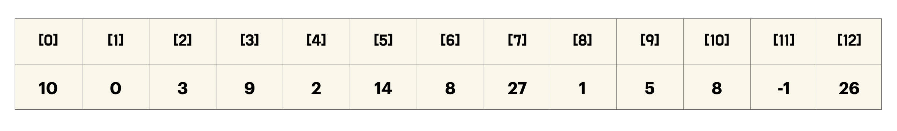
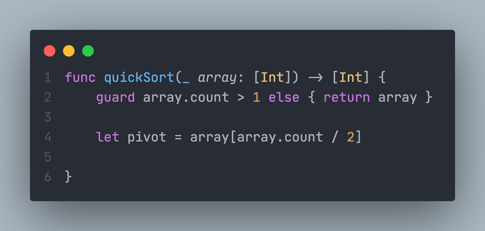
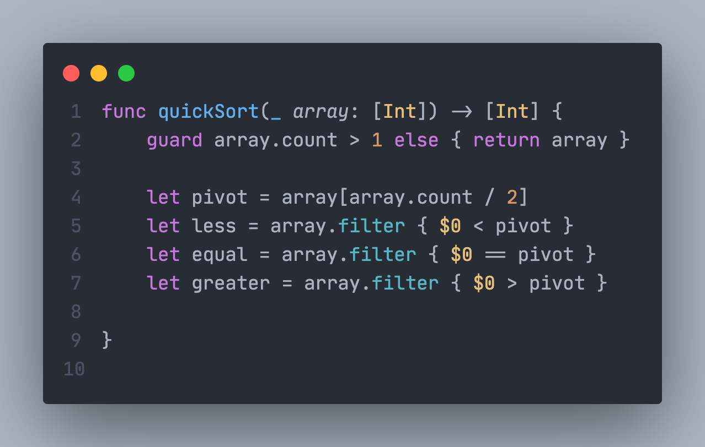
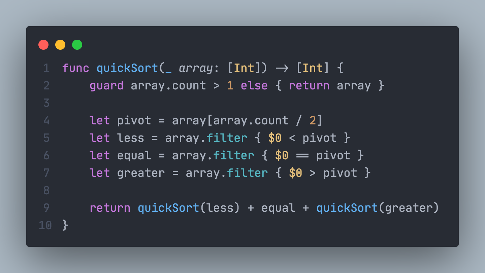
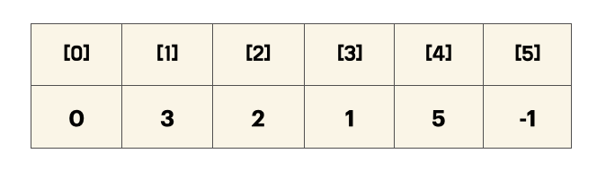
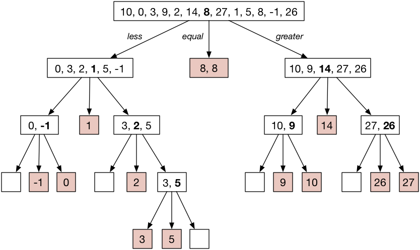

안녕하세요 Noah입니다 :)

이번 시간에는 **Sorting 알고리즘 톺아보기 2부** 마지막 시간입니다!!🥺 🥺

이번에 살펴볼 Sorting 알고리즘은 **Quick Sort**입니다.

**Quick Sort**는 정렬 알고리즘 중 가장 인기 있는 알고리즘 중에 하나인데요,

1959년에 영국의 [Tony Hoare](https://ko.wikipedia.org/wiki/%ED%86%A0%EB%8B%88_%ED%98%B8%EC%96%B4)란 분에 의해 고안되었다고 합니다.

**Quick Sort** 역시 **divide and conquer** 전략을 사용해 정렬을 진행하는데요, **Quick Sort**에 대해 한번 알아봅시다!

## Quick Sort

먼저 **Quick Sort**가 데이터를 정렬하는 모습부터 먼저 살펴보겠습니다.

<p align="center">

<center>Quick Sort</center>
</p>

그림을 통해 기준이 되는 **pivot(기준점)**을 기점으로 **정렬이 진행**되는 것을 볼 수 있습니다.

그림에서는 맨 우측 요소가 **pivot**이 되는 것을 확인할 수 있습니다.

**pivot**을 어디로 두느냐에 따라 **Quick Sort**는 **여러 방법**으로 구현이 가능합니다.

또한 **pivot**을 어디로 두느냐에 따라 같은 **Quick Sort**라도 큰 속도 차가 발생합니다.

먼저 **Swift**를 이용해 **Quick Sort**를 구현해보도록 하겠습니다.

### quickSort

---

```swift
func quickSort(_ array: [Int]) -> [Int] {
    guard array.count > 1 else { return array }

    let pivot = array[array.count / 2]
    let less = array.filter { $0 < pivot }
    let equal = array.filter { $0 == pivot }
    let greater = array.filter { $0 > pivot }

    return quickSort(less) + equal + quickSort(greater)
}

quickSort([10, 0, 3, 9, 2, 14, 8, 27, 1, 5, 8, -1, 26])
// [-1, 0, 1, 2, 3, 5, 8, 8, 9, 10, 14, 26, 27]

```

배열이 주어지면 배열은 **pivot**을 기준으로 **3개의 부분**으로 나눠집니다.

pivot보다 **작은 부분**, pivot과 **같은 부분**, pivot보다 **큰 부분**으로 나누어집니다.

한번 **Quick Sort**의 흐름을 따라가 보도록 해보겠습니다.

<p align="center">

<center>array</center>
</p>

먼저 위와 같은 배열이 **quickSort()**의 인자로 주어진다고 가정해보겠습니다.

지난 시간에 알아보았던 [Merge Sort](<https://noah0316.github.io/Algorithms/2021-07-16-merge-sort(%ED%95%A9%EB%B3%91%EC%A0%95%EB%A0%AC)/>)와 같이 guard문의 조건대로 array가 들어오면  
element가 **하나만 남을 때**까지 계속 **분할**이 진행됩니다.

<p align="center">

</p>

**array**의 크기가 **1보다 클 때만** 이후의 **코드를 진행**하고 1보다 크지 않다면 **현재 배열을 반환**합니다.

**현재 배열의 크기**가 1보다 크기 때문에 **pivot**을 정하는 코드를 만나게 됩니다.

**pivot**은 `array.count / 2` 를 하는 것으로 보아  
pivot을 정하는데 아무런 연산을 하지 않고, **주어진 array의 가운데 위치한 요소**를 **pivot**으로 하는  
**Quick Sort**임을 알 수 있습니다.

따라서 현재 array의 크기는 12이기 때문에 pivot은 6번째 인덱스에 있는 `8`이 **pivot**이 됩니다.

이제 우리는 array를 **pivot**을 기준으로 **세 부분**으로 나눌 것입니다. 바로 다음 코드를 통해 말이죠.

<p align="center">

</p>

filter를 이용해 array를 **세 부분**으로 나눕니다.

**less**에는 pivot보다 **작은** 요소를,

**equal**에는 pivot과 **같은** 요소를,

**greater**에는 pivot보다 **큰** 요소를 할당합니다.

위의 코드를 진행하고 난 뒤에는 `less, equal, greater`에는 다음과 같은 요소들이 할당됩니다.

```
less:    [ 0, 3, 2, 1, 5, -1 ]
equal:   [ 8, 8 ]
greater: [ 10, 9, 14, 27, 26 ]
```

`less`와 `greater`가 비슷한 수의 요소를 분할되었기 때문에

우리는 이번에 **좋은 pivot**을 골랐다고 할 수 있습니다.

**좋은 pivot**에 대한 기준은 뒤에서 다시 살펴보겠습니다.

이제 다음 코드를 진행해보도록 하겠습니다.

<p align="center">

</p>

**pivot을 기준**으로 `less`와 `greater`로 나눴으므로, `equal`의 자리는 현재 **확정**되었습니다.

`less`와`greater` 의 자리는 아직 확정되지 않았기 때문에 **quickSort()**를 다시 호출합니다.

호출하는 **quickSort()**는 방금 진행한 code와 **같은 일**을 합니다.

**pivot을 기준**으로 인자로 전달하는 subarray를 다시 **less, equal, greater** 세 부분으로 나눕니다.

`quickSort(less)` code를 따라가 보도록 하겠습니다.

`quickSort(less)`에 전달된 subarray는 다음과 같습니다.

```
[ 0, 3, 2, 1, 5, -1 ]
```

<p align="center">

</p>

<p align="center">

</p>

현재 **array의 크기**는 6이므로 1보다 크기 때문에 **pivot**을 정해줍니다.

따라서 **pivot**은 index 3번째에 위치한 `1`이 됩니다.

<p align="center">

</p>

**pivot**을 기준으로 array를 다시 **세 부분**으로 나누면 다음과 같습니다.

```
less:    [ 0, -1 ]
equal:   [ 1 ]
greater: [ 3, 2, 5 ]
```

`equal`의 자리는 확정되었지만, 아직 `less`, `greater`가 정렬이 되지 않았기 때문에

다시 `less`와 `greater`를 대상으로 **quickSort()**를 호출합니다.

<p align="center">

</p>

**pivot**을 기준으로 subarray를 다시 **less, equal, greater** 세 부분으로 나눕니다.

`quickSort(less)` code를 따라가 보도록 하겠습니다.

`quickSort(less)`에 전달된 subarray는 다음과 같습니다.

```
[ 0, -1 ]
```

array의 크기는 2이기 때문에 `guard` 문을 통과하고,

**pivot**은 **1번째 index**인 `-1`이 됩니다.

`-1`을 기준으로 subarray를 다시 **less, equal, greater** 세 부분으로 나누면 다음과 같이 됩니다.

```
less:    [ ]
equal:   [ -1 ]
greater: [ 0 ]
```

`less`에는 아무것도 들어가지 않습니다.

전달된 subarray에는 -1보다 작은 요소가 없기 때문입니다.

따라서 이 level에서 `quickSort(less)`를 호출한다면,

**array.count**가 `0`이기 때문에 **guard**문을 **통과하지 못해** 다시 돌아올 것입니다.

**equal**의 자리는 확정되었고, `quickSort(greater)`역시 **array.count가 1**이기 때문에

**guard문을 통과하지 못하고,** 전달한 subarray인`[0]`을 반환받아 올 것입니다.

따라서 여기까지 정복이 끝나게 되면  
더 큰 배열을 정렬하기 위해 현재 level의 subarray를 호출한 위 level로 `[-1, 0]`을 반환하여 올라갑니다.

현재 subarray를 호출한 곳의 **greater** 배열의 요소는 다음과 같습니다.

```
[ 3, 2, 5 ]
```

`quickSort(greater)` 를 호출하면 subarray는 **pivot**을 `2`로 하여 코드를 진행하게 되면

다음과 같이 세 부분으로 나누어집니다.

```
less:    [ ]
equal:   [ 2 ]
greater: [ 3, 5 ]
```

여기서 **pivot**을 `3`으로 선택하면 **더 좋았을 것**입니다. **3으로 pivot을 선택했을 경우**  
분할이 더 이뤄지지 않기 때문이죠!

아래는 3으로 pivot을 선택했을 경우입니다. 참고만 해주세요!!

```
less:    [ 2 ]
equal:   [ 3 ]
greater: [ 5 ]
```

만약 분할을 진행할 때 방금과 같은 **Bad Pivot**을 많이 고르게 될 경우  
**분할이 더 이루어져** **정렬이 느리게 진행**될 것입니다.

이것이 지금까지도 **좋은 pivot**을 결정함에 있어 **아직도 많은 논문**이 나오고 있는 이유 중 하나입니다.

```
less:    [ ]
equal:   [ 2 ]
greater: [ 3, 5 ]
```

**다시 원래 선택한 pivot으로 돌아와서** 이번 level에서 역시 **equal**의 자리가 확정되고

**greater**를 대상으로 **quickSort()**를 호출하게 됩니다.

`quickSort(greater)` 를 진행하게 될 경우 subarray는 다음과 같이 분할됩니다.

```
less:    [ 3 ]
equal:   [ 5 ]
greater: [ ]
```

이렇게 되면 분할이 완료되어 `return quickSort(less) + equal + quickSort(greater)`
을 통해

`[3, 5]` 배열이 반환될 것입니다.

우리가 위에서 본 **일련의 과정**은 모든 subarray가 **정렬**될 때까지 반복됩니다.

모든 정렬이 진행되고 난 후의 사진은 다음과 같습니다.

<p align="center">

</p>

모든 **분할과 정복**의 과정을 마치게 되면 다음과 같은 **정렬된 배열**을 얻게 됩니다.

```
[ -1, 0, 1, 2, 3, 5, 8, 8, 9, 10, 14, 26, 27 ]
```

### Summary

---

동작을 크게 구분 지으면 세 가지로 나누어집니다.

1. 최초에 **pivot**을 잡은 다음에 **pivot**보다  
   작은 숫자는 **less**로 같은 숫자는 **equal**로, 큰숫자는 **greater**로 분류한다.
2. **greater, less**의 요소가 **한 개의 요소**를 가질 때까지 **분할**을 진행한다.  
   **pivot**보다 작은 부분(less)에 대해서 **quickSort(less)**를 호출하고,  
   **equal**은 자리를 **확정**하게 되고,  
   **pivot**보다 큰 부분(greater)에 대해서 **quickSort(greater)**를 호출한다.

3. **greater, less**의 요소가 **한 개의 요소**를 가지게 되면 **정복의 과정**을 거쳐 **정렬된 배열**을 가지게 됩니다.

**Quick Sort**는 **pivot**을 어떠한 element로 정하느냐에 따라서 다양한 **Quick Sort**가 존재합니다.

대표적으로 **좋은 pivot**을 (분할을 적게 진행할 수 있는 pivot)고르는 것을 **운에 맡기는** Random,  
항상 **index의 가운데**에 있는 값을 **pivot**으로 정하는 **Median**,  
**맨 왼쪽, 오른쪽을 pivot**으로 정하는 **Quick Sort**들이 존재합니다.

### 시간 복잡도

---

\- Best : **O(n log n)**

\- Worst : **O(n^2)**

\- Average : **O(n log n)**

**Quick Sort**는 매 단계 적어도 1개 이상의 원소가 자리를 찾게 되므로 이후 **정렬할 개수가 줄어들어**

다른 **O(n log n)**으로 동작하는 정렬하는 알고리즘보다 **빨리 동작**합니다.

이러한 **빠른 동작**이 **Quick Sort**라는 이름의 기원이 되었다고 합니다⚡️

또한 **Quick Sort**는 배열의 요소 중에 같은 값이 있으면

정렬 이후 순서가 초기 순서와 달라질 수 있어 Merge Sort와는 달리 **불안정(Unstable) 정렬**에 속합니다.

평균과 가장 좋은 상황일 때 **O(n log n)**이며, 가장 나쁜 상황에서는 **O(n^2)**이 나옵니다.

여기서 말하는 **가장 나쁜 상황**이란 주어지는 모든 배열의 요소가 **정렬**되어있어  
**분할이 가장 많이 일어나는** 경우입니다.

이번 구현에서는 **재귀 함수**를 이용해 **Quick Sort**를 구현했습니다.

재귀 함수를 이용하게 되면 **스택 메모리**를 사용하기 때문에 과도한 재귀 호출을 하게 될 경우  
**스택 오버플로우**와 같은 문제가 발생할 수 있기 때문에 이 부분은 주의하셔야 할 것 같습니다.

이를 해결하기 위해 꼬리 재귀를 이용하면 되는데, 이에 대해서는 다음 기회에 포스팅하도록 하겠습니다 :)

여기까지 **Sorting 알고리즘 톺아보기 2부** 마지막 시간인 **Quick Sort**였습니다😄

혹시 제가 잘못 알고 있는 부분이 있거나, 오타 혹은 궁금한 점 있으시면 댓글로 알려주시면 감사하겠습니다!!😎  
<br>

> 참고
>
> - [Raywenderlich Swift Algorithm Club](https://github.com/raywenderlich/swift-algorithm-club/tree/master/Quicksort)
> - [위키 백과 퀵 정렬](https://ko.wikipedia.org/wiki/%ED%80%B5_%EC%A0%95%EB%A0%AC)
> - [퀵소트 / 퀵정렬 5분만에 이해하기 - Gunny](https://www.youtube.com/watch?v=cWH49IKDIiI)

> 이미지 출처
>
> - [퀵 정렬 애니메이션](https://commons.wikimedia.org/wiki/File:Sorting_quicksort_anim.gif)
> - [퀵 정렬 시뮬레이션](https://github.com/raywenderlich/swift-algorithm-club/blob/master/Quicksort/Images/Example.png)

> 관련 포스트
>
> - [Swift Merge Sort(합병정렬)](<https://noah0316.github.io/Algorithms/2021-07-16-merge-sort(%ED%95%A9%EB%B3%91%EC%A0%95%EB%A0%AC)/>)
> - [Swift Insertion Sort(삽입정렬)](https://noah0316.github.io/Algorithms/2021-07-08-insertion-sort/)
> - [Swift Bubble Sort(거품정렬)](https://noah0316.github.io/Algorithms/2021-07-07-bubble-sort/)
> - [Swift Selection Sort(선택정렬)](https://noah0316.github.io/Algorithms/2021-07-05-selection-sort/)
