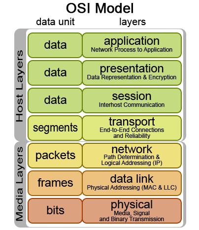
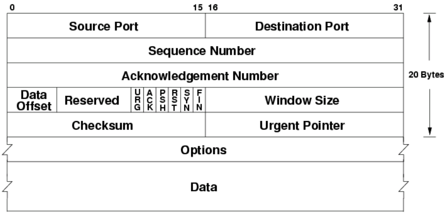
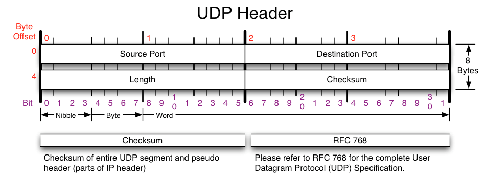
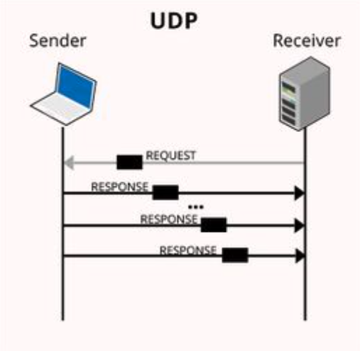

OSI7 Layer Model

인간사회에 여러 가지 규칙이나 규약이 있듯, 컴퓨터 네트워크 분야에도 여러 가지 규약이 있습니다.  
이러한 규약을 정하는 기관 중 국제표준화기구(ISO)에서 통신이 일어나는 과정을 단계별로 쉽게 파악하고,

다른 시스템 간의 원활한 통신을 위해 제안한 통신규약인 OSI 7 Layer Model은 위의 그림과 같습니다.  
 
 

#### TCP, UDP에 대해 알아보기 전에

4계층에 해당하는 전송계층을 더 자세히 알아보겠습니다.

전송계층에서는 source to destination, end-to-end간 연결을 제공하며,  
오류 제어, 흐름 제어, 데이터 순서화 등의 기능을 제공합니다.

여기서 말하는 end-to-end란 단순히 컴퓨터에서 컴퓨터로 만의 전달이 아닌,  
송신 컴퓨터의 응용프로그램(프로세스)에서 최종 수신 컴퓨터의 응용프로그램(프로세스)으로의  
 전달을 의미합니다.

전송계층에서의 주소 표현은 포트 번호를 사용하는데,  
포트 번호는 통신 프로세스를 구별하는 번호입니다.

또한, 전송계층에서의 프로토콜 데이터 단위(PDU)는 세그먼트라고 하며,  
전송계층에서는 신뢰성 관련 제어기능을 지원할 수도 있고, 안할수도 있습니다.

이제 TCP, UDP에 대해 알아봅시다😎

### TCP에 관하여

---

TCP(Transmission Control Protocol)를 한마디로 정의하자면  
신뢰성있는 데이터 통신을 가능하게 해주는 프로토콜입니다.

TCP의 가장 중요한 특징 중 하나는 Connection을 수립하는 과정입니다.

(Connection Establish) 이에 관해서는 3-way-handshake라는 과정이 존재하는데,  
이에 관해서는 잠시 후에 살펴보도록 하겠습니다.

다른 특징으로 TCP는 데이터의 순차 전송을 보장하며,  
흐름 제어, 혼잡 제어, 오류 감지가 가능하다는 특징을 가지고 있습니다.
 
 

TCP 헤더

전송계층에서는 포트 번호로 통신을 합니다.

따라서 TCP header에는 Source port와 destination port가 존재하고,  
순차 전송의 신뢰성을 보장하기 위해 Sequence number, Acknowledge number가 존재하고,  
flag field는 tcp의 연결을 제어하고, 데이터 관리를 하기 위해 존재합니다.

flag field중 크게 3가지만 먼저 알아보면 SYN은 연결을 요청할 때 쓰이는 flag,  
FIN은 연결을 종료할 때 쓰는 flag, ACK는 응답을 잘 받았음을 알려주기 위한 flag입니다.

이에 대한 자세한 내용은 3-way-handshake를 살펴보며 더 자세히 알아보겠습니다.

#### 3-way-handshake

---

 

3-way handshake

 

3-way-handshake란 Connection을 수립하는 과정입니다.

Client에서 Server에 연결을 신청을 할 때 SYN을 1로 설정해 송신을 한 뒤에  
Server에서 받으면 요청을 잘 받았다는 의미로 ACK를 1로 설정해 송신합니다.

Connection은 양방향이기 때문에 서버 역시 연결을 요청한다는 의미로 ACK와 함께  
SYN을 1로 설정해 송신합니다.  
Client도 요청을 잘 받았다는 의미로 ACK를 1로 설정해 다시 송신하면 Connection이 수립됩니다.

Connection이 수립된 이후에 데이터 송수신을 크게 3단계로 보면

1. Client가 데이터를 송신한다.
2. Server에서 잘 수신 했다면 ACK를 송신한다.
3. Client가 대기하다가 ACK를 수신하지 못하면 재전송을 한다.

이러한 일련의 과정을 통해 TCP는 TCP의 장점인 신뢰성 있는 통신을 구현합니다.

#### 4-way-handshake

---

4-way handshake 

Connection이 수립(establish) 되었다면 Connection을 닫는 과정도 필요합니다.

1. Client에서 더 이상 보낼 데이터가 없으면 FIN을 1로 설정하여 Server에게 송신한다.
2. Server에서는 잘 수신 받았다는 의미로 ACK를 1로 설정하여 클라이언트에게 송신한다.
3. Connection을 수립할때와는 다르게 Server쪽에서 아직 보낼 데이터가 남아있을 수도 있기 때문에  
   잠시 대기후 Server쪽에서 데이터를 모두 전달했다면 FIN을 1로 설정해 Client 쪽으로 송신한다.
4. Client에서 잘 수신을 받았으면 ACK를 1로 설정해 Server에게 송신하면 상태가 Closed 된다.

이러한 단계를 통해 TCP의 Connection을 Close합니다.

TCP의 단점으로는 매번 Connection을 3-way-handshake로 연결하기 때문에 시간 손실이 발생하고,  
 조금만 세그먼트를 손실해도 재전송을 한다는 점입니다.

e-mail과 같이 손실이 없어야 하는 데이터의 경우 이러한 과정이 장점이 될 수 있지만  
실시간 스트리밍과 같이 손실이 어느정도 발생해도 되는 데이터의 경우에는 비효율적인 통신 방법이 될 수 있다는 점을 주의해야합니다.

### UDP에 관하여

---

UDP(User Datagram Protocol)를 한마디로 정의하면 TCP보다 신뢰성이 떨어지지만 전송 속도가  
일반적으로 빠른 프로토콜이라 할 수 있습니다.

Connection을 TCP처럼 수립하지 않고,  
비연결 방식으로 통신을 하며 TCP의 주요기능인 순차 전송, 흐름 제어, 혼잡 제어 기능을 제공하지 않으며, Checksum을 통해 최소한의 에러검출을 진행합니다.

주로 데이터의 신뢰성이 중요하지 않을 때 사용됩니다.(ex. 실시간 스트리밍)

 UDP 헤더  

UDP헤더의 경우 TCP헤더 보다 비교적 단순합니다.

포트 번호로 통신을 하기위한 Source port와 destination port가 존재하고,  
에러 검출을 위한 Checksum이 존재합니다.  
 

 UDP 통신과정 

UDP의 데이터 전송 방식은 Connection이 없으니 확인을 하지 않고,  
무조건 데이터를 요청 하면 보내는 방식입니다.

Server는 UDP 관련해 소켓을 열어두고 있어 데이터를 요청 하기만 하면 무조건 받습니다.  
또한 Checksum을 이용해 최소한의 오류만을 검증하기 때문에 패킷의 손실이 상대적으로 많습니다.

그렇기에 TCP와 비교하여 신뢰성 있는 데이터의 전송을 보장할 수 없습니다.

또한, 앞서 언급된 Client와 Server는 모두 end-system이며 동시에 host입니다.

### TCP와 UDP 비교

---

TCP와 UDP의 특징을 표로 비교하여 한눈에 쉽게 알아보려 합니다.

| 구분         | TCP                                             | UDP                                              |
| ------------ | ----------------------------------------------- | ------------------------------------------------ |
| 연결 수립    | 연결 지향형                                     | 비 연결형                                        |
| 신뢰성, 승인 | 모든 데이터에 신뢰성, 승인 제공                 | 모든 데이터에 신뢰성, 승인 제공                  |
| 재전송       | 모든 데이터를 관리해 자동적으로 재전송          | 탐지 후 필요한 경우에만 수동적으로 재전송        |
| 흐름 제어    | 제공                                            | 미제공                                           |
| 손실         | 없음                                            | 손실 발생 가능성 있음                            |
| 속도         | 상대적으로 느리다.                              | 상대적으로 빠르다.                               |
| 용도         | 신뢰할 수 있는 방법으로 전송해야 하는 곳에 적합 | 데이터의 완전성보다 전달 속도가 중요한 곳에 적합 |

 

표를 통해 전송계층 프로토콜을 선택할 때 TCP, UDP의 특성을 파악하고,  
상황에 따라 적절한 프로토콜을 사용해야 한다는 사실을 도출할 수 있습니다.

이외에도 차세대 전송계층 프로토콜로는 SCTP, RSVP 구글에서 개발한 QUIC, 등이 있습니다.

혹시 제가 잘못 알고 있는 부분이 있거나, 오타 혹은 궁금한 점 있으시면 댓글로 알려주시면 감사하겠습니다!!😎

> 도움을 주신 분
>
> - 명지대 컴퓨터공학과 박현민 교수님

> 이미지 출처
>
> - [OSI 7 Layer Model](https://netchobo.tistory.com/44)
> - [TCP 헤더](https://hand-over.tistory.com/15)
>
> - [3-way handshake](https://www.luxoft-training.com/news/building-java-client-server-applications-with-tcp)
>
> - [4-way-handshake](https://steffen-lee.tistory.com/31)
> - [UDP 헤더](https://rednooby.tistory.com/17)
> - [UDP 통신과정](https://coconuts.tistory.com/33)
