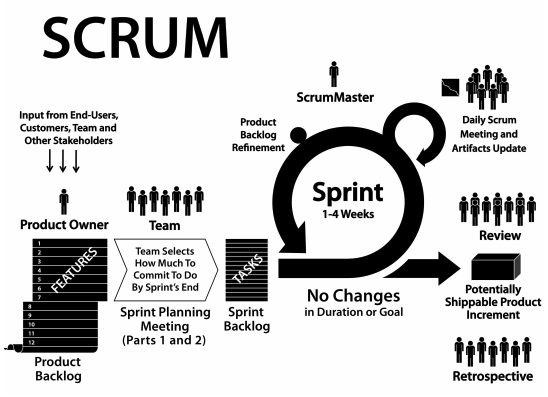
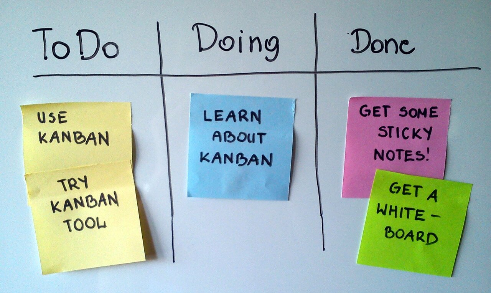
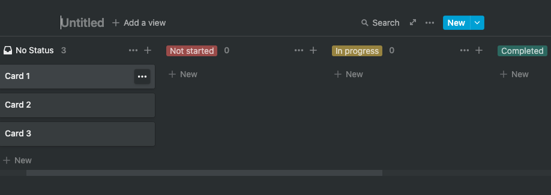
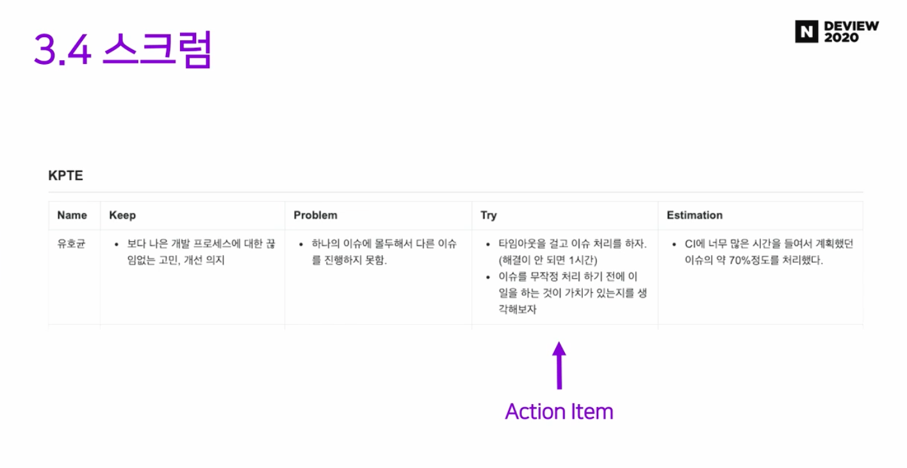

안녕하세요 Noah입니다 :)

애자일을 검색해보면 여러 용어가 나옵니다.  
애자일, 애자일 방법론, 익스트림 프로그래밍, 스크럼, 스프린트 등등 이러한 용어들을
살펴보며,  
애자일 개발 프로세스에 대해 알아보도록 하겠습니다.

애자일(agile)은 우리말로 **'날렵한', '민첩한', '기민한'** 이라는 의미를 지닙니다.

애자일 프로세스는 고객의 요구에 민첩하게 대응하고, 그때그때 주어진 문제를 풀어나가는 것을 중요하게 생각합니다.

### 등장 배경

애자일은 이전에 사용해왔던 프로세스 모델인 [water fall](https://ko.wikipedia.org/wiki/%ED%8F%AD%ED%8F%AC%EC%88%98_%EB%AA%A8%EB%8D%B8)과 같은  
계획기반 모델의 문제점을 해결하고자 나온 모델입니다.  
비즈니스 환경이 예전처럼 대규모 시스템만 필요한 것이 아니라  
 소규모 시스템, 즉각적으로 사용자와 상호작용하는 시스템들이
많이 필요하게 된 환경에서  
 계획기반의 제한적이고, 경직된 구조를 가진 개발 프로세스가  
 결국은 프로젝트를 위험에 빠지게 한다는 문제를 해결하기 위해 애자일 프로세스가 등장하게 되었습니다.

시스템을 개발할 때에는 개발하고 테스트하는 것에 시간을 많이 쏟아야 하는데,  
 너무 많은 시간을 분석, 설계에 투자하게 되면 개발하고 테스트할 시간이 부족하게 됩니다.  
 무거운 계획기반 개발 기법이 소규모, 중간규모의 시스템에 적용될 때는 오버헤드가 커진다는 문제점을 가지고 있습니다. 이러한 문제점을 해결하기 위한 노력이 여러 군데에서 동시다발적으로 이루어졌으며, 이러한 노력을 하는 사람들이 모여 애자일 선언이라는 것을 하게 됩니다.

다음은 애자일 선언문 전문입니다.

#### 애자일 선언문 전문

```
애자일 소프트웨어 개발 선언 - 한국어 ver


우리는 소프트웨어를 개발하고, 또 다른 사람의 개발을
도와주면서 소프트웨어 개발의 더 나은 방법들을 찾아가고
있다. 이 작업을 통해 우리는 다음을 가치 있게 여기게 되었다:

공정과 도구보다 개인과 상호작용을
포괄적인 문서보다 작동하는 소프트웨어를
계약 협상보다 고객과의 협력을
계획을 따르기보다 변화에 대응하기를

가치 있게 여긴다. 이 말은, 왼쪽에 있는 것들도 가치가 있지만,
우리는 오른쪽에 있는 것들에 더 높은 가치를 둔다는 것이다.


Kent Beck
Mike Beedle
Arie van Bennekum
Alistair Cockburn
Ward Cunningham
Martin Fowler
James Grenning
Jim Highsmith
Andrew Hunt
Ron Jeffries
Jon Kern
Brian Marick
Robert C. Martin
Steve Mellor
Ken Schwaber
Jeff Sutherland
Dave Thomas


© 2001, 상기 저자들
이 선언문은 어떤 형태로든 자유로이 복사할 수 있지만,
본 고지와 함께 전문으로서만 가능하다.
```

```
Manifesto for Agile Software Development - eng ver


We are uncovering better ways of developing
software by doing it and helping others do it.
Through this work we have come to value:

Individuals and interactions over processes and tools
Working software over comprehensive documentation
Customer collaboration over contract negotiation
Responding to change over following a plan

That is, while there is value in the items on
the right, we value the items on the left more.


Kent Beck
Mike Beedle
Arie van Bennekum
Alistair Cockburn
Ward Cunningham
Martin Fowler
James Grenning
Jim Highsmith
Andrew Hunt
Ron Jeffries
Jon Kern
Brian Marick
Robert C. Martin
Steve Mellor
Ken Schwaber
Jeff Sutherland
Dave Thomas


© 2001, the above authors
this declaration may be freely copied in any form,
but only in its entirety through this notice.
```

요약하자면 다음과 같습니다.

프로세스와 도구 중심이 아닌, 개개인과의 상호 소통을 중시하며,

문서 중심이 아닌, 실행 가능한 소프트웨어를 중시하며,

계약과 협상보다는 고객과의 협력을 중시하며,

계획보다는 변화에 대해 민첩하게 대응하는 것을 중시하는 것이 애자일의 기본가치입니다.

대표적인 방법론으로는 xp, 스크럼, 린, 칸반등이 있습니다.

반복적인 개발에도 사용하고 있으며. 사용자의 요구사항이 일정 수집된 이후에, 먼저 인도 가능한 소프트웨어를 만들고, 추가 요구를 반영해서, 요구가 반영된 소프트웨어를 제시하다 보니 애자일 프로세스는 프로토타입 기반의 방법을 사용하고 있습니다.

### 애자일 프로세스의 기본원리

애자일 프로세스 내에서는 사람이 부품처럼 활용되는 것이 아니라,  
개발자 자체가 적극적으로 자신의 모든 역량을 동원해 빠르게 요구사항의 변화에 대처할 수 있어야 합니다.

구체적으로 어떠한 단계를 거쳐 무엇을 해야 한다 보다는 자기가 가지고 있는 노하우를 충분히 활용하고,  
 다른 사람과 공유해야 하는 책임을 지고 있습니다.

또한 변경을 잘 수용해야 합니다.  
시스템 요구사항이 변경될 것으로 예상하고, 변경을 수용할 수 있도록 시스템을 설계해야 합니다.

이를 위해서는 시스템이 단순해야 합니다. 개발 중인 소프트웨어가 단순해야 하고, 개발 프로세스도 단순해야합니다.
복잡성을 제거해 적극적으로 작업해야 한다는 것이 애자일 프로세스의 기본원리입니다.

물론 문제점도 있습니다.

점증적으로 개발을 해서 인도를 하려면 사용자가 가까이 있어야 하는데,  
사용자가 시스템을 외부조직에 의뢰하게 되어 물리적으로 떨어져 있게 되면  
의사소통 부분에서 문제가 될 수 있고, 개발팀들이 서로 다른 장소에서 분할해서 작업하는  
대규모 시스템의 경우에는 애자일 기법이 다른 팀의 진행 상황을 파악하기 어려운 부분이 있어,  
관리가 어려울 수 있기 때문에 대규모 시스템 개발은 적합하지 않다는 평을 받고 있습니다.

보통은 부분적으로 혼용해 사용하는 경우가 많다고 합니다.

전체적인 시스템은 계획기반의 방법론을 쓰되, 각 서브 시스템을 개발할 때는 서브 시스템에 대한 요구사항이나, 목표 같은 것이 정의되어있다면

그 안에서는 부분적으로 애자일 기법을 사용하기도 한다고 합니다.  
<br/>

애자일 개발 프로세스 모델에서 많이 알려진 것은 **익스트림 프로그래밍(XP)**과 **스크럼**입니다.

XP는 전체적인 프로세스보다는 개발 자체에 포커스를 맞춘 애자일 기법입니다.

스크럼 기법은 프로젝트 관리에 애자일 기법이 적용된 것이기 때문에 스크럼이 조직관리를 위해 유용하게 사용되긴 하지만,

구체적인 실천 방법을 제시하지 않다 보니, 다른 방법론들하고 많이 결합이 됩니다.

그중에 XP와 많이 결합이 되며, [XP, 스크럼 혹은], [XP, 스크럼, 칸반], [스크럼, 칸반], [스크럼, 칸반, 린]  
이와 같이 결합이 되는데, XP와 주로 결합이 되다 보니 XP하고 스크럼하고 혼용되어 설명되는 경우가 많고,  
XP와 스크럼을 구분짓기 어려울 때가 있습니다.

### 익스트림 프로그래밍

<p align="center">

<center>Extreme-Programming</center>
</p>

XP는 가장 먼저 알려진 애자일 프로세스이며,

의사소통을 중요시하고, 꼭 필요한 문서만 만들며, 산출물은 코드와 단위 테스트가 문서 역할을 하도록 하는 것이 익스트림 프로그래밍이 중요하게 생각하는 점입니다.

XP는 5가지 핵심 가치와 12가지의 구체적인 실천사항을 가지고 있어, 비교적 작은 규모를 가진  
개발 프로젝트에 적용하기 좋습니다.

다음은 XP의 5가지 핵심가치와 XP의 12가지 실천사항입니다.

### XP의 5가지 핵심 가치(Core Value)

| 핵심 가치                   | 설명                                                               |
| --------------------------- | :----------------------------------------------------------------- |
| 용기(Courage)               | 고객의 요구사항 변화에 능동적인 대처                               |
| 단순성(Simplicity)          | 부가적 기능, 사용되지 않는 구조와 알고리즘 배제 설계와 코드는 간결 |
| 커뮤니케이션(Communication) | 개발자, 관리자, 고객 간의 원활한 의사소통                          |
| 피드백(Feedback)            | 지속적인 테스트와 반복적 결함 수정, 빠른 피드백                    |
| 존중(Respect)               | 모든 프로젝트 관리자는 팀원의 기여를 존중                          |

### XP의 12가지 실천사항

| 구분                           | 내용                                                                                                       |
| ------------------------------ | ---------------------------------------------------------------------------------------------------------- |
| 01. Planning game              | user story(일종의 요구사항)를 이용해 next release의 범위를 빠르게 결정.                                    |
| 02. Small                      | 필요한 기능들만 갖춘 간단한 시스템을 빠르게 production화 해서 자주 배포.                                   |
| 03. Metaphor                   | 의사소통을 하기 위해 너무 어렵고 전문적인 용어를 쓰기보다 Metaphor(ex 쉬운 그림)를 이용해 의사소통         |
| 04. Simple design              | 현재의 요구사항을 만족시키도록 가능한 한 단순하게 설계를 한다.                                             |
| 05. Testing                    | 실제 코드를 쓰기 전에 먼저 테스트 코드를 작성. (TDD 기반)                                                  |
| 06. Refactoring                | 프로그램의 기능을 바꾸지 않으면서 중복제거, 커뮤니케이션 향상, 단순화, 유연성 추가 등을 위해 시스템 재구성 |
| 07. Pair programming           | 하나의 컴퓨터에 두 사람이 앉아서 같이 프로그램 (Driver / Partner, 개발 / 테스트)                           |
| 08. Collective ownership       | 시스템에 있는 코드는 누구든지 언제라도 수정 가능함.                                                        |
| 09. CI(Continuous Integration) | 하루에 몇 번이라도 시스템을 통합하여 빌드 할 수 있음.                                                      |
| 10. 40-hour week               | 일주일에 40시간 이상을 일하지 말도록 규칙으로 정하고, 2주를 연속으로 오버 타임 하지 않도록 함.             |
| 11. On-site customer           | 개발자들의 질문에 즉각 대답해 줄 수 있는 고객을 프로젝트에 풀 타임으로 상주시킴                            |
| 12. Coding standards           | 팀원들 간 커뮤니케이션을 향상시키기 위해서는 코드가 표준화된 관례에 따라 작성되어야 함.                    |

다음으로는 스크럼입니다.

### 스크럼

<p align="center">

<center>Scrum</center>
</p>

스크럼 역시 애자일 기법 중 널리 사용되는 기법이며, 소프트웨어 개발보다는 팀 활동을 개선하고,  
프로젝트를 관리하기 위한 경험적 관리기법입니다.

개발 단계에 대해서는 구체적인 프로세스가 없어 주로 XP와 결합이 됩니다.

전체적인 진행 상황은 다음과 같습니다.

1. product owner, 서비스 기획자에 의해 요구사항 정의와 우선순위가 부여됩니다.
   우선순위가 부여된 기능 목록을 Product Backlog라고 합니다.
2. 팀원은 Product Backlog에 있는 요구사항 하나하나를 선택해 개발하게 되는데, 각 반복 단계마다 요구사항을 선별해
   반복 주기 내에서 개발을 하게 됩니다. 이 반복 주기를 Sprint라고 합니다.

팀원들은 직위가 없으며, 동등한 형태로 팀이 구성되어있습니다.  
팀과 제품 책임자 사이에서 스크럼 마스터가 전체적인 팀 활동을 지원하는 역할을 합니다.

스프린트 계획 회의(Sprint Planning Meeting)는 1~4주 보통 2주 정도를 하는 하나의 스프린트를 시작하기 위한 계획 회의이며,
Product Backlog에서 사용자의 요구를 구현하기로 했다면 이를 구현하기 위해 어떤 활동을 해야 하는지 정의를 하며 Sprint Backlog, 상세 요구 사항을 정의합니다.

Sprint Backlog를 스프린트 계획 회의에서 정의를 하면, 스프린트 주기 내에서 수행을 하며, 각각의 팀원이 개발하게 되는데, 개발을 진행하며 매일매일 스크럼 회의를 진행합니다.

<p align="center">

<center>Kanban Board</center>
</p>

스크린트 현황판은 칸반에서 사용하는 방법을 이용합니다. 노션에도 다음과 같은 칸반보드가 존재합니다.!

<p align="center">

<center>Notion Progress Board</center>
</p>

데일리 스크럼 회의

1. DONE: 어제 한 일
2. TODO: 오늘 할 일
3. ISSUE: 일을 진행하면서 문제점

데일리 스크럼 회의에서는 진행 상황을 점검하고, 문제 상황은 없는지 파악을 하게 되며  
문제가 발생하면 문제를 해결하거나, 조정하는데 이를 조정해주는 역할을 스크럼 마스터가 합니다.  
진행 상황은 소멸 차트를 그려 진행 상황을 점검을 합니다.

진행 상황만 점검하고, 스프린트 작업 목록을 잘 개발하고 있는지 확인을 하며, 모든 팀원이 참석하여  
한 사람씩 한 일을 얘기하며, 앞으로 어떤 일을 할 것인지, 문제점 및 어려운 점을 공유하여  
매일 완료된 세부 작업 항목을 완료 상태로 옮겨 스프린트 현황판을 업데이트합니다.

일정을 관리하는 진척관리를 표현할 때 계획대비 작업이 얼마나 남았는지에 대해 표현하는 소멸차트가 있습니다.

스프린트를 수행을 하며, 데일리 스크럼 회의를 매일 진행합니다.

스프린트 수행 주기가 끝나 최종 product가 나오게 되면 최종제품을 스프린트 검토 회의를 통해  
고객과 함께 검토하고, 테스트하고, 피드백을 받게 되며 스프린트 회고(Retrospective)라는 활동을 통해  
이번 스프린트에 대한 개선점을 찾는 시간을 가집니다.

네이버 DEVIEW2020에서 유호균 연사님께서 '주먹구구 게 섯거라 K-Agile이 나가신다'라는 주제로

네이버 검색 SRE팀에서 불확실에 대응하기 위한 방법으로
애자일에서 파생된 여러 방법론 중 팀이 당장 적용할 수 있겠다는 판단하에 적용한 요소에 대해 소개해주셨습니다.

1. 가능한 작은 태스크와 예측  
   => 시간이 많이 소요되고, 복잡도가 높은 이슈는 작게 쪼개서 분리
2. 유연하게 바뀔 수 있는 할 일  
   => 유연한 사이클 기간,  
   급한 이슈는 2주 이내에 구현되도록 라벨링
3. 달성 가능한 작은 목표
4. 개선을 위한 회고  
   => KPTE 회고 프레임 워크  
   K : Keep -> 계속 유지하고 싶은 부분  
   P : Problem -> 불편하다고 느낀 부분, 개선하고 싶은 부분  
   T : Try -> Problem을 해결하기 위한 Action Item(행동 양식)  
   E : Estimation -> 전체 개발 사이클 중에서 계획한 이슈를 어느 정도 끝냈는지 예측해본 결과를 평가하는 부분

KPTE 회고프레임워크 예시

<p align="center">

<center>KPTE 회고 프레임워크</center>
</p>

발표를 지켜보고, 애자일 프로세스에 대해 찾아보며 공부한 결과,  
스크럼에 대한 용어 자체에 매몰되기보다는 현재 속해있는 팀의 배경과 상황에서  
적절한 애자일 프로세스의 요소를 뽑아서 도입해야함을 조금이나마 알 수 있었습니다.

또한 애자일 프로세스는 컴퓨터 과학의 divide and conquer 전략과 같이 작은 목표를 가지고,  
꾸준히 개선해 나가며, 팀원 개별들의 능력을 중요하게 생각하며, 팀원들의 상호작용을 통해 협력을 통해 결과물을 만들어내는 구조를 띠고 있다는 점이 인상이 깊었습니다.

혹시 제가 잘못 알고 있는 부분이 있거나, 오타 혹은 궁금한 점 있으시면 댓글로 알려주시면 감사하겠습니다!!😎

> 참고
>
> - [주먹구구 게 섯거라 K-Agile이 나가신다](https://tv.naver.com/v/16970956)
>
> - [쉽게 배우는 소프트웨어 공학](http://www.yes24.com/Product/Goods/23343477)

> 이미지 출처
>
> - [Extreme-Programming](http://www.extremeprogramming.org/)
>
> - [Scrum](https://www.qagile.pl/wp-content/uploads/2018/11/scrum-papers.pdf)
>
> - [Kanban Board](https://brunch.co.kr/@bradlee/4)
>
> - [KPTE 회고 프레임워크](https://tv.naver.com/v/16970956)
