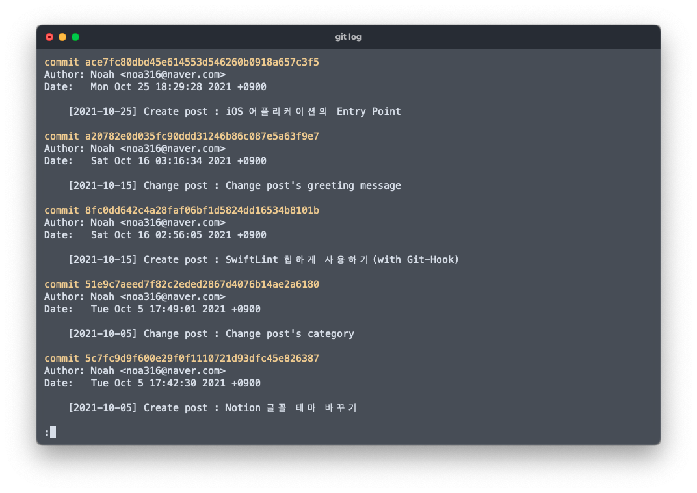
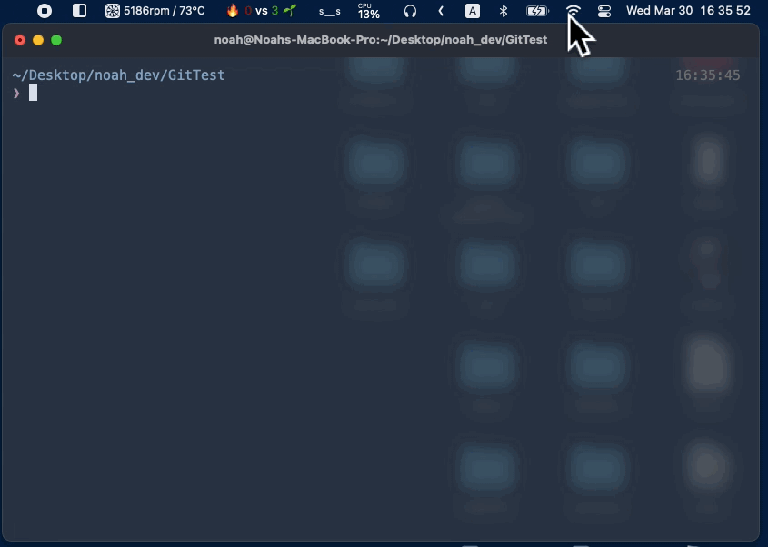
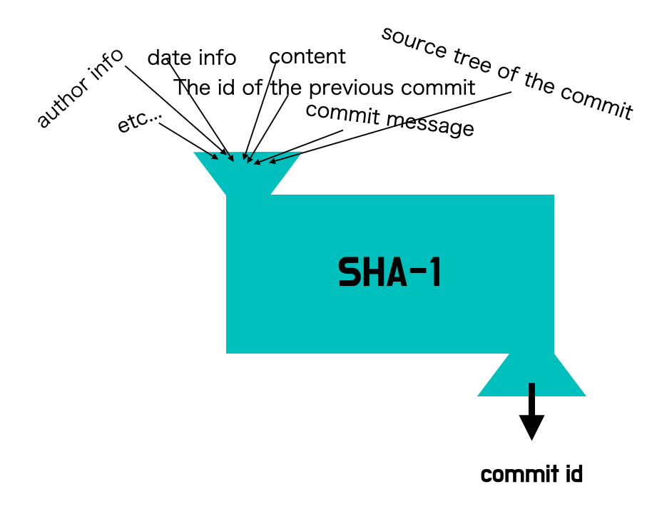
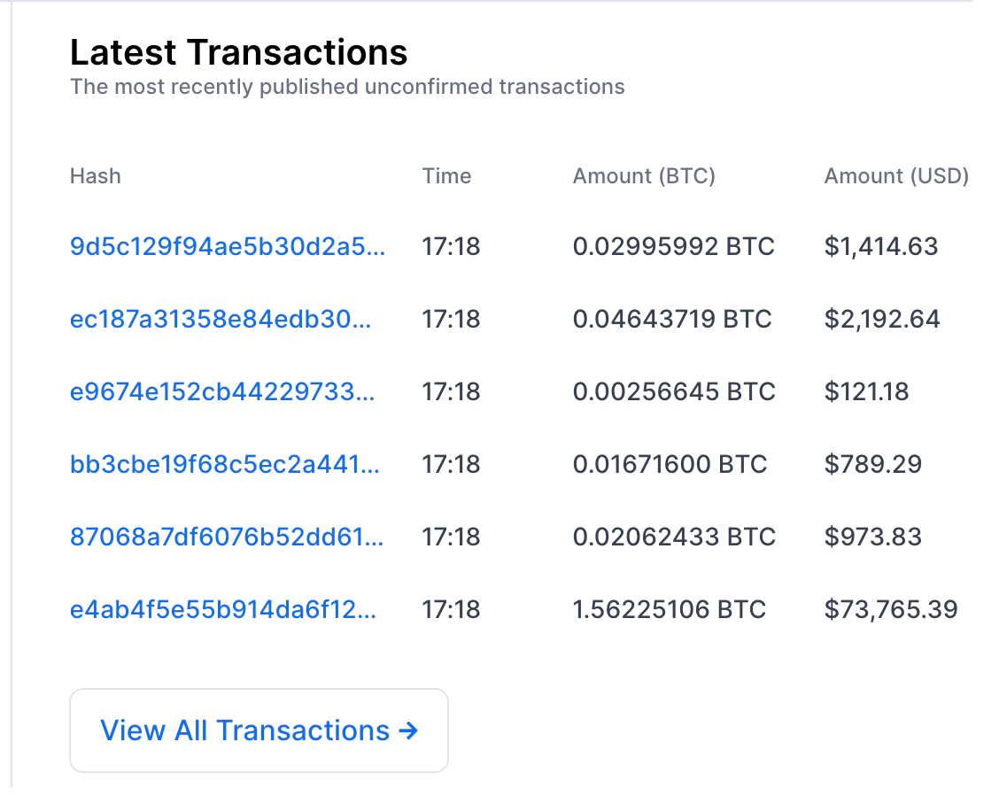

여러분 안녕하세요! Noah입니다.

### 혹시 Git을 사용하면서 commit id를 보신 적이 있나요?

우리는 commit id로 특정 버전을 가리켜 commit을 되돌리기도 하고,

특정 commit의 변경사항을 되돌리기도 합니다.

그렇다면 이 commit id는 어떻게 해서 만들어지는 걸까요?

### **Q.** **서버에서 고유한 id를 부여해주나요..?🧐**

**A.** Git은 로컬에서 관리되는 버전 관리시스템이기 때문에 별도의 인터넷이 연결되지 않은 환경에서도 commit이 되고,

commit id가 부여되는 것을 확인할 수 있습니다!

이를 통해 commit id를 부여하는 방식이 서버가 부여해주는 것이 아닌,

별도의 규칙을 통해 부여되는 것임을 유추해볼 수 있습니다.

### Q. 그런데요...id는 고유한 게 생명 아닌가요?

**서버에서 id를 부여해주는 게 아니면 어떻게 고유한 걸 보장하죠??🧐**

**A.** 이를 알아보기 전에 먼저 hash function에 대해 이해하고 있어야 합니다.

> hash function을 첨 들어보셨다면?!  
> hash function에 대한 자세한 설명은 아래의 링크를 참고해주세요!  
> [위키피디아 해시함수](https://ko.wikipedia.org/wiki/%ED%95%B4%EC%8B%9C_%ED%95%A8%EC%88%98)  
> [hash algorithm](<https://noah0316.github.io/Algorithms/2021-06-24-%ED%95%B4%EC%8B%9C-%EC%95%8C%EA%B3%A0%EB%A6%AC%EC%A6%98(hash-algorithm)/>)

Git은 hash를 이용해 commit의 id를 생성합니다.

**그러면 commit id를 생성하는데 필요한 해시 알고리즘은 어떠한 것을 채택하고 있을까요?**

Git은 commit id를 생성하는데 필요한 해시 알고리즘으로 SHA-1을 채택하고 있습니다.

> commit id가 40자리로 구성되어있는 것을 보고 SHA-1을 사용하고 있다고 유추해볼 수도 있겠습니다.

commit id가 만들어지는 과정을 살펴보면 아래 그림과 같습니다.

SHA-1의 입력으로 들어가는 많은 정보들 중에 한 글자만 바뀌더라도 commit id는 바뀌게 됩니다.

### Q. 그럼 hash function을 사용하면 고유한 id라는 게 보장이 되나요?

**hash function은 collision이 발생하지 않나요??🧐**

**맞습니다. 발생할 수 있습니다.**

hash function가 무한한 가짓수의 입력값을 받아 유한한 가짓수의 출력 값을 생성하는 경우,

비둘기집 원리(pigeonhole principle)에 의해 해시 충돌은 항상 존재합니다.

> 비둘기집 원리 :  
> [https://ko.wikipedia.org/wiki/비둘기집\_원리](https://ko.wikipedia.org/wiki/%EB%B9%84%EB%91%98%EA%B8%B0%EC%A7%91_%EC%9B%90%EB%A6%AC)

SHA-1의 출력 값은 40자리 수의 16진수 문자열입니다.

SHA-1로 생성 가능한 commit id의 개수는

한 자리 수당 4비트씩 곱하면 4\*40 = 160비트 10비트는 대략 1000(정확히는 1024)

그렇다면 SHA-1로 생성 가능한 commit id의 개수는

1 000 000 000 000 000 000 000 000 000 000 000 000 000 000 000 0000

10의 48승개입니다.

10의 48승이라는 숫자를 조금 더 다가오도록 예시를 들어보면, 달(Moon)은 10의 47승개의 원자로 구성되어있습니다.

같은 commit id를 발견할 확률은 우주에 여러 개의 달(Moon)이 있다고 가정했을 때 이 달 중에서 원자 하나를 무작위로 고른 다음, 다른 달에서 원자하나를 무작위로 골랐을 때 같은 원자를 선택할 가능성과 같습니다.

### Q. 그래도 누군가가 악의적으로 commit id를 중복시키기 위해 계속해서 시도한다면요?🧐

**A. “이렇게 까지 해야 하나...”**

git의 commit id를 중복되게 하기 위해 컴퓨팅 연산에 드는 비용, 시간과

git commit id를 중복되게 만들어서 얻을 수 있는 이익을 비교했을 때 가성비가 0에 수렴하기 때문에

충분한 재원을 가진 누군가가 시도를 하지 않는 이상 시도하기 어렵다고 합니다.

> 구글에서 SHA1의 충돌 쌍을 만들어내기 위해 9경 번의 연산을 시도했다고 합니다.

하지만 SHA-1의 충돌 공격에 대해서는 많은 문제가 드러났고,

이미 보안 분야에서는 SHA-1은 거의 퇴출된 상태입니다.

때문에 Github에서는 Git contents의 충돌을 감지하고 이에 대한 대응책을 내놓았습니다.

[SHA-1 collision detection on GitHub.com](https://github.blog/2017-03-20-sha-1-collision-detection-on-github-com/)

## 그렇다면

이렇게 중앙 집중형 서버 없이 고유한 ID를 부여받을 수 있는 hash는 또 어디에 사용할 수 있을까요?

**바로 블록체인입니다.**

비트코인과 같이 블록체인 기술을 사용하는 암호화폐의 거래 과정은 중앙집중형 방식이 아닌, 탈중앙화 된 전자장부에 쓰입니다.

### 그렇다면 각 블록에 포함된 거래내역(트랜잭션)의 id는 어떻게 부여받을까요?

> 블록에 포함된 트랜잭션의 id는 중복 없이 고유해야 합니다.

id를 관리하는 서버에서 고유한 트랜잭션의 id를 부여할까요?

만약 id를 서버에서 부여한다면 블록체인의 철학인 탈중앙화와 어긋나는 행위일 것입니다.

따라서 블록체인의 트랜잭션의 id를 부여하는 방식 역시 hash를 이용합니다.

비트코인에서는 transaction의 id를 부여하는 hash algorithm으로 SHA-256을 사용하는 것으로 알려져 있습니다.

자, 여기까지 Git의 commit id가 어떻게 생성되는지 알아보며, 이와 함께 hash function이 또 어느 곳에 사용되었는지 알아보았습니다.

_아직 모르는 것이 많고 알아가는 과정입니다. 잘못된 것이 있다면 댓글로 남겨주신다면 감사하겠습니다!_
😊

> 참고
>
> - [Github Blog](https://github.blog/2017-03-20-sha-1-collision-detection-on-github-com/)
> - [Stack Overflow](https://stackoverflow.com/questions/1867191/probability-of-sha1-collisions)
