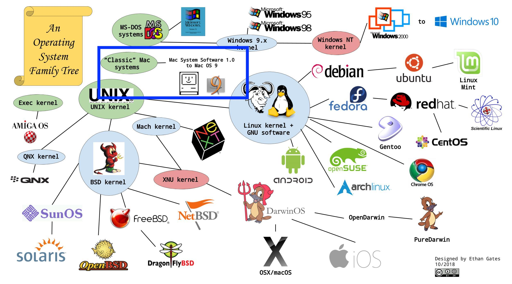

운영체제가 프로세스별로 메모리를 관리하는 방식을 이해하기 위한 학습의 일환으로 Apple의 과거 [Macintosh Operating System](https://ko.wikipedia.org/wiki/%EB%A7%A5_OS)의 메모리 관리 모델을 현대 프로세스 메모리 관리 모델과 비교해가며, stack, heap, text, 글로벌 변수 GVAR, BSS의 역할에 대해 정리해보자.

# Inside Macintosh: Memory
## Classic Mac OS memory management

먼저 오늘 살펴보려고 하는 Apple의 Macintosh System 7.0이다.

> 이미지 출처 : https://github.com/EG-tech/digipres-posters

Apple은 1980년대에 자체 운영체제인 Macintosh System을 만들었기 때문에 UNIX 계열과는 다른 부분이 있다. 이 때문에 밑에서 볼 Process memory model은 현재 우리가 일반적으로 알고 있는 Unix계열의 process memory model과 다르다.

<iframe width="560" height="315" src="https://www.youtube.com/embed/_W4CntluoBQ" title="YouTube video player" frameborder="0" allow="accelerometer; autoplay; clipboard-write; encrypted-media; gyroscope; picture-in-picture; web-share" allowfullscreen></iframe>

현재 우리가 사용하고 있는 Mac OS는 2000년대 초반 Classic Mac OS와는 다른     UNIX에 뿌리를 두고있는 운영체제이며, Classic Mac OS는 OS X가 출시 된 이후 WWDC 2002에서 MacOS 9의 모의 장례식을 통해 사라지게 되었다..

Apple developer 사이트에 archive된 도서를 통해 Macitonsh system의 Process memory model을 살펴보도록 해보자  
링크: [Inside Macintosh: Memory](https://developer.apple.com/library/archive/documentation/mac/pdf/Memory/Intro_to_Mem_Mgmt.pdf)

> 이미지 출처 : amazon

## About Memory
Macintosh Operating System이 시작되면 사용 가능한 RAM을 두개의 섹션으로 나눈다.
두개의 섹션 중 하나는 system partition인데, system partition은 항상 주소 지정이 가능한 가장 낮은 메모리 주소(0번지)에서 시작한다. system partition에는 system heap, global variable들의 집합을 포함한다.

> linux와 같은 현대 운영체제에서는 일반적으로 virtual memory를 kernel space와 user space로 나누는데 Macintosh System에서는 이를 system partition과 application partition으로 나누는 것 같네요!

나머지 섹션인 system partition 외부의 모든 메모리는 application이나 기타 software components에 할당할 수 있다.

    

> 이미지 출처 : [Apple Wiki](https://apple.fandom.com/wiki/System_7)

Macintosh System 7(1991년 출시) 이상부터 사용자가 한번에 여러 application을 열 수 있게되었는데, 과거 Apple에서 application 별로 메모리를 어떻게 관리했었는지 살펴보자.

> Apple은 Macintosh System 7부터 가상메모리를 제공하기 시작했으며, 이때부터 협력형 멀티태스킹을 지원하기 시작했다.   
> 참조: https://en.wikipedia.org/wiki/System_7

전술한 바와 같이 system partition 메모리에서 가장 낮은 위치를 차지한다.   
application partition은 먼저 메모리의 상단 부분부터 로드 된다.

위 그림에서는 세개의 application이 있는데, application마다 고유한 partition을 가지고 있다.
Application1로 표시된 application이 active application이다.
> 현재 활성화된 애플리케이션을 가리키는 것으로 생각되네요

오른쪽에 있는 라벨들은 system global variables에서 사용하는 system global variable이다.

### The System Heap
---
system partition의 main part는 system heap이다.
일반적으로 system heap은 system resource, system code segement 및 system data structure와 같은 다양한 항목을 로드하는 운영체제 및 기타 system software에서 독점적으로 사용하도록 예약되어 있다. 예를들어 system buffer, queue 등이 system heap에 할당된다.

### The System Global Variables
---
Memory의 가장 낮은 부분은 system global variables(or low-memory system global variables)라고 하는 global variable의 collection이 차지한다.

운영체제는 이러한 global variable을 사용해 운영 환경에 대한 여러 종류의 정보를 유지한다.
예를 들어 operating-system queue의 head에 대한 pointer, menu bar의 높이 등이 있다.

low memory에 위치한 대부분의 global variable은 일반적으로 운영체제, 또는 기타 system software에만 유용한 정보가 포함되어있다.

low memory에 위치한 다른 global variable 현재 application에 대한 정보가 포함되어있다.
예를 들어 

- `ApplZone`global variable에는 현재 활성화 된 application partition의 의 첫번째 바이트의 주소가 저장되어있다.

- `ApplLimit` global variable에는 현재 활성화 된 application의 힙이 확장할 수 있는 마지막 바이트의 주소가 저장되어있다.

- `CurrentA5` global variable에는 현재 활성화 된 application의 global variable과 parameter사이의 경계 주소가 저장되어있다.

이러한 global variable에는 활성화된 application에 대한 정보가 포함되어있기 때문에 운영체제는 context switching이 발생할 때마다 이러한 global variable의 값을 변경한다.

> 제가 공부했었던 다른 현대 Operating System에서는 `ApplZone`, `ApplLimit`, `CurrentA5`와 같은 메모리 주소공간과 같은 정보들은 프로세스 별로 [Process Control Block](https://ko.wikipedia.org/wiki/%ED%94%84%EB%A1%9C%EC%84%B8%EC%8A%A4_%EC%A0%9C%EC%96%B4_%EB%B8%94%EB%A1%9D)이라는 자료구조에 담아 kernel에 저장하고 있다가 CPU의 레지스터에(메모리 정보와 같은 경우 현재 page table을 가리키는 레지스터 등)해당 정보들을 복사하는 방식인데, 위의 global variable들이 이와 비슷한 역할을 하는 것으로 보입니다.

일반적으로 low memory에 위치한 global variable들은 read/write하지 않는 것이 좋다.
대부분의 global variable들은 문서화되어있지 않고, 변경할 경우 예측하기 어렵기 때문에 사용하지 않는 것이 좋다. 일반적으로 low memory에 위치한 global variable을 application에서 사용할 가능성이 있는 경우 함수를 호출하여 global variable의 현재 값을 가져올 수 있다.

> 이 역시 다른 현대 Operating System에서는 kernel의 보호문제로 User mode에서는 kernel space에 접근해야하는 경우 system call을 이용해 접근해야 하는데 Macintosh System에서는 application에서 system call을 사용하지 않고도 system partition의 global variable에 접근할 수 있었나 봅니다.

### Organization of Memory in an Application Partition
---
application이 시작되면 운영체제는 application partition이라는 memory partition을 할당합니다.
해당 partition에는 application code의 필수 segment와 application과 관련된 기타 데이터가 포함된다.

아래의 그림은 applcation partition의 일반적인 구성을 보여준다.

application partition은 세가지의 major part로 나뉜다.
- application stack
- applicaiton heap
- application global variable and A5 world

heap은 application의 low memory끝(`ApplZone`)에 위치하며 항상 높은 메모리 쪽으로 확장된다.  
A5 World는 application partition의 high memory끝에 위치하며 크기가 고정되어있다.

stack은 A5 World의 low memory부터 시작하며 heap의 상단을 향해 아래쪽으로 확장한다.

### 잠깐 A5 world? 그게 뭘까?
---
Apple은 Macintosh에 classic 68K 런타임 아키텍쳐를 사용했는데요, 모든 classic 68k application에는 A5 world 메모리 영역이 포함되어있습니다. 즉 메모리 영역을 말하는 것이지요.

A5 world에는 다음과 같은 항목들을 저장합니다.
- **application의 global variable**
- application의 paramter
- application이 code segment간에 호출할 수 있도록 하는 jump table
- Macintosh의 그래픽 모델인 [Quickdraw](https://en.wikipedia.org/wiki/QuickDraw)의 drawing environment의 정보를 저장하고 있는 global variable

결국 일반적으로 알고 있는 프로세스의 메모리 모델에서 데이터 영역에 해당하는 것 같네요!

위 그림에서 볼 수 있듯, 왼쪽에 보이는 것이 Maciontosh System의 프로세스 별 메모리 구조, 오른쪽이 일반적으로 우리가 알고 있는 프로세스의 메모리 구조입니다. Data, Code(Text)영역이 Heap의 밑부분에 위치한 반면 과거 Macintosh System에서는 Stack의 윗부분의 A5 world라는 일반으로 우리가 알고있는 data 영역에 통상적으로 알고있는 process model의 data(GVAR, BSS)에 해당하는 데이터를 저장하고 있습니다.

이에 대해서는 뒤에서 조금 더 살펴봅시다!

> 통상적인 process memory model에서 데이터 섹션은 `GVAR`, `BSS`로 나뉘는데 `GVAR`에는 초기화된 전역변수, `BSS`영역에는 초기화되지 않은 전역변수가 저장됩니다.

> 왜 나눠놓았을까? 
> `BSS`영역에는 초기화되지 않은 전역변수들이 저장되어 프로그램이 실행될 때 영역을 차지해 `BSS`영역 변수들이 많아져도 프로그램의 실행 코드 사이즈를 늘리지 않는다는 특징이 있습니다.   
> 참고 : https://ko.wikipedia.org/wiki/.bss

### 자! 다시 돌아와서
---
일반적으로 stack과 heap 사이에는 사용되지 않는 메모리 영역(unused memory)이 있다. 이 영역은 application heap에 할당된 공간을 침범하지 않고, stack이 커질 수 있는 공간을 제공한다. 그러나 경우에 따라 application heap 용도로 예약된 공간을 stack이 침범할 수 있는데, 이 경우 heap의 데이터가 손상될 가능성이 매우 높다.

### The Application stack
---
stack은 application partition의 memory영역으로 한쪽 끝은 늘어나거나 줄고, 다른 쪽 끝은 고정된 상태로 유지됩니다. 이는 stack 영역이 항상 **LIFO**(후입선출)순서로 할당 및 해제됨을 의미한다.
마지막으로 할당된 항목이 항상 가장 먼저 해제된다. 또한 stack의 할당된 영역이 항상 연속적이라는 의미이기도 하며, stack의 맨 위에서만 해제되고 중간에서는 해제되지 않기 때문에 이는 stack에 할당되지 않는 "holes(구멍)"는 없음을 의미한다.

일반적으로 stack은 high memory에서 low memory로 쌓인다. 늘어나거나 줄어드는 stack의 끝은 실제로는 스택이 차지하는 메모리의 하단에 있지만 일반적으로 stack의 상단이라고 한다.

**LIFO**특성으로 인해 stack은 함수 또는 프로시저 실행과 관련된 메모리 할당에 특히 유용하다. application이 특정 루틴을 호출하면 stack frame에 대한 공간이 stack에 자동으로 할당된다. stack frame에는 루틴의 parameter, local variable 및 반환주소가 포함된다.

위 그림은 함수 호출 중에 stack이 어떻게 확장되고 축소되는지 보여준다. 맨 왼쪽 그림은 함수가 호출되기 직전의 stack을 보여준다. 중간 그림과 맨 오른쪽 그림은 확장된 stack frame과 함수의 결과가 어디에 있게 되는지 보여준다. 함수의 실행이 완료되고 나면 local variable들과 함수 parameter들은 stack에서 pop되며,함수의 결과는 이전 stack의 최상단에 있다.

Pascal과 같은 고급 개발 언어를 사용하는 경우 stack의 동적 메모리 할당은 일반적으로 자동으로 처리되며, 컴파일러는 각 함수 또는 프로시저 호출에 대한 stack frame을 만들고 삭제하는 코드를 생성한다.

### The Appliaction heap
---
application heap은 동적으로 할당되고, 요청시 해제되는 application partition의 memory영역이다. heap은 application의 low memory끝에서 시작하여 memory 위쪽으로 확장된다. heap에는 stack에 할당되지 않은 거의 모든 항목이 포함된다.

예를 들어 application heap에는 현재 memory에 로드된 application의 code segment와 resource가 포함되어있다. heap에는 window records, dialog records, document data와 같이 동적으로 할당된 다른 항목도 포함된다.

> 여기서 말하는 code segment란 application의 실행 코드를 의미합니다.   
> 참조 : [Apple Document Segment Manager](https://developer.apple.com/library/archive/documentation/mac/pdf/Processes/Segment_Manager.pdf)

> 일반적으로 알고있는 process memory model에서는 heap, text섹션을 분리해 놓았는데, 과거 Apple의 Macitosh System은 이를 heap에 포함되어있다고 설명하고 있는게 흥미롭네요

Memory Manager를 직접적(예를들면, `NewHandle`함수 사용) 혹은 간접적(예를 들어, Memory Manager를 호출하는 `NewWindow`와 같은 루틴을 사용)으로 호출하여 application의 heap내에 공간을 할당한다.

Heap의 공간은 특정 object에 필요한 모든 크기의 블록으로 할당된다.

Memory Manager는 heap의 블록을 추적하는데 필요한 모든 것을 수행한다. 이러한 작업은 임의의 순서로 발생할 수 있기 떄문에 heap은 일반적으로 stack처럼 질서 정연한 방식으로 확장 및 축소되지 않는다. 대신 application이 실행된 후 한동한 아래의 그림처럼 heap이 할당된 블록과 free block(사용 가능한 블록)으로 단편화(fragmentation)되는 경향이 있다. 이를 Heap fragmentation이라고 한다.

Heap fragmentation이 발생하면 사용가능한 여유공간이 충분하더라도 공간이 요청된 크기보다 작은 블록으로 나뉘어있기 때문에 Memory manager가 특정 크기의 block을 할당하라는 application의 요청을 수행하지 못할 수 있다. 이러한 일이 발생하면 Memory manager는 할당된 블록을 이동하여 필요한 공간을 생성하려고 시도한다. 이 작업(operation)을 Heap compaction이라고 한다.

아래의 그림은 Heap compation 작업을 수행한 heap을 나타낸다.

'할당된 메모리 블록이 Heap compaction중에 자유롭게 이동할 수 있는 한 Heap compaction은 일반적으로 문제가 되지 않지만 자유롭게 이동할 수 없는 두 가지 상황이 있다. 즉, 재배치 불가능한 블록(nonrelocatable)인 경우와 잠긴(locked) 블록인 경우이다. Heap fragmentation을 최소화하기 위해서는 재배치 불가능한 블록을 드물게 사용해야 하며, 절대적으로 필요한 경우에만 블록을 lock해야한다. 

> 이 방법에 대해서는 범위가 넘어가므로 다루지 않도록 하겠습니다.
> 더 자세한 내용이 궁금하신 분들은 [문서](https://developer.apple.com/library/archive/documentation/mac/pdf/Memory/Intro_to_Mem_Mgmt.pdf)를 참고해주세요!

### The Application Global Variables and A5 World
---
application의 global variable은 application partition의 상단에 위치한 A5 World에 저장된다.

A5 World의 구조는 아래와 같다. 

global variable과, jump table크기는 application마다 다를 수 있지만 이러한 각 항목의 크기는 고정되어있다.

application의 global variable은 전술했던 quickdraw global variable 위 또는 아래에 나타날 수 있다. 이 두 항목의 상대적 위치는 linker에 의해 결정된다.

system global variable인 `CurrentA5`는 현재 application global variable과 application parameter와의 경계를 가리킨다.

application의 jump table에는 application의 각 루틴에 대한 entry가 포함되어있다.
다른 segment의 code에 의해 호출되며, Segment Manager는 jump table을 사용하여 code segment에 의해 호출되는 외부 참조 루틴의 주소를 결정한다.

> [jump table에 대한 설명](https://ko.wikipedia.org/wiki/%EB%B6%84%EA%B8%B0_%ED%85%8C%EC%9D%B4%EB%B8%94)

application parameter는 32바이트 메모리이며 이는 운영체제에서 사용하도록 예약되어있다.

### Temporary Memory
---
Macintosh 멀티태스킹 환경에서 각 application은 특정 memory partiton으로 제한된다. (크기는 'SIZE'라는 application의 resource에 의해 결정된다.) application heap의 크기에 제한을 두기 때문에 application partition크기에 제한이 있어 application에서 사용하는 buffer 및 기타 리소스가 부족할 수 있다. 

위 그림처럼 application의 heap에서 현재 사용 가능한 것 보다 더 많은 memory가 필요한 경우 다른 application에 아직 할당되지 않은 사용가능한 memory를 사용하도록 운영체제에 요청할 수 있다. temporary memory로 알려진 이 memory는 사용 가능한 RAM에서 할당된다. 일반적으로 해당 memory는 application영역의 memory와 인접하지 않다.

temporary memory를 가끔씩만 사용하는 좋은 이유 중 하나는 요청한 temporary memory를 항상 받을 것이라고 가정할 수 없기 때문이다.

### Virtual Memory
---
Macintosh system 7.0이상에서 Maciontosh computer는 virtual memory로 알려진 운영체제의 기능을 활용할 수 있다. 

이를 통해 시스템은 사용 가능한 물리적 메모리의 한계를 넘어 확장되는 논리 주소 공간을 가질 수 있다.
운영체제는 사용 가능한 보조 저장소의 일부(즉 하드 디스크의 일부)를 사용하여 주소 공간을 확장해 현재 RAM에 필요하지 않은 응용 프로그램 및 데이터의 일부를 보관한다.

> Intel이 80286(1982년 출시) CPU를 통해 가상 메모리 기능을 제공했던 것에 비해 Apple은 9년뒤인 1991년 부터 가상 메모리를 지원하기 시작했네요 👀

### Addressing Modes
---
Macintosh에서 운영체제는 32비트 주소지정, 즉 32비트를 사용하여 메모리 주소를 결정하는 기능을 지원한다. 기존 방식인 24비트 주소지정 방식은 24비트 주소 지정 방식에서 논리 주소 공간의 크기는 16MB이지만 8MB가 I/O, ROM 및 슬롯 공간용으로 예약되어 있으므로 가장 큰 연속 프로그램 주소공간(Contiguous)은 8MB이다. 32비트 방식에서 최대 프로그램 주소 공간은 1GB이다. 

### Summary
---
여기까지 Apple의 과거 Process memory model과 현대의 일반적인 Process memory model을 비교해보며, 구조는 약간 다르지만(global variable이 stack의 상단의 A5 World라는 곳에 있는 등) 전체적인 큰 부분에서의 기본적인 컨셉은 같이하고 있었다는 사실을 알 수 있었으며, Unix계열의 Process memory model과 비교해보며 각 Section의 (stack, heap, text, 글로벌 변수 GVAR, BSS)의 역할에 대해 학습할 수 있었다.

_아직 모르는 것이 많고 알아가는 과정입니다. 잘못된 것이 있다면 댓글로 남겨주신다면 감사하겠습니다!_
😊
