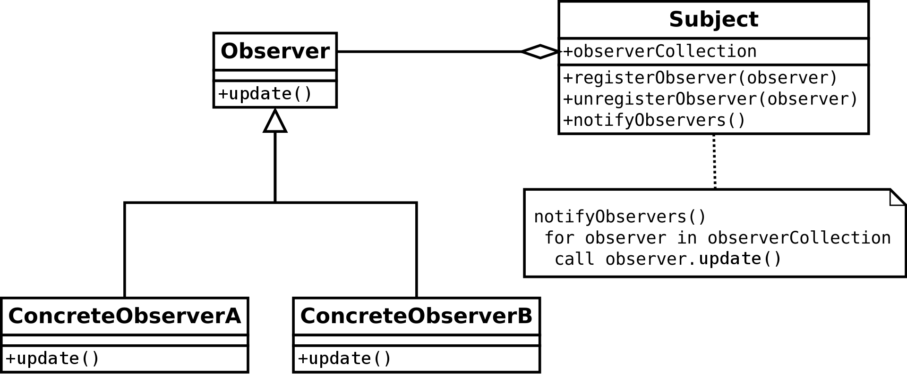

안녕하세요 Noah입니다 :)

오늘은 **G**ang **o**f **F**our **소프트웨어 디자인 패턴** 중 행위 패턴에 속하는

**Observer Pattern** 에 대해서 알아보도록 하겠습니다.

### iOS에서 Observer Pattern은

Foundation framework의 NotificationCenter, KVO(Key Value Observing), Property Observer, Combine framework의 Publisher, Subscriber 등에서 쓰이는데요,

> Combine framework의 Publisher(Observable), Subscriber(Observer)과 Notification Center는
> Observer Pattern과 비슷하지만 약간의 차이를 가진 Pub/Sub Pattern을 사용합니다.

이러한 여러 기술들의 **기본 구현 철학**이 되는 소프트웨어 **디자인 패턴**인 **Observer Pattern**에 대해 알아봅시다!!

# Observer Pattern

<p align="center">

</p>

**Observer**를 그대로 직역하면 **감시자** 라고 할 수 있겠네요!

이름에서부터 느낌이 오지만 지켜보는 것과 관련 있는 디자인 패턴입니다.

**Observer Pattern**의 컨셉을 간단하게 GIF로 나타내면 다음과 같은데요

<p align="center">

</p>

하나 이상의 **Observer**(감시자) 들이 한 곳, 하나의 **Subject**를 바라보고 있다가 그곳에서 어떠한 event가 발생하면 **Subject**를 바라보던 **Observer** 들이 그에 따른 반응을 하는 패턴입니다.

그림과 같이 **Observer Pattern**은 **Observer** 들이 한 곳 하나의 **Subject**를 바라보고 있는데요,

다시 말해 하나의 **Observer** 혹은 다수의 **Observer**들은 하나의 **Subject**의 event, 상태 변화에 귀 기울이고 있습니다.

이를 통해 **Observer Pattern**은 **one to many** 즉, 1 대 다의 의존 관계를 갖는 것을 알 수 있습니다.

우리가 만약 **Observer Pattern**을 사용하지 않고 **Subject**의 상태 변화, event를 탐지, 알아차리기 위해서는 일정한 간격의 시간 즉, Time interval을 두고 **Subject**의 상태를 계속해서 체크해야 할 텐데요,

이러한 방식을 **컴퓨터 과학**에서는 **“Polling”**이라고 합니다.

<p align="center">

</p>

물론 모든 상황에 **Polling**과 **Observer Pattern** 중 **Observer Pattern**만 적용할 수는 없지만,

주기적으로 **Subject**의 상태를 계속 체크해야 하는 **Polling** 방식보다 **Subject**의 상태변화 혹은 event가 있을 때만 **Observer**에게 알리는 **Observer Pattern**이 훨씬 효율적일 것입니다.

계속해서 **Subject**의 상태를 체크해야 하는 경우 **Polling**은 리소스 낭비로 이어질 수 있겠습니다.

자, 이제 **Observer Pattern**의 구조를 파헤쳐봅시다.

## Observer Pattern의 구조

<p align="center">

</p>

**Observer Pattern**의 UML은 위와 같이 생겼습니다.

먼저 **Observer** 부분부터 보겠습니다.

<p align="center">

</p>

### Observer Protocol(Interface)

먼저 event, 알림을 감지할 **Observer Protocol**(Interface)을 만들어줍니다.

<p align="center">

</p>

**Observer Protocol**은

메소드로 Subject의 event, 알림을 감지했을 때

**Observer**가 **해야 할 일**을 담을 update 메소드를 가지고 있습니다.

그러면 이제 이 Protocol을 채택 및 준수하여 각 Observer에서 해야 할 일을

정의한 실제 Observer를 정의해줄 수 있습니다.

다음과 같이 말이죠

<p align="center">

</p>

`ConcreteObserverA`, `ConcreteObserverB` 는

각각 자신이 event, 알림을 감지해야 할 일을 정의한 `update()` 메소드를 가지고 있기 때문에

Subject의 event, 알림을 감지했을 때는 각 Observer에 맞는 `update()`메소드가 실행될 것입니다.

여기까지 Swift Code로 작성해보면 다음과 같습니다.

> 편의상 별도의 동등 비교 연산을 추가하지 않고 [===](https://developer.apple.com/documentation/swift/1538988) 연산자를 이용해 같은 instance를 가리키는지(point)에 대한 여부로 객체를 비교하기 위해 class로 구현하도록 하겠습니다.

### Observer

---

```swift
protocol Observer: AnyObject {
	func update()
}

class ConcreteObserverA: Observer {
	func update() {
		print("ConcreteObserverA: Subject의 state가 변경되었습니다.")
	}
}

class ConcreteObserverB: Observer {
	func update() {
		print("ConcreteObserverB: Subject의 state가 변경되었습니다.")
	}
}
```

자, 이제 Observer의 관찰의 대상이 되는 Subject를 봐야 하는데요,

### Subject

<p align="center">

</p>

**Observer**와 **Subject**의 화살표의 모양을 보면

**Subject**와 **Observer**의 **관계**는 **has 관계**입니다.

다시 말해, **Subject**가 **Observer**를 소유하고 있습니다.

이를 쉽게 그림으로 표현하면 다음과 같습니다.

<p align="center">

</p>

**Subject**가 `observerCollection`에 **Observer**를 소유하고 있습니다.

이를 더 이해하기 쉽게 참조 관계를 보면 다음과 같습니다.

<p align="center">

</p>

#### “Subject가 Observer를 소유한다”라는 개념까지 Swift Code로 작성해보면 다음과 같습니다.

```swift
class Subject {
    var observerCollection: [Observer] = []
}
```

이제 UML을 다시 보겠습니다.

<p align="center">

</p>

Subject는 3개의 동작(메소드)을 가지고 있습니다.

1. `registerObserver(observer)`
2. `unregisterObserver(observer)`
3. `notifyObservers()`

3개의 메소드의 이름이 되게 직관적이기 때문에 각각의 동작을 유추해볼 수 있는데요,  
(~~이래서 함수명, 메소드 명을 잘 지어야 하나 봅니다..~~)

## `registerObserver(observer)`

Subject의 **observerCollection**에 여러 Observer 들을 **소유**할 수 있게 Observer를 **등록**해주는 메소드입니다.

## `unregisterObserver(observer)`

observerCollection에 있는 여러 Observer들 중 특정 Observer와 Subject간의 **관계를 해제**해주는 메소드입니다. ~~어떻게 보면 구독 취소와도 비슷한 것 같습니다.~~

## `notifyObservers()`

Observer Pattern의 핵심입니다. 바로 Subject의 **event를 알리는** 메소드인데요,  
Subject가 소유하고 있는 Observer 들의 **update메소드**를 **호출**해줍니다.

`notifyObservers()` 의 메소드 구현 부를 보면

<p align="center">

</p>

상태변화, event 알림을 감지했을 때 각 Observer에서 해야 할 일을 수행할 수 있도록

`observerCollection`을 순회하면서

각각의 `observer` 들의 `update()` 메소드를 호출해주는 것을 알 수 있습니다.

여기까지 살펴본 Subject를 Swift Code로 작성해보면 다음과 같습니다.

### Subject

---

```swift
struct Subject {
	var observerCollection = [Observer]()

	mutating func registerObserver(observer: Observer) {
		print("Subject: Observer가 등록되었습니다.")
		observerCollection.append(observer)
	}

	mutating func unregisterObserver(observer: Observer) {
		print("Subject: Observer가 해제되었습니다.")
		observerCollection = observerCollection.filter { $0 !== observer }
	}

	func notifyObservers() {
		print("Subject: Notifying observers...")
		for observer in observerCollection {
			observer.update()
		}
	}
}
```

## Implement

이제 작성한 코드를 구현해 실제로 사용해보도록 하겠습니다.

자, 사용하기에 앞서 우리의 client는 몇 가지 기능을 원한다고 **가정**을 하고 코드를 사용해보도록 하겠습니다.

1. Subject는 **state**를 가지고 있다.
2. 어떠한 **Business Logic**이 실행되면 **state**를 변화시키고, 이 변화에 대한 알림을 Observer 들에게 **알린다.**
3. 각각의 Observer 들은 **Subject의 알림에 반응**한다.

위의 기능을 구현한 코드는 아래와 같습니다.

## Implement Observer Pattern

```swift
protocol Observer: AnyObject {
	func update()
}

class ConcreteObserverA: Observer {
	func update() {
		print("ConcreteObserverA: Subject의 state가 변경되었습니다.")
	}
}

class ConcreteObserverB: Observer {
	func update() {
		print("ConcreteObserverB: Subject의 state가 변경되었습니다.")
	}
}

struct Subject {
	var state: Int = { return Int.random(in: 0...10) }()

	var observerCollection = [Observer]()

	mutating func registerObserver(observer: Observer) {
		print("Subject: Observer가 등록되었습니다.")
		observerCollection.append(observer)
	}

	mutating func unregisterObserver(observer: Observer) {
		print("Subject: Observer가 해제되었습니다.")
		observerCollection = observerCollection.filter { $0 !== observer }
	}

	func notifyObservers() {
		print("Subject: Notifying observers...")
		for observer in observerCollection {
			observer.update()
		}
	}

	mutating func someBusinessLogic() {
		print("Subject: I'm doing something important.")
		state = Int.random(in: 0...10)
		print("Subject: state가 변경되었습니다. : \(state)")
		notifyObservers()
	}
}
```

이제 작성된 코드를 이용해 `class`를 생성하고, observer를 등록하고,  
해제하고 Business Logic을 실행토록 해보겠습니다.

```swift
var subject = Subject()

let observer1 = ConcreteObserverA()
let observer2 = ConcreteObserverB()

/// Observer 등록
subject.registerObserver(observer: observer1)
subject.registerObserver(observer: observer2)
/// Business Logic 실행
subject.someBusinessLogic()
/// Observer 등록 해제
subject.unregisterObserver(observer: observer2)
/// Business Logic 실행
subject.someBusinessLogic()
```

출력의 결과는 아래와 같습니다.

```
Subject: Observer가 등록되었습니다.
Subject: Observer가 등록되었습니다.

Subject: I'm doing something important.
Subject: state가 변경되었습니다. : 10
Subject: Notifying observers...

ConcreteObserverA: Subject의 state가 변경되었습니다.
ConcreteObserverB: Subject의 state가 변경되었습니다.

Subject: Observer가 해제되었습니다.

Subject: I'm doing something important.
Subject: state가 변경되었습니다. : 8
Subject: Notifying observers...

ConcreteObserverA: Subject의 state가 변경되었습니다.
```

등록, 해제에 따라 `someBusinessLogic()` 메소드가 실행되었을 때

호출되는 Observer의 `update()` 메소드가 다른 것을 보니, 잘 적용된 것을 확인할 수 있습니다.

## iOS Communication Pattern

여기서부터는 **iOS 내용**입니다!! 🍎

iOS에서 정보전달을 위한 **Communication Pattern**에는 크게 두 가지 Option이 있는데요,

1. Delegates & Protocol
2. Notification Center & Observers

가 있습니다.

각각의 특성에 맞게 두 가지 옵션을 사용하는데요,

어떠한 상황에서 사용하는지만 간략하게 살펴보면

**Delegates & Protocol**은 **one to one** 1 대 1의 의존관계를 갖는 곳에서 사용하며,

**Notification Center & Observers**는 **one to many** 1 대 다의 의존관계를 갖는 곳에서 사용합니다.

자 여기까지 살펴보았으니,

잠깐 **Foundation framework**의 **NotificationCenter**를 잠시 살펴볼까요?

> [Notification Center Apple 공식문서](https://developer.apple.com/documentation/foundation/notificationcenter)

<p align="center">

</p>

설명을 보니, 등록된 observer들에게 정보를 broadcast 할 수 있는 notification dispatch 메커니즘이라고 합니다.

마치 우리가 여태 봐왔던 Observer Pattern의 설명을 보는 듯하네요!

자 어떠한 메소드들이 있는지 볼까요?

<p align="center">

</p>

`addObserver` , `removeObserver` 메소드의 설명을 보니

아까 우리가 위에서 봤던 Subject의 `registerObserver` , `unregisterObserver` 역할을 하고 있는 것으로 보이네요!!

<p align="center">

</p>

`post` 메소드의 설명을 보니

Subject의 `notifyObservers` 와 같은 역할을 하는 것으로 보입니다.

<p align="center">

</p>

Subject를 다시 보니 한눈에 더 잘 들어오지 않나요?

자 다음은 Apple의 Document Archive에 있는 NSNotificationCenter 문서의 그림입니다.

<p align="center">

</p>

> 이 그림은 Notification Center가 Event Channel의 역할을 하고 있기 때문에 Publish/Subscribe 패턴과  
> 유사하지만 설명 편의상 Observer Pattern과 같이 설명하도록 하겠습니다.

이 그림을 우리가 봤던 Observer Pattern과 같이 생각해보면 다음과 같아질 것입니다.

<p align="center">

</p>

또한, Observer Pattern은 [모델-뷰-컨트롤러](https://ko.wikipedia.org/wiki/%EB%AA%A8%EB%8D%B8-%EB%B7%B0-%EC%BB%A8%ED%8A%B8%EB%A1%A4%EB%9F%AC)(Model-View-controller, MVC) 패러다임과 자주 결합되는데요,

Observer Pattern은 MVC에서 모델과 뷰 사이를 느슨히 연결하기 위해 사용됩니다.

<p align="center">

</p>

대표적으로 위와 같이 모델에서 일어나는 이벤트를 통보받는 Observer가 뷰의 내용을 바꾸도록 하게 말이죠!!

이렇게 Observe Pattern은 이미 정말 다양한 곳에서 쓰이고 있음을 확인할 수 있습니다.

이외에도 다양한 상황에 맞게, 1 대 다 Communication을 해야 할 때 Observer Pattern을 사용하면 좋을 것 같네요!!

## Summary

오늘은 Observer Pattern을 정리해보며 이 개념이 어디에서 쓰이는지 보았습니다.

이번 design pattern 공부를 하며 깨닫게 된 것이 있습니다.

소프트웨어 기술의 기본 구현 철학이 되는 소프트웨어 디자인 패턴과 같은 이론의 기본기를 잘 다져놓으면,

새로운 언어, 프레임워크를 학습할 때 있어 학습의 러닝 커브를 줄일 수 있다는 것을 몸소 깨닫게 되었습니다.

흐름에 압도되기보다 급할수록 더 기술의 기본이 되는 기본기에 집중해야겠습니다.

오늘도 포스팅 봐주셔서 감사합니다!!

*아직 모르는 것이 많고 알아가는 과정입니다. 잘못된 것이 있다면 댓글로 남겨주신다면 감사하겠습니다!*😊

> 이미지 출처
>
> - [Observer Pattern UML](https://en.wikipedia.org/wiki/Observer_pattern#/media/File:Observer_w_update.svg)
> - [Apple Developer Documentation](https://developer.apple.com/documentation/)
> - [Notification Center Image](https://developer.apple.com/library/archive/documentation/General/Conceptual/DevPedia-CocoaCore/Notification.html)
> - 이외 다른 이미지는 직접 제작하였습니다 :)

> 참고
>
> - [Communication Patterns in Swift](https://medium.com/@icodespree/communication-patterns-in-swift-89442ff6af29)
> - [Observer Pattern](https://en.wikipedia.org/wiki/Observer_pattern)
