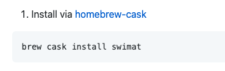
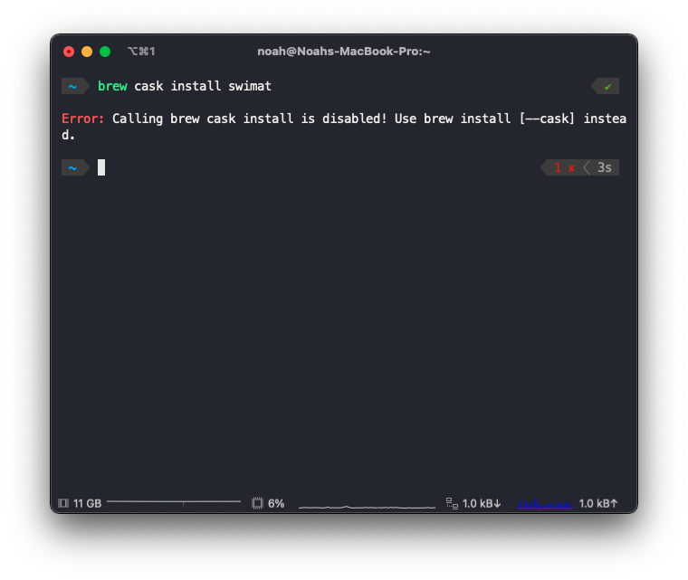
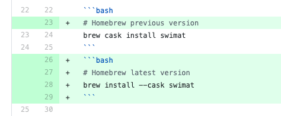
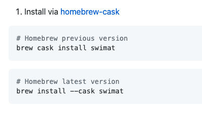
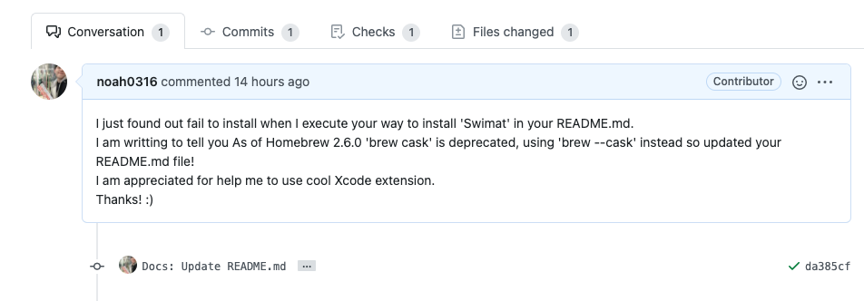
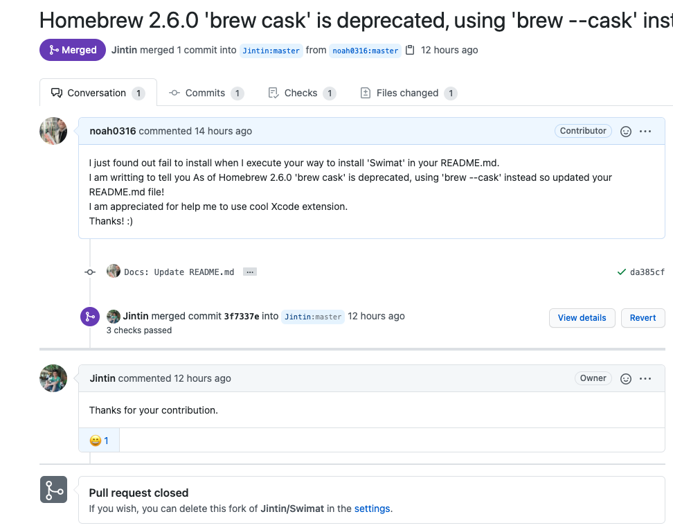

### 안녕하세요 :) Noah입니다.

오늘은 Swift Extension중 Cool한 Extension에 PR을 보내본 이야기를 나눠보려 합니다🤓  
(PR이라고 하기도 부끄럽지만 ㅎㅎ..)

Swift를 공부하기 시작한지 얼마되지 않은 저는 사용할만한 여러 Xcode Extension을 찾아보고 있었습니다.

평소 코드 스타일, Lint에 관심이 많기에 Swift를 처음 공부하기 시작하면서  
스스로 고민하고 어떤 코드가 좋은 코드인지 찾아나가는 과정속에서 **내 마음대로 코드를 짜는** 나쁜 습관을 들이지 않기 위해

[Swift Style Guide](https://github.com/github/swift-style-guide), Style Share 구성원들이  
Swift코드를 이해하기 쉽고 명확하게 작성하기 위한 스타일 가이드인  
[StyleShare/swift-style-guide](https://github.com/StyleShare/swift-style-guide) 를보며 실무에서는 코드 가이드라인이 어떠한지에 대해 알아보고 있습니다.

> StyleShare/swift-style-guide 잘 보고 있습니다. 공유해 주심에 감사드립니다🙇‍♂️  
> 다음번에는 Swift용 linter인 **SwiftLint**에 대해 알아볼 예정입니다.
>
> SwiftLint는 swift 의 코드 스타일을 벗어나거나, 사용자가 설정한 rule 에서 벗어나게 되면  
> 문제점이 있음을 알려주는 기능을 제공하여 일관성 있는 코드를 작성할 수 있게 도움을 주는 도구입니다.

 
다시 본론으로 돌아와서

Xcode Extension을 찾아보던 중 Indent formatting을 지원해주는 확장 프로그램인  
Swimat이라는 프로그램을 보게 되었습니다.
(마치 Vscode Extension인 prettier와 비슷합니다.)

Swimat의 공식 Github의 Star도 1.3k 씩이나 되고 사용하는 사람도 많은 것 같아 사용을 해보기로 했습니다.  
사용을 하기 위해 Swimat의 Github에서 설치방법을 보고, 설치를 하기위해 터미널에 명령어를 쳤는데,

    

    

다음과 같이 `brew cask` install 대신에 `brew install --cask`라는 명령어를 사용하라고 하는 메시지가 출력되었습니다.  
"README를 보고 설치를 했는데 왜 명령어가 사용 불가능하지? Homebrew 명령어에 문제가 있나?" 라는 생각이 들어 (~~당황하지 않고~~)
먼저 Homebrew의 공식 도큐먼트를 보러갔습니다.🧐

> [Homebrew란?](<https://ko.wikipedia.org/wiki/%ED%99%88%EB%B8%8C%EB%A3%A8_(%ED%8C%A8%ED%82%A4%EC%A7%80_%EA%B4%80%EB%A6%AC_%EC%86%8C%ED%94%84%ED%8A%B8%EC%9B%A8%EC%96%B4)>)  
> Homebrew는 macOS용 소프트웨어 패키지 관리 시스템으로써 apple의 macOS 운영 체제의 소프트웨어 설치를 단순하게 만들어줍니다.

[homebrew의 공식 도큐먼트](https://brew.sh/blog/)를 보러가보니  
얼마전인 2020년 12월 21일에 마이너 업데이트가 한번 있었고(Homebrew 2.7.0)  
그보다 전인 2020년 12월 01에 마이너 업데이트가 한번 있었습니다. (Homebrew 2.6.0)

여기서 주의깊게 본 버전은 2.6.0 버전입니다.  
2.6.0 업데이트 내용을 살펴보니 Homebrew 2.6.0 버전에서  
 `brew cask`라는 명령어가 **deprecated** 되어 `brew --cask`로 대체 됨을 알 수 있었습니다.

이를 보고 "아, 아직 Swimat의 README파일이 Update가 되지 않은거구나"  
라는 생각과 함께, 나와 같이 처음 사용해보려고 하는 사용자들이 똑같은 과정을 겪게 되는 수고를 덜기위해  
pull request를 보내 README파일을 update해보기로 마음을 먹었습니다.

    

    

다음과 커밋을 하고 push를 하여 내용을 변경한뒤에,

    

다음과 같은 메시지와 함께 pull request를 보냈고 몇시간 후에
**정말 감사하게도** master(main) 브랜치에 Merge가 되었습니다!!🎉🎉🎉

    

**Merge**가 되고난 후에 Swimat Github 메인 페이지를 보았는데

    

컨트리뷰터에 들어가있는 내 프로필을 보니 왠지 모를 뿌듯함이 ㅎㅎ
지금은 Swift를 시작한지 얼마되지 않아  
README 파일 밖에 contribute하지 못했지만  
실력이 조금 더 쌓인 후에는 코드를 통해 contribute를 하는 그날까지!!

뭔가 오픈소스 프로젝트에 컨트리뷰트 하는게 막연하고 두렵기만 했었는데,  
이번 기회를 통해 다음에 코드를 통해 하게 될 contribute의 발판을 마련하는 좋은 경험을 한 것 같습니다.

> Swimat Github 주소
>
> - https://github.com/Jintin/Swimat
