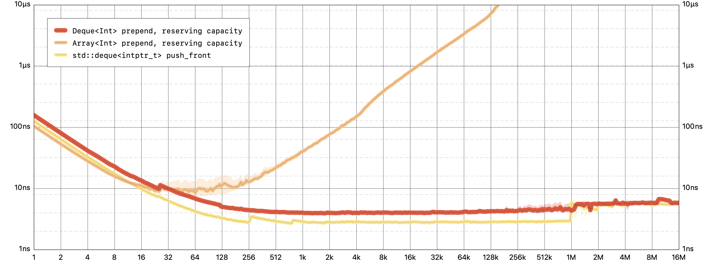

안녕하세요 noah입니다 :)  
오늘은 **Swift 컬렉션 패키지**에 대해 소개해보려 합니다.

요즘 알고리즘 문제 풀이를 하며 Swift에서 제공하는 여러 자료구조에 대해 찾아보던 중

2021년 4월 5일 **Apple**이 공개한 **Swift 컬렉션 패키지**를 알게 되었습니다.

Swift의 공식 blog 글에 따르면 이번에 새로 공개한 Swift 컬렉션 패키지에서는 3가지의 범용 데이터 구조인  
Array, Set 그리고, Dictionary를 위한 새로운 기능을 제공한다고 합니다.

## Deque

**Deque**은("deck"이라고 발음합니다.) 마치 Array처럼 동작합니다.

**Deque**은 **Double ended queue**의 줄임말로 stack이나 queue처럼

한 방향에서 삽입과 삭제가 일어나는 게 아닌 **'양방향'**에서 **삽입**과 **삭제**가 일어나는 구조입니다.

<p align="center">

<center>Benchmark</center>
</p>

**양방향**으로 **삽입**과 **삭제**가 일어나기 때문에  
**Array**보다 **월등히 좋은 성능**을 보임을 그래프를 통해 알 수 있습니다.

> 해당 [benchmarks](https://github.com/apple/swift-collections/tree/main/Documentation/Announcement-benchmarks)는 2017 iMac Pro에서 실행되었고,  
> 모든 그래프는 [log-log](https://darrengwon.tistory.com/789) scale로 평균 처리 시간을 표시한 것이며  
> 낮을수록 좋습니다.

First-in-First-out queue가 필요할 때 deque을 선택하면 효율적으로 데이터를 처리할 수 있을 것입니다.

**deque**의 **사용법**은 다음과 같습니다.

```swift
import Collections

var colors: Deque = ["red", "yellow", "blue"]

colors.prepend("green")
colors.append("orange")
// `colors` is now ["green", "red", "yellow", "blue", "orange"]

colors.popFirst() // "green"
colors.popLast() // "orange"
// `colors` is back to ["red", "yellow", "blue"]
```

앞부분에 item을 삽입/삭제를 할 필요가 없는 상황에서는 Array보다 약간 느리게 작동하므로  
모든 Array를 deque로 대체하는 것은 좋지 않을 수 있습니다.

## OrderedSet

**OrderedSet**은 강력한 **Array**와 **Set**의 **hybrid**입니다.

원래 Set은 순서를 가지지 않으며, 중복 없이 한 번만 저장되어야 하는 데이터들을 다룰 때  
Array 대신 사용했던 자료형입니다.

Hashable 프로토콜을 준수하는 타입은 Set의 element type이 될 수 있습니다.  
(Hash 연산하는 방법을 제공해야 합니다.)

> Swift에서 제공하는 모든 기본 type은 기본적으로 Hash 연산을 할 수 있습니다.

OrderedSet을 이용하면 순서를 가지는 **정렬 된 Set**을 만들 수 있습니다.

역시 Set과 마찬가지로 중복되는 element는 제거됩니다.

사용법은 다음과 같습니다.

```swift
import Collections

let buildingMaterials: OrderedSet = ["straw", "sticks", "bricks"]

for i in 0 ..< buildingMaterials.count {
  print("Little piggie #\(i) built a house of \(buildingMaterials[i])")
}
// Little piggie #0 built a house of straw
// Little piggie #1 built a house of sticks
// Little piggie #2 built a house of bricks
```

기존의 Set은 원래 순서가 없지만, Set의 sort()를 사용하면 정렬된 결과를 반환받을 수 있었습니다.

하지만 **집합 자체에 순서가 부여**되는 것이 아니었기 때문에 이 부분에서

기존의 Set과 다른 의미를 가지는 것 같습니다.

## OrderedDictionary

원래 우리가 기존에 사용하던 Dictionary 역시 순서를 가지지 않았습니다.

**OrdredDictionary**는 요소의 **순서가 중요**하거나,

컬렉션 내의 **다양한 위치**에서 요소에 **효율적으로 접근** 해야 하는 경우에 유용하게 쓰입니다.

기존의 Dictionary와 마찬가지로 Hashable 프로토콜을 준수하는 타입은

OrdredDictionary의 Key가 될 수 있습니다.

사용법은 다음과 같습니다.

```swift
import Collections

let responses: OrderedDictionary = [
  200: "OK",
  403: "Forbidden",
  404: "Not Found",
]

responses[200] // "OK"
responses[500] = "Internal Server Error"

for (code, phrase) in responses {
  print("\(code) (\(phrase))")
}
// 200 (OK)
// 403 (Forbidden)
// 404 (Not Found)
// 500 (Internal Server Error)

```

OrderedDictionary는 정수형 index를 사용하며 첫 번째 요소는 항상 0으로 시작합니다.

key-base와 index-base의 모호성을 피하고자 key-value pair에 대한 random-access를 지원합니다.

```swift
responses[0] // nil (key-based subscript)
responses.elements[0] // (200, "OK") (index-based subscript)
```

## 아...

이 좋은 패키지는 Swift에 내장되어있는 것이 아닌,

Swift Package Manager를 통해 설치한 다음 import를 하는 과정을 거쳐야 하므로

**알고리즘 테스트**에서는 사용하지 못할 것 같습니다🥺🥺

Swift에 내장되는 날을 기다리며..🥳

여기까지 2021년 4월 5일 **Apple**이 공개한 **Swift 컬렉션 패키지**에 대해 간략하게 알아보았습니다!

혹시 제가 잘못 알고 있는 부분이 있거나, 오타 혹은 궁금한 점 있으시면 댓글로 알려주시면 감사하겠습니다!!😎

> 참고
>
> - [Introducing Swift Collections](https://swift.org/blog/swift-collections/)
