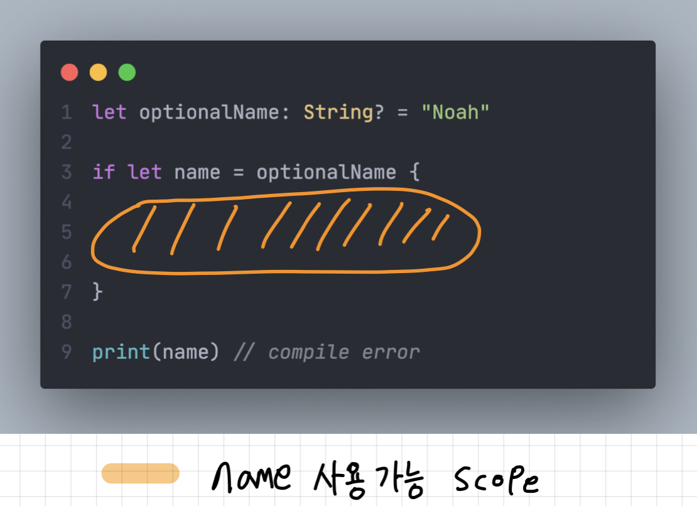
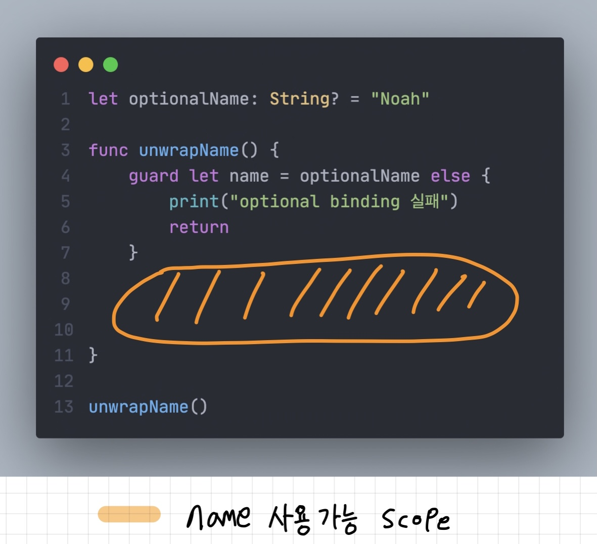

안녕하세요 Noah입니다 :)

날이 아주 덥습니다 여러분~! ⛱☀️

건강 유의하셔서 즐코딩하세요 ㅎㅎ🍉

오늘은 **if문**을 이용한 **Optional Binding**과  
**guard문**을 이용한 **Optional Binding**에 대해 알아보도록 하겠습니다.

**Optional type**의 값을 안전하게 가져오기 위해서는 **Optional Binding**을 해주어야합니다.

먼저 if문을 사용해 Optional Binding을 하는 방법을 보도록 하겠습니다.

#### if문을 이용한 Optional Binding

---

```swift
let optionalName: String? = "Noah"

if let name = optionalName {
    print(name)
}

print(name) // compile error
```

상수 `name`에 값을 담기 위해 먼저 `optionalName`의 값을 **평가**합니다.

만약 `optionalName`에 값이 **존재**한다면(nil이 아니라면)

상수 `name`에 `optionalName`에 담긴 값인 `Optional("Noah")`가 언래핑되어

`"Noah"`가 `name` 상수에 대입되고 true가 return 됩니다.

`optionalName`에 값이 **존재하지 않는다면**(nil 이라면) `false`가 return되어

if문 이후로 **제어가 전달**됩니다.

마지막줄에서 name의 값을 읽어오려하는데, `compile error`가 발생합니다.

`error`메시지는 다음과 같습니다.

`Cannot find 'name' in scope`

<p align="center">

</p>

**if문**을 사용해 **Optional Binding**을 진행한 상수 혹은 변수는 **if문 내부**에서만 사용가능합니다.

다시 말해 **if문의 내부 scope**에서만 사용이 가능합니다.

다음으로 **guard문**을 사용해 **Optional Binding**을 하는 방법을 살펴보도록 하겠습니다.

#### guard문을 이용한 Optional Binding

---

```swift
let optionalName: String? = "Noah"

func unwrapName() {
    guard let name = optionalName else {
        print("optional binding 실패")
        return
    }
    print(name)
}

unwrapName()
```

다른 프로그래밍 언어를 보다 **Swift**의 **guard문**을 보면 생소할 수 있습니다. (~~제가 그랬습니다 ㅎㅎ~~)

**guard문**은 **early exit**이라는 **특성**을 가지고 있습니다.

#### early exit이란?

원하는 조건을 만족하지 않으면 이후의 코드를 실행하지 않고 종료를 시켜버림을 의미합니다.

guard문의 조건을 만족하지 않는다면 **guard문**이 선언된 **해당 Scope**를 **벗어나**  
같은 **Scope**의 이후 코드를 실행하지 않습니다.

따라서 **guard문**의 **else block**은 절대 **생략할 수 없으며**,  
**else block**에는 **해당 Scope를 벗어나기 위한** `return`, `continue`, `break`, `throw`등의 구문이 반드시 포함되어야합니다.

위와 같은 특성때문에 **guard문**은 **함수나 메소드**와 같이 **local scope**를 갖는 곳에서 사용합니다.

<p align="center">

</p>

**guard문**으로 **Optional Binding**한 값은

**guard문**이 선언된 **scope내부** 임과 동시에, **guard문**이 실행된 이후의 **scope내**에서 사용이 가능합니다.

또한 **guard문**의 **else block**에서는 **Optional Binding**한 값을 사용할 수 없습니다.

**else block**으로 제어가 넘어왔을 때는 **Optional Binding**에 실패했기 때문입니다☝️

### Summary

---

**if문**을 이용한 **Optional Binding**은 성공적으로 상수에 nil이 아닌 값을 전달했다면

해당 값을 **if문 내부**에서 **local 상수**로 사용합니다.

만약 상수에 nil을 전달했다면 **if문 이후로 제어가 전달**되어 if문 이후의 code를 진행할 수 있습니다.

**guard문**을 이용한 **Optional Binding**은 성공적으로 상수에 nil이 아닌 값을 전달했다면

**guard문**이 선언된 **scope**임과 동시에 **guard문**이  
실행된 이후의**scope**내에서 해당 상수를 사용할 수 있습니다.

만약 상수에 nil을 전달했다면 무조건 해당 scope를 벗어납니다.

따라서 **둘의 차이를 구분**하여 상황에 맞는 **Optional Binding**을 이용해 **Optional type**의 값의 **unwrapping**을 진행하면 될 것 같습니다.

또한 binding한 값을 변경해야한다면 let 키워드를 var키워드로 교체해주시면 됩니다😄

여기까지 **if문**을 이용한 **Optional Binding**과  
**guard문**을 이용한 **Optional Binding**에 대해 알아보았습니다.

혹시 제가 잘못 알고 있는 부분이 있거나, 오타 혹은 궁금한 점 있으시면 댓글로 알려주시면 감사하겠습니다!!😎

> 참고
>
> - [docs.swift.org](https://docs.swift.org/swift-book/ReferenceManual/Statements.html#grammar_guard-statement)
