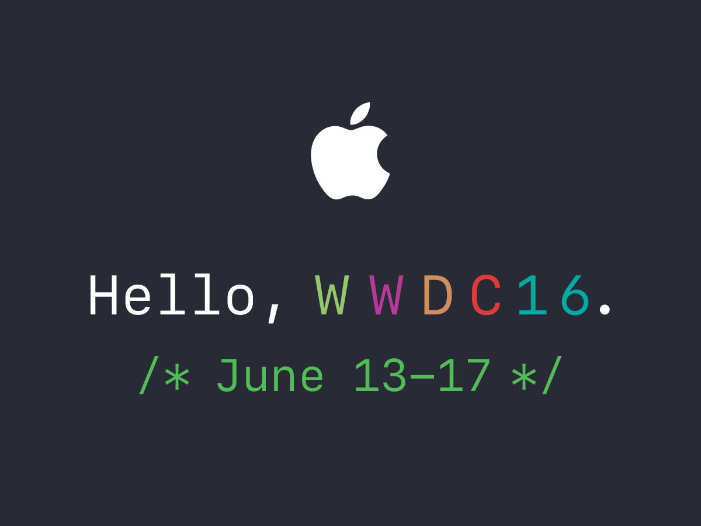
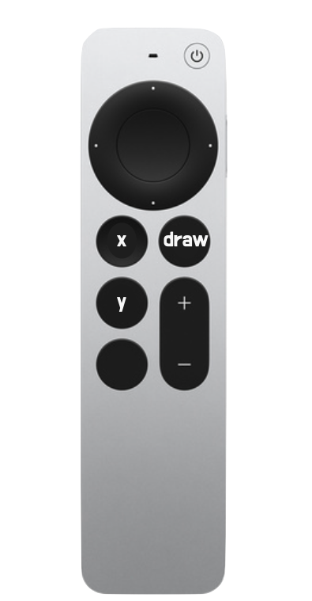
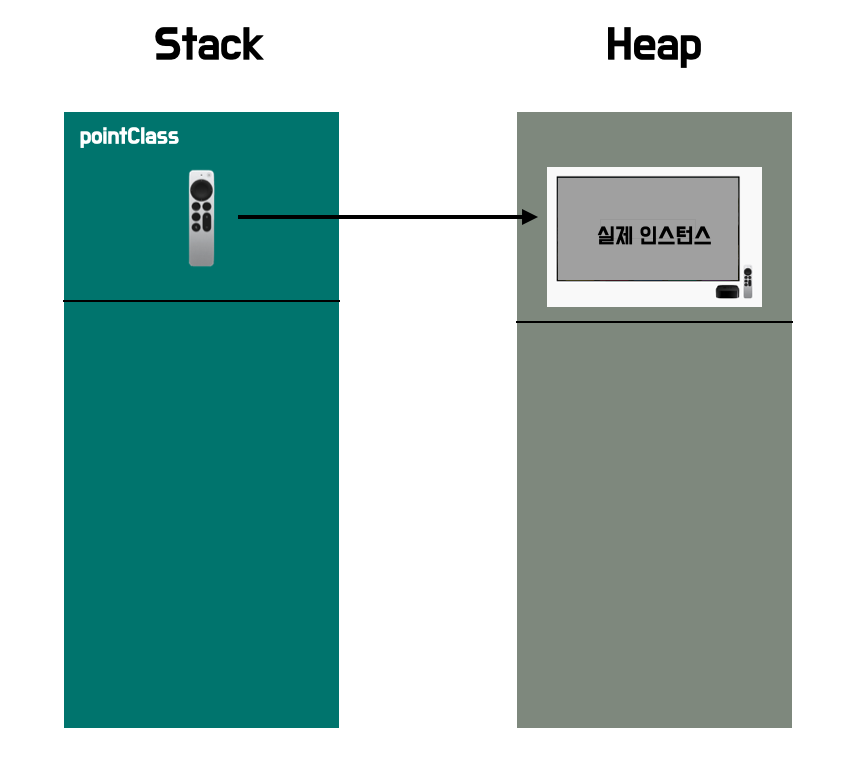
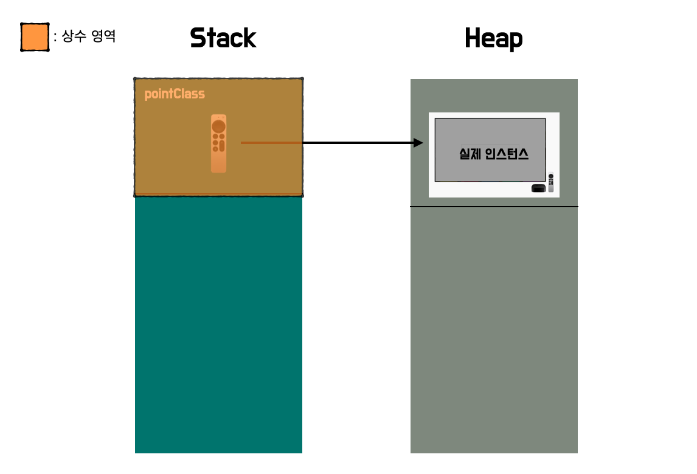
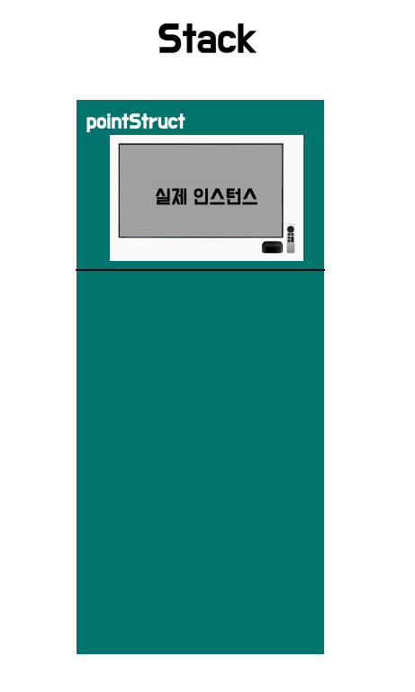
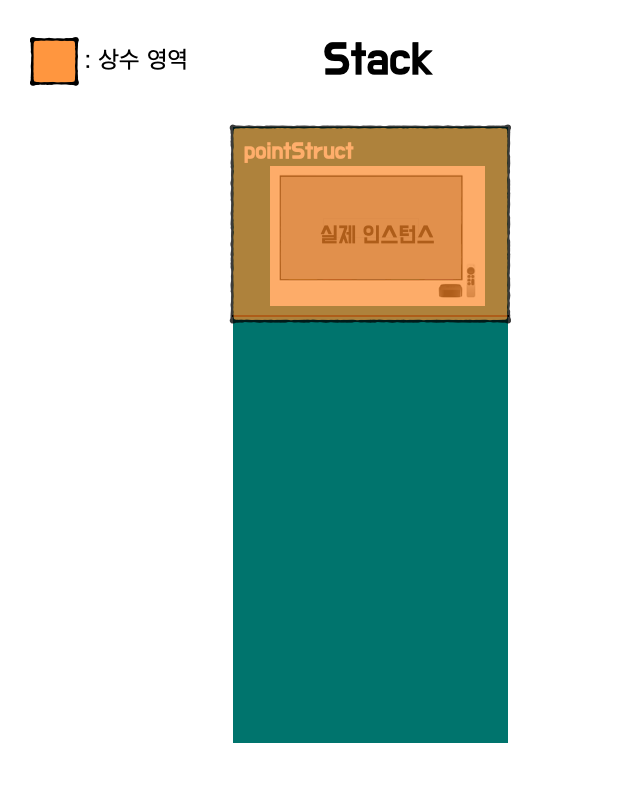

안녕하세요 Noah입니다 :)

오늘은 문법 공부를 하며 궁금증을 해소하기 위해 찾아보았던 내용을 주제로 풀어볼 예정입니다.

먼저 궁금점의 시작은 다음과 같았습니다.

```swift
struct PointStruct {
	var x = 0
	var y = 0

  func draw() {
    // draw
  }
}

class PointClass {
	var x = 0
	let y = 0

  func draw() {
    // draw
  }
}

let pointStruct = PointStruct()
let pointClass = PointClass()

pointStruct.x = 1 // Compile Error
pointStruct.y = 1 // Compile Error

pointClass.x = 1
pointClass.y = 1 // Compile Error
```

**구조체**의 **initializer**로 생성한 **인스턴스**는 **인스턴스**가 **let(상수)**으로 선언이 되어 있으면,

**인스턴스**의 **속성**이 **가변 속성(var)**으로 되어있어도 변하지 않는것 이었습니다.

반면 **Class**의 **initializer**로 생성한 **인스턴스**는 **인스턴스**의 속성에 따라  
불변(read-only), 가변이 결정되었습니다.

궁금증을 해소하고, 구조체를 let으로 선언한 **상수**에 인스턴스를 담으면  
속성이 **변수**로 선언되어있어도 바꿀 수 없구나~~ 식의 암기보다는!!

**Class**와 **구조체**가 **Swift**에서는 어떻게 기본 구현이 되어 있으며,

개념적인 이해를 확실히 하고 싶어



<br/>

[WWDC 2016 Understanding Swift Performance](https://developer.apple.com/videos/play/wwdc2016/416/)를 보며 정리해보았습니다.

<br/>

> - 정리된 내용 중에는 이해를 돕기 위한 (~~직접 만든~~) 그림과 설명이 들어있으며, 이는 제 개인적인 생각과 견해도 들어가 있음을 알립니다!
> - 또 heap, stack, OS에 대한 기본지식이 있다는 가정하에 설명을 진행하겠습니다!

자세한 정리내용은 다음 포스트에서 다룰 예정이며,  
이번에는 궁금증 해소를 위한 기본 개념을 나누어보도록 하겠습니다!

## Class

먼저 **Class**의 **인스턴스**가 생성되면 어디에 할당될까요?

```swift
class PointClass {
	var x = 0
  var y = 0

  func draw() {
    // draw
  }
}

let pointClass = PointClass()
```

답부터 말하자면, **Class**는 **Reference Type**으로 **인스턴스**는 **heap**에 할당됩니다.

먼저 **Stack**이라는 공간에  
**heap**에 할당될 **인스턴스**를 **참조하는 상수**를 담기 위한

**pointClass**에 대한 메모리 할당이 진행됩니다.

그리고 참조대상이 되는 **인스턴스**는 **heap**에 할당됩니다.

**PointClass**의 **인스턴스**를 생성할 때 **Swift**는 **heap**을 **lock**하고, 사용하지 않는 블록을 찾아

**heap**에 **인스턴스**를 할당하는데요,

> **heap**을 **lock** 하는 이유는 여러 스레드가 **동시**에 **heap**에 메모리를 할당할 수 있기 때문에  
> **Swift**는 **heap**을 **lock**하고 **동기화 메커니즘**을 이용해 **무결성**을 보장합니다.

<br/>


**참조**하는 변수? **참조?** 라는 개념이 생소하신 분들을 위해 조금 더 쉽게 설명해보도록 하겠습니다.

우리가 TV를 이용할 때 **리모컨**을 이용해 **조작**하죠? (~~버튼만 사용해 조작하시는 분들은 존경합니다...~~)

여기서 **리모컨**은 **참조**를 하는 **참조변수**와 같고, 우리가 실제 조작하고 싶은

**참조 대상**이 되는 **인스턴스**는 **TV**와 같습니다.

위의 **pointClass**를 **리모컨**으로 만들어보면 아래와 같겠네요!!

```swift
class PointClass {
	var x = 0
  var y = 0

  func draw() {
    // draw
  }
}

let pointClass = PointClass()
```

<p align="center">

</p>

#### ~~apple TV 리모컨 멋있다..~~

실제 참조 대상이 되는 **인스턴스**는 **TV**가 되고 말이죠 인스턴스의 내부는  
**WWDC 정리 포스트**에서 다루도록 하겠습니다.

우리가 조작하려는 실제 대상! 정도로만 기억해주세요!

<p align="center">

</p>

참조변수인 **리모콘(pointClass)**는 **Stack**에 할당되고,

실제 인스턴스인 **TV**는 **Heap**에 **할당**된다고 아까 우리 봤었죠?

이를 그림으로 나타내면 다음과 같습니다!

<p align="center">

</p>

우리가 **리모콘**으로 **TV**를 조작하듯, **pointClass상수**로 실제 **인스턴스**를 조작이 가능한 것입니다.

여기서 **주의**할 점은 **pointClass**는 변수가 아닌 **상수**입니다!

**pointClass**는 **상수**라고 했으니, **pointClass**는 변할 수 없겠죠?

<p align="center">

</p>

이해를 돕기 위해 표시하지 않았던 상수 영역을 추가해보았습니다!

자 여기까지 보았으니, 구조체는 어떻게 인스턴스가 생성이 되는지 확인해볼까요?

## 구조체(Struct)

**구조체**의 **인스턴스**는 어디에 할당될까요?

```swift
struct PointStruct {
	var x = 0
	var y = 0

  func draw() {
    // draw
  }
}

let pointStruct = PointStruct()
```

**구조체**는 **Value Type**으로 **구조체**의 **인스턴스**는 **Stack**에 할당됩니다.

**Stack** 메모리 공간에 **pointStruct 인스턴스**에 대한 공간이 할당된 후에,

**initializer**를 통해 **Stack** 메모리 공간에 할당되어있는 메모리를 **초기화**합니다.

그림을 보면 다음과 같겠네요~!!

<p align="center">

</p>

자 이번에도 우리는 **pointStruct**를 **상수**로 선언했었죠??

다시 상수 영역을 표시해볼까요?

<p align="center">

</p>

그림을 통해 실제 **인스턴스**가 담겨있는 **Stack**이 **상수 영역**인걸 확인할 수 있네요 :)


아, 그러면 뭔가 머리를 스쳐 지나가지 않나요?

자 이제 **Class**와 **Struct** 의 그림을 같이 봅시다!

## Class & Struct

<p align="center">

</p>

**Class**는 실제 **인스턴스**를 참조 상수로 **참조**하고 있죠??

실제 **인스턴스**가 상수 영역에 포함되어있는 것은 아닙니다.

따라서 다음과 같은 코드 진행이 가능합니다.

```swift
class PointClass {
	var x = 0
	let y = 0

  func draw() {
    // draw
  }
}

let pointClass = PointClass()

pointClass.x = 1
pointClass.y = 1 // Compile Error
```

마지막 줄에서 컴파일 에러가 발생하는 것을 확인할 수 있는데요,

이는 실제 **인스턴스**를 생성할 때 **인스턴스**의 속성인 y가 상수로 선언되어있기 때문입니다!

이처럼 **Class**가 선언된 **속성**에 따라 참조변수, 참조상수에 상관없이

**인스턴스**의 값을 **인스턴스**의 **속성**이  
어떻게 **선언**되어있느냐에 따라 컨트롤이 가능합니다.

<p align="center">

</p>

**Struct** 는 위에 보이는 것처럼 실제 **인스턴스**가 **Stack** 영역에 있습니다.

또한 **pointStruct**를 상수로 선언했기 때문에  
실제 **인스턴스**가 상수 영역에 있어 값을 바꾸지 못합니다.

따라서 다음과 같은 코드에서 컴파일 에러가 발생했던 것입니다.

```swift
struct PointStruct {
	var x = 0
	var y = 0

  func draw() {
    // draw
  }
}

let pointStruct = PointStruct()

pointStruct.x = 1 // Compile Error
pointStruct.y = 1 // Compile Error
```

**인스턴스**가 있는 **Stack** 영역이 값을 바꾸지 못하는 영역으로 되어있기 때문에

**구조체**의 **속성**이 변할 수 있는 변수로 선언되어있다고 하더라도

영역 자체가 값을 바꾸지 못하는 영역이기 때문에

**Compile time**에 **Error**를 내뿜고 있는 것입니다.

여기까지 잘 이해 가셨나요?? 정리해보도록 하겠습니다 😃

## Summary

- **Class**의 **인스턴스**는 **Heap**에 할당되고, **참조**하는 변수 OR 상수는 **Stack**에 할당된다.
- **구조체** **인스턴스**는 **Stack**에 할당된다.
- **Class** **인스턴스**의 **참조**를 담는 공간이 상수로 선언되었다고 하더라도  
  실제 **인스턴스**는
  **Heap**에 있기 때문에 **참조** 상수를 통해  
  **Class**의 **속성**이 어떻게 선언되었는지에 따라 값 변경이 가능하다.
- **구조체**는 **인스턴스**가 **Stack**에 할당되기 때문에 **상수**로 선언했다면  
  해당 **Stack** 영역이 값을 바꿀 수 없는 영역이 되기 때문에 **구조체**의 속성이 **변수**라도 값을 변경하지 못한다.

---

자, 이제 맨 처음 보았던 코드가 왜 컴파일 에러가 발생했었는지 잘 이해가시나요?

충분히 이해가 가셨길 바라면서  
다음번에는 [WWDC 2016 Understanding Swift Performance](https://developer.apple.com/videos/play/wwdc2016/416/) 정리 포스트로

돌아오도록 하겠습니다 :)

혹시 제가 잘못 알고 있는 부분이 있거나, 오타 혹은 궁금한 점 있으시면 댓글로 알려주시면 감사하겠습니다!!😎

> 참고
>
> - [Understanding Swift Performance](https://developer.apple.com/videos/play/wwdc2016/416/)
