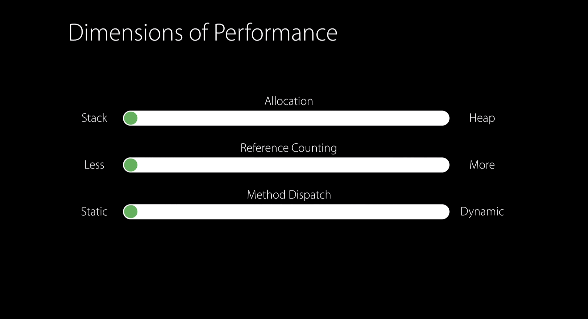

안녕하세요 Noah입니다 :)

좋은 개발자는 좋은 코드를 짜야 할 것입니다.

제가 생각하는 좋은 코드란, 팀원들이 보기에 좋은 코드를 작성하고, 안정적이고 속도가 빠른 코드를 작성해

결과적으로 앱을 사용하는 사용자에게 좋은 경험을 안겨주는 것이 좋은 코드라고 생각합니다.

이번 시간에는 좋은 코드를 작성하기 위한 초석으로 Swift 성능 이해하기라는 제목으로 알아봅시다!!

이번 편에서는 struct와 class에 대해서 다뤄보며, 클래스와 구조체가 Swift에서는 어떻게 기본 구현이 되어 있는지,

[WWDC 2016 Understanding Swift Performance](https://developer.apple.com/videos/play/wwdc2016/416/)를 보며 개념적인 이해를 확실히 해보도록 하겠습니다.

## Understanding Swift Performance

<p align="center">

</p>

성능을 고려하여 코드를 작성한다면 위에서 말한 좋은 코드를 작성할 수 있을 것입니다.

Swift의 추상화 메커니즘이(Struct, Class, enum, inheritance, generics, protocols 등등...

오늘 살펴볼 것은 Struct, Class) 성능에 미치는 영향을 이해하는 가장 좋은 방법은 기본 구현을 이해하는 것입니다.

이러한 기본 구현을 이해하기 위해 구조체와 클래스를 사용하는 코드를 따라가 보며 오버헤드와 관련된 내용을 자세하게 알아보며

배운 내용을 적용하여 Swift 코드를 정리하고, 속도를 높이는 방법을 살펴봅시다.

추상화를 구축하거나, 추상화 메커니즘 옵션을 평가할 때 우리는 다음과 같은 3가지를 고려해야 합니다.

Swift에서 추상화 메커니즘을 사용할 때 성능에 영향을 주는 3가지 요소는 다음과 같습니다.

1. 나의 인스턴스가 stack에 할당될까 아니면 heap에 할당될까?

2. 이 인스턴스를 전달할 때 얼마나 많은 참조 카운트 오버헤드가 발생할까?

3. 인스턴스에서 메소드를 호출할 때, 그게 static dispatch를 통해 일어나는지 혹은 dynamic dispatch가 일어날까?

<p align="center">

</p>
이를 다시 간단히 나열해보면 다음과 같습니다.

1. Allocation
2. Reference Counting
3. Method Dispatch

<p align="center">

</p>

컴퓨터 과학에서 trade-off란(물론 일상에서도), 일반적으로 한쪽의 성능을 높이면, 다른 쪽의 성능은 떨어지는 방향으로 흐르는 것을 얘기합니다.

따라서 우리는 좋은 성능을 내는 Swift Code를 작성하기 위해 성능에 영향을 주는 이 3가지 영역을 올바르게 이해하고,

이 세 가지 영역에서 각각의 영역의 성능을 비교해 가면서 최적의 타협점을 찾기 위해 각 영역이 어떻게 trade

되는지 살펴봅시다.

위에 나열된 allocation부터 시작해서 이러한 각 영역을 한 번에 하나씩 살펴봅시다!

# allocation

Swift는 C와 같은 Unmanaged Language와는 다르게 사용자 대신 메모리를 자동으로 할당하고 해제해주는 Managed Language입니다. (ARC가 있죠 ㅎㅎ)

Swift에서 메모리 중 일부는 스택에 할당되기도 합니다.

스택은 Last In First Out 구조를 가진 간단한 자료구조입니다.

stack의 최상단에 push하거나 stack의 최상단을 pop을 할 수도 있습니다.

stack은 stack의 최상단에만 add 또는 Remove만 가능하기 때문에 stack 끝에 pointer를 유지함으로써 push, pop을 하는 스택을 구현할 수 있습니다. 따라서 우리는 stack의 최상단에 있는 pointer를 stack pointer라고 부릅니다.

함수를 호출할 때 stack pointer를 감소시켜 필요한 메모리를 할당하고,

함수 실행이 다 끝나면 stack pointer를 함수를 호출했던 곳으로 다시 증가시켜 메모리를 간단하게 해제합니다.

stack의 메모리 할당은 정말 빠른데요,

stack의 할당은 말 그대로 integer를 할당하는 정도의 비용만 지불하면 됩니다.

여기서 기억해야 할 것은 stack의 메모리 할당은 빠르다는 것입니다!!

<p align="center">

</p>

stack과 대조적으로 heap이라는 자료구조가 있습니다.

heap은 stack보다는 더 Dynamic 하지만, 효율은 stack보다 좋지 않습니다.

stack은 dynamic lifetime을 가진 메모리를 할당할 수 없었습니다.

하지만 heap은 dynamic lifetime을 가진 메모리를 할당할 수 있습니다.

> dynamic lifetime이란, 사용자에 의해 동적으로 객체의 lifetime이 결정되는 것을 말합니다.

따라서 heap은 stack보다 더 복잡한 구조로 되어 있습니다.

heap에 메모리를 할당하려면 heap은 stack보다 dynamic 한 할당 방법을 사용하는데,

heap 영역에서 사용하지 않은 블록을 찾아서 메모리 할당을 진행합니다.

또한 사용이 끝났다면 해제를 해줘야 하는데요,

해제를 하려면 해당 메모리를 적절한 위치에 다시 re-insert 해줘야 합니다.

검색하고, 다시 삽입하고 딱 봐도 stack보다 복잡하지요??

**하지만 방금 살펴본 것들은 heap 할당과 관련된 주요 cost가 아닙니다.**

주요 cost는 다음과 같습니다.

여러쓰레드에서 동시에 heap에 메모리를 할당할 수 있기 때문에 locking 또는 동기화 메커니즘을 이용해
Thread-Safe하게 무결성을 보호해야합니다.

이게 heap에서 드는 가장 큰 비용입니다.

코드를 작성할 때 메모리를 할당하는 장소에 조금만 더 신중을 기하면 성능을 드라마틱하게 향상할 수 있습니다.

코드를 보며 Swift가 우리를 대신에 무엇을 하는지 살펴봅시다!

<p align="center">

</p>

struct `Point`는 x와 y라는 stored property를 가지고 있으며, draw라는 method를 가지고 있습니다.

우리는 `(x: 0, y: 0)`을가지는 `Point` 인스턴스를 생성해서 `point1`에 할당하고,

`point1`에 있는 값을 `point2`에 복사한 뒤에,

`point2.x`에 5를 할당하고 `point1`과 `point2`를 사용해봅시다.

<p align="center">

</p>

지금 하이라이트 된 공간에 들어가면 어떠한 코드를 실행하기 전에

stack 메모리 공간에 `point1`과 `point2` 인스턴스에 대한 공간이 stack에 할당됩니다.

또한 `Point`는 struct이기 때문에 x, y는 stack의 line에 저장됩니다.

<p align="center">

</p>

`Point(x: 0, y: 0)`인 인스턴스를 만들 때는  stack에 우리가 위에서 할당한 메모리를 초기화 하는 것뿐입니다.

다음으로 `point2`에 `point1`을 할당할 때는 `point1`에 대한 복사본을 만들고

이미 스택에 할당한 메모리를 다시 초기화(`point2`를 의미)하는 것 뿐입니다.

여기서 기억해야할 것은 `point1`과 `point2`는 서로 독립적인 인스턴스임을 기억해야합니다.

<p align="center">

</p>

이 말인즉슨 `point2.x`에 `5`를 할당하면 `point2.x` 는 5이지만, `point1.x`는 여전히 `0`이라는 말입니다.

이는 Value Semantics로 알려져 있습니다.

> 프로그래밍 언어에서 Semantics란 의미에 대한 규칙, 구조를 뜻합니다.

<p align="center">

</p>

그리고, `point1`, `point2`를 사용하면 함수의 실행이 완료됩니다.

우리가 함수에 진입했을 때의 위치로 함수 포인터를 증가시키면 `point1`과 `point2`를 간단하게 해제할 수 있습니다.

<p align="center">

</p>

위와 완벽히 같은 코드를 struct 대신에 class를 사용해보도록 하겠습니다.

<p align="center">

</p>
function에 진입했을 때 우리는 이전처럼 stack에 메모리를 할당합니다.

코드를 실행하기 전에, 이미 stack에 `point1`과 `point2`에 대한 메모리 할당이 됩니다.

하지만 아까처럼 stack의 line에 point의 프로퍼티를 실제로 저장하는 스토리지 대신에,

`point1`과 `point2`를 참조하는 메모리를 할당합니다.

> 이에 대한 더 자세한 설명은 [관련 포스트](https://noah0316.github.io/Swift/2021-09-01-swift-class,-struct%EB%8A%94-%EC%96%B4%EB%94%94%EC%97%90-%EC%A0%80%EC%9E%A5%EB%90%A0%EA%B9%8C/)를 참조하시면 이해에 더 도움이 되실 겁니다!

참조할 메모리는 heap에 할당합니다.

<p align="center">

</p>

`Point(x: 0, y: 0)`를 생성할 때 Swift는 heap을 lock 하고, 사용하기 적합한 사이즈의 unused block을 찾습니다.(검색합니다.)

<p align="center">

</p>
사용하기 적합한 사이즈의 unused block을 찾았다면 heap에 있는 메모리의 x를 0으로, y를 0으로 초기화합니다.

이 초기화 진행과정은 heap에 있는 메모리의 주소를 가지고 해당 메모리를 참조하여 초기화를 진행합니다.

우리가 heap에 할당할 때 Swift는 실제로 point class를 저장할 때 4 Word의 크기를 할당합니다.

> word하나에 변수 한 개를 저장할 수 있습니다.
> word란 특정 프로세서가 자연스럽게 처리할 수 있는 데이터의 크기를 말합니다.
> 64비트 프로세서라고 했을 때는 64비트가 word의 크기입니다.

이는 struct를 이용해 할당했을 때 stack에 2 word만 할당했던 것과 대조됩니다.

이는 point가 현재는 `class`이고 x와 y를 저장하는 것 이외에 추가적으로 두 개의 `word`를 할당하는데요 Swift가 우리 대신에 메모리를 관리하기 위해 사용하기 때문입니다.

이 부분은 heap diagram에서 파란색으로 표기되어있습니다.

<p align="center">

</p>

`point1`을 `point2`에 할당할 때

`point1`이 `struct`일 때처럼 `point1`의 contents를 복사하는 대신, `point1`의 인스턴스에 대한 참조를 복사합니다.

이제 `point1`과 `point2`는 실제로 heap에 있는 point 인스턴스를 완벽히 똑같이 가리킵니다.

이 말인즉슨 우리가 `point2.x`에 `5`를 할당하면 `point1.x`와 `point2.x`의 값은 동일하게 `5`라는 얘기입니다.

이는 reference semantics라고 알려져 있으며,

이는 의도하지 않아도 같은 상태를 공유하게 됩니다.

<p align="center">

</p>

이곳에서도 역시 point1, point2를 사용해 함수의 실행이 완료됩니다.

실행이 완료되면 Swift는 우리를 대신해 heap을 lock 하고, 메모리를 해제해 다시 사용하지 않는 블록으로 돌려놓은 뒤에 적절한 위치로 다시 re-insert 합니다.

<p align="center">

</p>

이 과정을 완료한 뒤에 이제 stack을 pop 하여 함수에 진입했을 때의 위치로 함수 포인터를 증가시켜 `point1`과 `point2`에 대한 메모리를 해제할 수 있습니다.

자.. 우리가 지금 struct, class의 메모리 할당을 봤는데요,

<p align="center">

</p>

struct를 이용해 인스턴스를 생성했을 때보다 class를 이용할 때 도 많은 일들이 일어나는 것을 살펴보았습니다.

이는 class가 heap할당을 필요로 하기 때문에 class가 struct보다 구성하는데 더 많은 비용, cost가 든다는 것을 알게 되었습니다.

class는 reference semantics를 갖고 있기 때문에 heap에 할당하고, 또한 클래스는 ID, 간접 저장(indeirect storage)과 같은 강력한 특성을 가지고 있습니다.

그러나 우리가 추상화를 이용하려고 할 때 이러한 특성을 필요하지 않는다면 struct를 사용하는 게 더 좋습니다.

struct는 class처럼 의도적이지 않게 상태를 공유하지 않아 이러한 부분에서 취약하지 않습니다.

따라서 이를 적용해 Swift 코드의 성능을 향상하는 방법을 살펴보도록 하겠습니다.

WWDC에서는 메시징 앱의 코드를 예를 들어 한 가지 더 예를 들어줬는데요,

<p align="center">

</p>

이는 뷰 레이어의 코드이며,

<p align="center">

</p>

우리가 원하는 함수의 기능은 사용자들이 메시지를 보내면, 문자 뒤에 풍선 이미지를 그려주는 것이라고 가정해보겠습니다.

makeBallon function은 위에 있는 풍선 이미지를 만들고, 다른 풍선들 사이의 공간을 설정하는 것을 돕습니다.

예를 들어 이 풍선은 blue color이고, right 방향에 꼬리(tail)를 가진 풍선입니다.

<p align="center">

</p>

또한 이 풍선은 gray color이고, left 방향에 bubble tail을 가진 풍선입니다.

makeBallon function은 매우 빨리 실행되어야 합니다.

왜냐면 이 함수를 사용자가 스크롤을 하며 자주자주 호출한다고 가정할 것 이기 때문입니다.

<p align="center">

</p>

그래서 caching layer를 추가해주었는데요,

<p align="center">

</p>

코드에서 `cache`는 `String`이 `key`이고, `UIImage` 가 `value` 인 dictionary로 되어있습니다.

dictionary는 키의 중복이 없다는 특징이 있습니다.

즉, 한번 설정이 키로 주어지면 같은 설정을 가진 `key`에 대해서는 여러 번 동일한 `UIImage`를 생성할 필요 없이

`cache`라는 dictionary에서 꺼내 사용하면 됩니다.

이와 같은 방법으로 `makeBallon` function의 속도의 향상을 바랐는데요,

이 방법은 그다지 안전한 방법이 아닙니다.

`String`에는 어떠한 문자열이 올지 예측할 수 없기 때문에 (오타가 들어갈 가능성을 배제해서는 안 되겠죠?)

따라서 `String`은 key를 위한 안전한 타입이 아닙니다.

또한 `String`은 heap에 간접적으로 `Character` 들을 저장합니다.

이 말인즉슨 우리가 cache라는 딕셔너리를 만들었지만, cache가 hit 되어도 heap할당이 발생해 앞에서 살펴봤던 heap할당에서 발생하는 여러 비용을 지불해야 합니다.

이를 어떻게 개선할 수 있을까요?

<p align="center">

</p>
우리는 key에 String 을 사용하는 것 대신 struct를 사용해 color, orientation, tail에 대한 설정을 할 수 있습니다.

이는 `String`을 사용해 설정을 나타내는 것보다 조금 더 안전한 방법입니다.

왜냐하면 Swift에서 구조체는 First class types이며 위의 사진처럼 우리가 만든 딕셔너리에서 key로 사용될 수 있습니다.

> First class Types에 관한 내용이 궁금하시다면 다음 [관련 포스트](https://noah0316.github.io/Swift/2021-02-09-swift%EC%9D%98-%ED%95%A8%EC%88%98%EB%8A%94-%EC%9D%BC%EA%B8%89%ED%95%A8%EC%88%98%EC%9D%B8%EA%B0%80/)를 참고해주세요!

<p align="center">

</p>

Attributes라는 struct에 Hashable 프로토콜을 채용하여 dictionary의 key가 될 수 있도록 하여 cache dictionary의 key타입으로 사용합니다.

이제 우리가 `makeBallon` function을 호출했을 때 cache hit이 발생한다면, 더 이상 allocation overhead(할당으로 인한 오버헤드)는 없을 것입니다.

왜냐면 `struct`는 heap할당을 필요로 하지 않기 때문입니다.

그리고 `String`때와 달리, 오타와 같이 다른 키가 입력되어 발생하는 위험부담도 사라지게 됐네요~!

이는 `String`을  key로 사용했던 것과 달리 훨씬 안전하고, 훨씬 더 빨리 결과를 가져다줄 것입니다.

자, 우리는 여기까지 Allocation에 대한 내용을 다뤄보았습니다.

이제 성능에 영향을 미치는 두 번째 요소를 알아볼 것인데요 바로 Reference Counting입니다.

## Reference Counting

위에서 heap에 할당이 이뤄지는 과정을 살펴보면서 얘기하지 않았던 부분인데요, 이제 한번 살펴봅시다.

Q. “Swift는 어떻게 안전하게 heap에 할당되어있는 메모리를 해제해야 하는 시점을 알아차릴까요?”

A. “Swift는 heap에 있는 인스턴스에 대한 총 Reference Count를 가지고 있습니다.”

또한 인스턴스 안에 자신에 대한 Reference Count를 유지합니다.

Reference를 추가하거나, Reference를 삭제하면 Reference Count는 이에 따라 증가하고, 감소합니다.

Count의 수가 0이 된다면 Swift는 아무도 heap에 있는 해당 인스턴스를 가리키고 있지 않다고 판단하고,

메모리를 할당 해제(deallocate) 하기에 안전하다고 판단합니다.

Reference Counting에서 명심해야 하는 점은 단순히 +1. -1 하는 것 이상으로 참조 카운팅은 매우 빈번하게 수행됩니다.

<p align="center">

</p>

Reference Counting은 단순히 정수를 증가하고 감소하는 것보다 간접적이고 복잡한 몇 가지 단계를 거칩니다.

heap에 할당하는 것과 마찬가지로 Reference가 추가되고 삭제되는 것은 여러 스레드에서 동시에 heap에 있는 동일한 instance에 접근할 수 있기 때문에 우리는 원자적으로 Reference Count의 감소와 증가를 진행해야 합니다.

> 원자성에 대한 예는 다음과 같습니다.

> 항공 티켓 주문이 원자성의 한 예다. 티켓은 반드시 지불과 예약이 동시에 되거나 아니면 모두 되지 않아야 한다. 성공적으로 지불은 되었으나 좌석 예약은 되지 않은 경우는 허용되지 않는다. 하나의 트랜잭션은 항공 티켓 예약뿐 아니라 호텔, 운송, 현재 환율로 정확히 환전되는 데에도 적용된다.

> - 작업이 부분적으로 실행되거나 중단되지 않는 것을 보장하는 것을 말합니다.

> - 즉, All or Noting의 개념으로서 작업 단위를 일부분만 실행하지 않는다는 것을 의미합니다.

> 출처 : [위키백과](<https://ko.wikipedia.org/wiki/%EC%9B%90%EC%9E%90%EC%84%B1_(%EB%8D%B0%EC%9D%B4%ED%84%B0%EB%B2%A0%EC%9D%B4%EC%8A%A4_%EC%8B%9C%EC%8A%A4%ED%85%9C)>)

또한 Reference Counting 연산이 많이 일어나면 이에 대한 비용, cost 역시 증가합니다.

<p align="center">

</p>

다시 point class 예제로 돌아와서 Swift가 우리를 대신에 실제로 어떠한 일들을 실행하는지 살펴봅시다.

<p align="center">

</p>

Point는 class이기 때문에 Heap할당이 일어날 것이며, Reference Count가 발생할 것입니다.

오른쪽에 보이는 코드는 Swift가 우리를 대신해하는 일들을 나타내기 위해 만들어낸 의사 코드(pseudo)입니다.

오른쪽에 보면 `refCount`라는 속성이 추가된 것을 확인할 수 있습니다.

위에서 인스턴스에 대한 Reference Count를 인스턴스 자체에 유지하고 있는다고 했는데,

바로 이를 나타내는 속성입니다.

그리고 Swift는 retain과 release메소드를 호출하고 있습니다.

retain은 원자적으로 Reference Count를 증가시키고, release는 원자적으로 레퍼런스 카운트를 감소시키는 메소드입니다.

위의 방법을 통해 Swift는 heap에 있는 point에 대한 인스턴스에 대한 참조가 얼마나 있는지 추적이 가능합니다.

자 코드를 한번 따라가 봅시다!

<p align="center">

</p>

위에서 살펴본 것처럼 코드가 실행되기 전에 `point1`과 `point2`에 인스턴스를 참조하는 변수에 대한 메모리 공간을 Stack에 할당하고,

<p align="center">

</p>

Point 인스턴스를 heap에 할당하고, reference count가 초기화됩니다.

> heap에 할당하는 과정은 사용하지 않는 맞는 사이즈의 블록을 검색하는 과정을 포함합니다.

현재 `refCount`가 1인 이유는 `point1`변수가 point인스턴스를 가리키고 있기 때문입니다.

<p align="center">

</p>

이제 `point1`에 `point2`를 할당합니다.

아직 이 코드라인에서는 `refCount`가 1입니다.

<p align="center">

</p>

`retain`메소드를 호출해 refCont를 원자적으로 증가시켜 point인스턴스에 대한 `refCount`는 2가 됩니다.

이제 우리는 두 개의 Reference를 가지게 되었습니다.

<p align="center">

</p>

`point1`에 대한 사용이 모두 끝나면

<p align="center">

</p>

`point1`은 더 이상 사용하지 않는 reference이기 때문에 Swift는 release 메소드를 호출해

원자적으로 reference count를 감소시킵니다.

<p align="center">

</p>

마찬가지로 `point2`에 대한 사용이 모두 끝나면 Swift는 release 메소드를 호출해

원자적으로 reference count를 감소시킵니다.

이 시점에서 point인스턴스에 대한 더 이상의 레퍼런스를 만들지 않는다고 하면 Swift는 heap을 lock 하고,

메모리를 반납하기 safe 한 타이밍으로 판단합니다.

<p align="center">

</p>

<p align="center">

</p>

<p align="center">

</p>

struct의 경우는 어떨까요?

Reference Count와 관련된 복잡한 일들이 struct에서 일어날까요?

<p align="center">

</p>

아니죠!! struct Point를 생성하면 heap 할당이 일어나지 않습니다.

<p align="center">

</p>

또, 복사를 했을 때도 이와 관련된 heap할당이 일어나지 않습니다.

이는 struct를 이용하면 Reference Counting에 대한 오버헤드가 없음을 보여줍니다.

조금 더 복잡한 struct 예제를 살펴볼까요?

<p align="center">

</p>

struct Label은 `String`타입의 text, `UIFont`타입의 font라는 속성을 가지고 있습니다.

> UIFont 역시 Class입니다. 애플 개발자 문서([UIFont](https://developer.apple.com/documentation/uikit/uifont))

String은 전에 얘기했듯, String의 contents들을 heap에 저장합니다.

이는 reference count가 필요함을 얘기합니다.

<p align="center">

</p>

먼저 코드를 실행 전에 `label1`, `label2`에 대한 stack메모리 공간을 할당합니다.

`label1`은 text, font 둘 다 heap을 사용하기 때문에 두 개의 레퍼런스를 가지고 있습니다.

<p align="center">

</p>

`label1`을 `label2`에 할당하면

두 개의 레퍼런스가 더 생기며, 하나는 heap에 있는 text의 저장공간을 가리키며,

하나는 heap에 있는 font의 저장공간을 가리키게 될 것입니다.

<p align="center">

</p>

Swift는 위와 같이 retain과 release메소드를 호출해 heap 할당을 추적합니다.

위에서 보이는 것처럼 `Label`은 실제로 클래스가 가질 수 있는 reference count 오버헤드의 두배를 발생시킵니다.

`Label`의 두 개의 속성이 모두 힙에 저장되어있기 때문에 두 번씩 진행해줘야 합니다.

<p align="center">

</p>

class는 heap에 할당되기 때문에 Swift는 Reference Counting 통해 heap 할당에 대한 life time을 관리해줍니다.

이는 간단하지 않으며 Reference Count연산은 원자적으로 레퍼런스를 카운팅 하기 때문에 빈번하게 일어납니다.

여기서 주목해야 할 부분은 만약 struct가 Reference를 포함한다면 해당 Reference Count에 대한 오버헤드도 지불해야 한다는 것입니다.

struct가 포함하고 있는 Reference의 수에 비례하여 Reference Counting 오버헤드에 대한 비용을 지불하게 됩니다.

<p align="center">

</p>

따라서 하나 이상의 Reference를 속성으로 갖는다면

struct를 사용해도 class보다 많은 reference counting 오버헤드를 가지게 될 것입니다.

다른 예제을 보며 이 문제를 어떻게 해결해나갈지 보도록 하겠습니다.

<p align="center">

</p>

유저는 텍스트 메시지를 보내는 것만으로는 만족하지 않아 첨부 기능을 추가하기 위해

메세지의 첨부 기능을 추상화한 Attachment라는 struct를 만들었다고 해보겠습니다.

struct Attachment는 `fileURL`속성을 가졌으며, 이는 첨부파일이 저장되어있는 경로를 나타냅니다.

또한 `uuid`는 유일하고 랜덤 하게 생성된 고유 식별자이며 클라이언트, 서버, 다른 사용자의 기기에서 이 첨부파일을 인식할 수 있게 도와줍니다.

> uuid에 대한 자세한 설명은 다음 [링크](https://medium.com/@jang.wangsu/ios-swift-uuid%EB%8A%94-%EC%96%B4%EB%96%A4-%EC%9B%90%EB%A6%AC%EB%A1%9C-%EB%A7%8C%EB%93%A4%EC%96%B4%EC%A7%80%EB%8A%94-%EA%B2%83%EC%9D%BC%EA%B9%8C-22ec9ff4e792)를 참조해주세요!

`mimeType`은 첨부파일의 타입이 JPG인지, PNG인지, GIF인지를 저장하는 속성입니다.

`init?` 은 failable initializer입니다. 모든 미디어 타입을 지원하지 않기 때문에

mimeType이 맞지 않으면 작업을 중단하고 guard문에 의해 nil을 반환합니다.

mimeType이 맞다면 `fileURL`, `uuid` 그리고 `mimeType`을 초기화할 것입니다.

<p align="center">

</p>

위에 보이는 struct가 Stack에 저장된 모습을 보면

많은 Reference Counting 오버헤드가 발생한다는 것에 주목할 필요가 있습니다.

struct의 각 속성이 모두 heap 할당에 대한 Reference가 있기 때문에 이를 전달할 때

3가지 속성 모두 Reference Counting을 발생시킵니다.

URL은 struct이지만, init을 할 때 String을 받기 때문에 Reference Count가 발생합니다.

앞서 둘 이상의 Reference가 있는 경우, class보다 레퍼런스 카운팅 오버헤드가 더 많이 유지된다고 했는데,

현재는 Reference가 무려 3개입니다🥺

우리는 이를 개선할 수 있습니다!!!!

<p align="center">

</p>

먼저, 위에서 본 것처럼 uuid는 정말 잘 정의된 개념입니다.

> uuid는 유일하고 랜덤 하게 생성된 고유 식별자이며 클라이언트, 서버, 다른 사용자의 기기에서 이 첨부파일을 인식할 수 있게 도와줍니다.

<p align="center">

</p>

2016년에 Foundation에 uuid를 위해 새로운 value type을 추가했으며,

이는 실제로 struct에 직접적으로 128비트를 저장하기 때문에 heap할당으로 인한 Reference Counting 오버헤드가 발생하지 않습니다.

이렇게 apple에서 uuid를 위한 좋은 타입을 만들어놓았으니, 사용해봅시다.

이것을 이용하면 String이었던 `uuid`필드를 위해 지불해야 하는 Reference Counting 오버헤드를 배제할 수 있습니다.

이전 `String` 으로 지정했을 때 처럼 오타가 들어갈 수 있는 위험도 배제할 수 있어 훨씬 안전하다고 할 수 있습니다.

이제 `mimeType`을 봅시다!!

<p align="center">

</p>

어떻게 `isMimeType`을 이용해 `mimeType`을 체크하는지 한번 봅시다.

우리는 JPG, PNG, GIF 이들 3가지 set에 대해서만 지원한다고 가정해보겠습니다.

String을 extension을 해주어 받고 있지만 조금 더 개선시킬 수 있지 않을까?

여러분도 잘 아시는 것처럼 Swift는 고정된 set을 위한 훌륭한 추상화 메커니즘을 가지고 있습니다.

그것은 바로 enumeration입니다.

<p align="center">

</p>

failable initializer안의 Switch문을 이용하면 `MimeType`이 적절한 케이스를 매핑해줄 것입니다.

이제 이 열거형을 통해 우리는 타입 안정성을 조금 더 확보하고, 또한 heap에 간접적으로 저장할 필요가 없기 때문에 성능 향상을 가져올 것입니다.

Swift는 단축 문법을 지원하기 때문에 아래의 코드는 위와 완벽히 같은 코드입니다!

(enum은 기본적으로 failable initializer 이죠!)

<p align="center">

</p>

`rawValue`를 `String`으로 선언했네요

따라서 이는 작성하기 조금 더 편하지만 훨씬 더 보기 간결해졌네요!!

<p align="center">

</p>

이제 struct Attachment는 전보다 훨씬 더 타입 안정성이 확보되었습니다.

enum은 struct와 마찬가지로 value type이며 각 case들을 heap에 저장하지 않습니다.

이제 우리는 Reference Counting 오버헤드와 같은 것에 더 이상 비용을 지불하지 않습니다.

uuid와 mimeType 필드가 더 이상 heap 할당이 필요하지 않기 때문이죠.

이제 성능에 영향을 미치는 마지막 요소인 Method Dispatch에 대해 살펴보겠습니다.

## Method dispatch

런타임에 메소드를 호출한다면 Swift는 어떤 메소드를 호출해야 하는지 맞는 구현을 찾아야 할 것입니다.

따라서 Method Dispatch란 Swift가 어떤 메소드를 호출해야 하는지 맞는 구현을 호출하는 과정을 말합니다.

<p align="center">

</p>

만약 컴파일 타임에 어떤 구현을 실행하도록 결정할 수 있다면 이를 Static Dispatch라고 합니다.

이러한 Static dispatch는 Dynamic dispatch와는 대조적인데요,

Dynamic Dispatch는 컴파일러가 **컴파일 타임에 어떤 구현을 실행할 건지 결정 할 수 없습니다.**

컴파일러는 실제로 어떤 구현이 호출될 것인지에 대해 미리 알고 있기 때문에

inlining기법과 같은 것을 활용해 코드를 적극적으로 최적화할 수 있습니다.

> **인 라이닝**(inlining)은 메소드를 호출할 때 실제 메소드를 호출하지 않고 바로 결과값을 돌려주는 수동 또는 컴파일러 최적화 기법을 말합니다.  
> 출처 - [위키백과](https://ko.wikipedia.org/wiki/%EC%9D%B8%EB%9D%BC%EC%9D%B8_%ED%99%95%EC%9E%A5), [Java의 이해 핫스팟VM의 메소드 인라이닝](https://jangsunjin.tistory.com/191)

```c
// inlining 이전 - C language example
int process(int value) {
    return 2 * value;
}

int foo(int a) {
    return process(a);
}
```

```c
// inlining 이후 - C language example
int foo(int a) {
    return 2 * a; // the body of process() is copied into foo()
}
```

이는 Dynamic Dispatch와 대조됩니다.

<p align="center">

</p>

Dynamic Dispatch는 컴파일 타임에 어떠한 구현으로 jump 해야 할지 모르기 때문에

컴파일 타임에 어떠한 구현으로 jump 할지 결정하지 못합니다.

그래서 런타임에 실제로 구현이 되어있는 곳을 확인하고 jump 합니다.

> 어셈블리의 jmp와 비슷한 느낌이라고 생각되네요..🤔

따라서 Dynamic Dispatch 자체는 Static Dispatch보다 많은 비용을 필요로 하지는 않습니다.

Thread 동기화 오버헤드, Reference Counting, heap 할당과 같은 오버헤드는 없습니다.

단지 한 가지 수준의 간접적인 행동이 있는데요,

Dynamic Dispatch는 컴파일러의 가시성(visibility)을 막기 때문에 컴파일러가 최적화를 하는 것을 막습니다.

위에서 inlining에 대해 언급했었는데요,

inlining이 뭘까요??

<p align="center">

</p>

자, 이제는 익숙한 Point구조체 코드로 돌아와 봅시다.

struct는 Point는 `x`와, `y` `draw()` method를 가지고 있습니다.

struct Point 이외에 또 `drawApoint()` 함수가 추가되어있습니다.

`drawAPoint()` 함수는 Point 인스턴스를 파라미터로 받고, 해당 인스턴스의 `draw()`메소드를 호출합니다.

자 이제 프로그램의 body에서는 `Point(x: 0, y: 0)` 인스턴스를 생성하고, 해당 인스턴스를 `drawAPoint()` 함수로 전달합니다.

`drawAPoint()` 함수 안에서는 struct Point에 구현되어있는 `draw()` 메소드를 호출합니다.

`drawAPoint()` 함수, `draw()` 메소드 모두 컴파일 시점에 코드를 파악할 수 있기 때문에 Static Dispatch를 진행할 수 있습니다.

<p align="center">

</p>

이 말인즉슨 컴파일러는 어떤 구현을 실행해야 하는지 완벽하게 알고 있다는 뜻이며,

이는 실제로 `drawAPoint()`가 Dispatch 되고,

<p align="center">

</p>

그림처럼 `point.draw()` 로 구현이 대치될 것입니다.

아까 위에서 봤던

> **인 라이닝**(inlining)은 메소드를 호출할 때 실제 메소드를 호출하지 않고 바로 결과값을 돌려주는 수동 또는 컴파일러 최적화 기법을 말합니다.  
> 출처 - [위키백과](https://ko.wikipedia.org/wiki/%EC%9D%B8%EB%9D%BC%EC%9D%B8_%ED%99%95%EC%9E%A5), [Java의 이해 핫스팟VM의 메소드 인라이닝](https://jangsunjin.tistory.com/191)

이 설명이 더 잘 이해되지 않나요?

<p align="center">

</p>

더 나아가 Point.draw()를 실행할 필요 없이 Point.draw의 구현이 대치됩니다.

런타임 과정이 어떻게 일어나는지 한번 살펴보도록 하겠습니다.

<p align="center">

</p>

<p align="center">

</p>

<p align="center">

</p>

<p align="center">

</p>

두 개의 Static Dispatch를 처리하는 과정에서 콜 스택 관련 설정 및 해체와 같은 별도의 오버헤드가 발생하지 않는 것을 확인할 수 있습니다.

Single Static Dispatch와 Single Dynamic Dispatch는 성능상의 큰 차이는 없습니다.

하지만, Dispatch Chain에서는 성능상의 차이가 있습니다.

Static Dispatch Chain은 컴파일러가 전체 체인에 대해 코드를 파악하고 있어 가시성을 가지게 됩니다.

반면 Dynamic Dispatch 체인은 컴파일러가 추론을 할 수 없습니다.

컴파일러는 Static Dispatch Chain을 inlining 기법을 통해 콜 스택 오버헤드가 발생하지 않는 단일 구현으로 축소할 수 있습니다.

### 그러면 왜 우리는 굳이 Dynamic Dispatch를 사용해야 할까요?

많은 이유 중 한 가지는 다형성과 같은 강력한 기능을 사용할 수 있기 때문인데요,

객체지향을 설명할 때 자주 등장하는 전통적인 객체지향 프로그램을 한번 살펴봅시다!

<p align="center">

</p>

`Drawable` 이라는 superclass를 만들고, 이를 상속받는 subclass를 두 개 만들었는데요,

`Point`와 `Line` 이라는 Class입니다.

그리고 두 subclass 모두 `draw()`메소드를 오버 라이딩했네요,

<p align="center">

</p>

그리고, 다형성을 이용하기 위해 `drawables` 라는 배열을 만들었다고 해봅시다.

이 배열에는 `Point`의 인스턴스가 담길 수 있고, `Line`의 인스턴스 역시 담길 수 있으며, 이들은 각각에 대해서 `draw()`메소드를 호출할 수 있습니다.

또한 배열의 각각의 element의 크기는 인스턴스에 대한 주소를 저장하기 때문에 같은 크기일 것입니다.

내부적으로 이 코드는 어떻게 동작할까요?

<p align="center">

</p>

배열 내부의 element들은 Heap에 있는 인스턴스를 가리키고, Heap에서는 우리가 위에서 살펴본 것처럼 `refCount`를 자체적으로 가지고 있을 것입니다.

자 우리는 이제 컴파일러가 컴파일 타임에 어떤 것이 실행하기 위한 맞는 구현인지 결정할 수 없다는 것을 직감적으로 알 수 있습니다.

for문 안에서 `d.draw`는 `Point`가 될 수도, `Line`이 될 수도 있기 때문이죠.

그럼 for문 안에서 컴파일러는 어떤 `draw()` 메소드를 호출해야 하는지 어떻게 결정할 수 있을까요?

<p align="center">

</p>

컴파일러는 class에 하나의 필드를 더 추가해 타입에 대한 정보를 가지고 있습니다.

그리고 이 정보는 static memory에 저장합니다.

우리가 for문 안에서 `draw()`메소드를 호출할 때 컴파일러는 내부적으로 static memory에 있는 virtual method table이라고 부르는 곳을 살펴보고, 어떠한 것이 실행하기 위한 맞는 구현인지를 찾아냅니다.

<p align="center">

</p>

따라서 d가 바뀌면 컴파일러는 우리대신에 V-Table(virtual method table)을 보고, 맞는 구현을 실행합니다.

그리고 실제로 파라미터로(self) 해당 인스턴스를 전달합니다.

결과적으로 `d.type.vtable.draw(d)` 를 실행하는게 되겠네요.

자 우리가 방금 살펴본 것은 무엇일까요?

클래스는 메소드를 기본적으로 Dynamic Dispatch합니다.

이것만으로 성능의 큰 차이를 만들진 않지만 Method Chaining과 같은 다른 것들을 할 때

이는 컴파일러가 수행하는 inlining기법과 같은 최적화를 막을 수 있습니다.

<p align="center">

</p>

모든 class가 dynamic dispatch를 기본적으로 필요로 하는 것은 아닙니다.

subclass가 필요하지 않으면 final 키워드를 의도적으로 추가해 팀원과 미래의 자신에게 그것이 의도한 것임을 전달할 수 있습니다.

또한 컴파일러는 이것을 보고 static dispatch를 할 것입니다.

뿐만 아니라, 컴파일러는 애플리케이션에서 subclass가 필요하지 않음을 추론하고, 입증할 수 있다면

dynamic dispatch대신에 static dispatch를 할 것 입니다.

> 이에 대해 더 자세히 알고 싶다면 WWDC2015 Optimizing Swift Performance Session을 참조해주세요!!

<p align="center">

</p>

<p align="center">

</p>

## Summary

자 정리해봅시다.

Swift code를 읽거나 쓸 때, 우리는 이 인스턴스가 stack에 할당될지 heap에 할당될지 생각하고, 살펴보아야 한다는 것을 이번 기회를 통해 알게 되었습니다.

또, 인스턴스를 전달할 때, 얼마나 많은 Reference Counting 오버헤드를 발생시킬지,

인스턴스에 있는 메소드를 호출할 때 static dispatch일지, 혹은 dynamic dispatch일지,

만약 dynamism이 필요하지 않은데 이에 대한 비용을 지불하고 있지는 않은지,

성능을 고려하여 코드를 작성하는 기준에 대해 생각해 볼 수 있어 개인적으로 좋았던 시간이었습니다 ㅎㅎ

저는 그동안 왜 Swift에서 class대신 struct를 우선적으로 사용하고, 기본 자료형들이 struct로 구현되어있는지,

이번 기회를 통해 그 이유를 조금이나마 알게 된 것 같아 기쁩니다 :)

다음 기회에는 이 세션의 뒷부분인 프로토콜과 제네릭의 성능에 대해 살펴보도록 하겠습니다😃

*아직 모르는 것이 많고 알아가는 과정입니다. 잘못된 것이 있다면 댓글로 남겨주신다면 감사하겠습니다!* 😊

> 참고
>
> - [WWDC 2016 Understanding Swift Performance](https://developer.apple.com/videos/play/wwdc2016/416/)

> 이미지 출처
>
> - Apple Inc.
