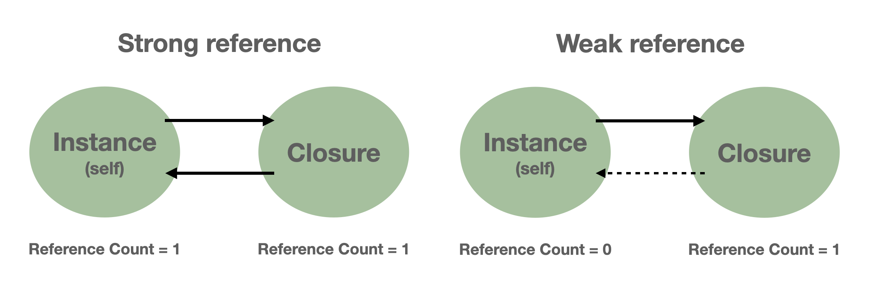
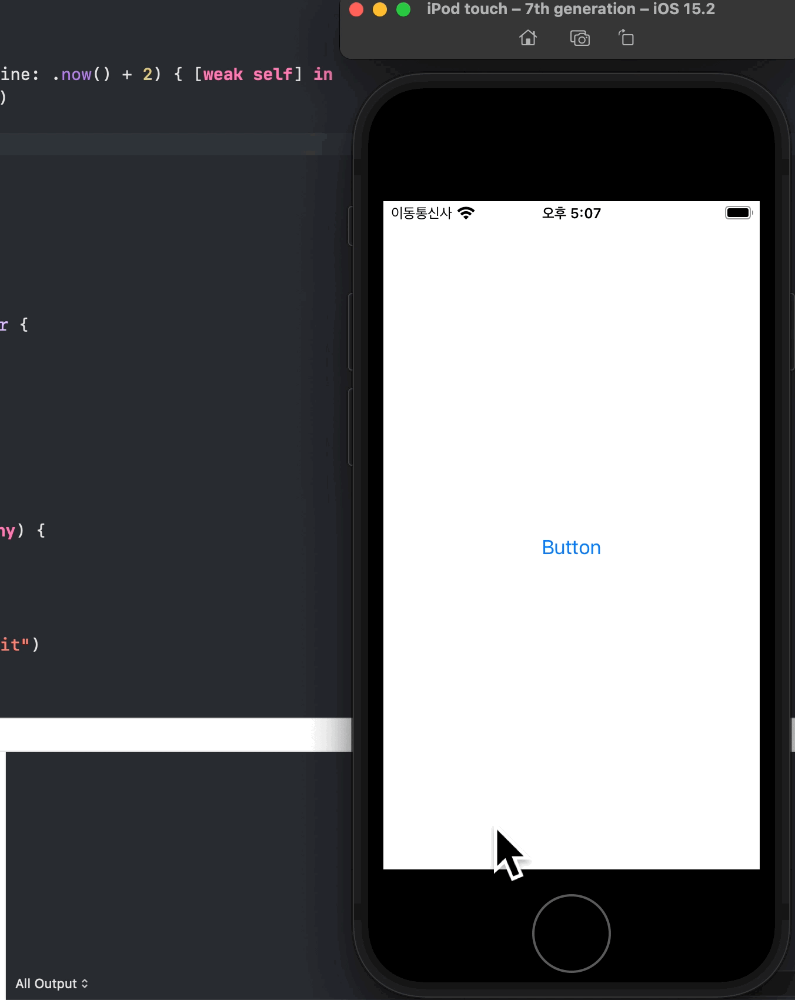
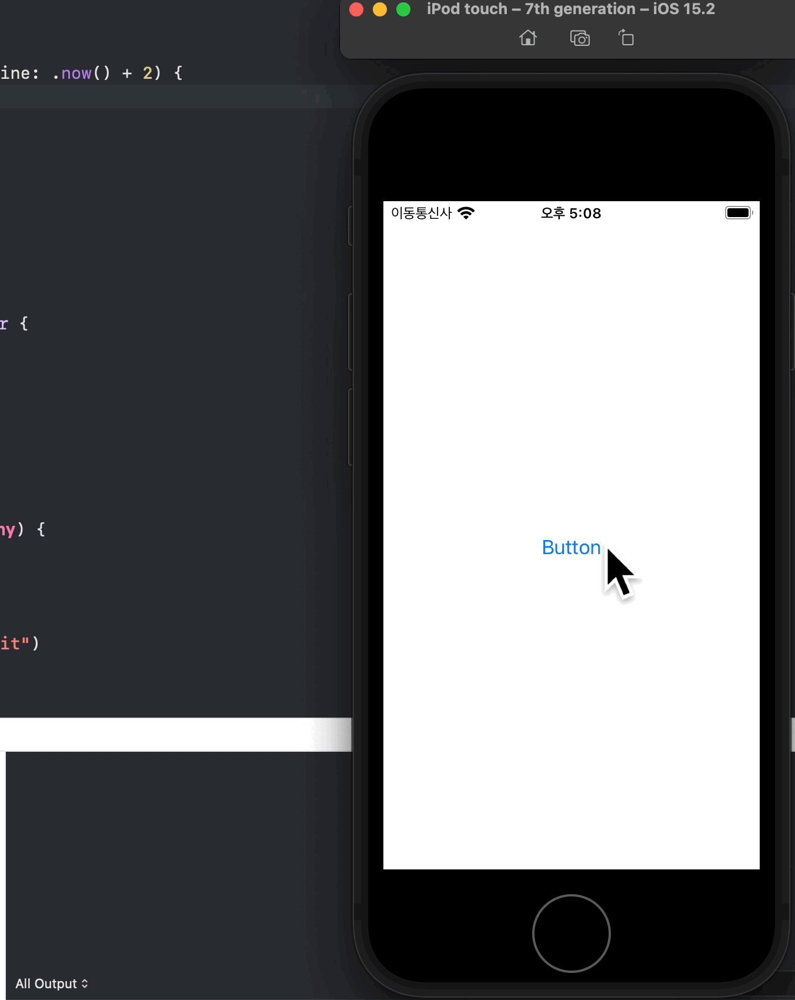

<p align="center">
    
</p>

클로져에서 self를 캡쳐할 때 `[weak self]` 를 사용하는 경우는 순환 참조를 방지하기 위해

약한 참조로 클로져 내부에서 해당 클래스의 인스턴스를 사용할때 입니다.

> 클로져에서 약한 참조를 이용해 특정 인스턴스를 캡쳐하지 않으면 (여기서는 self를 캡쳐한다고 가정)  
> self가 해제될 때까지 기다리고 self는 클로져가 해제될 때까지 기다리는 strong reference cycle  
> 상황을 만들어 내게 됩니다. 이러한 상황을 해결하기 위해 사용하는 것이 `[weak self]`입니다.

> 따라서 클로져에서 특정 인스턴스를 캡쳐할 때 약한 참조(ex. `[weak self]`)
> 를 하는 이유는 Retain Cycle(순환 참조)로 인한 메모리 누수(memory leak)를 방지하기 위해 사용합니다.

그동안 저는 클로져 내부에서 해당 클래스의 인스턴스를 사용할 때는 대부분 `[weak self]`를 이용해

self를 캡쳐해 클로져 내부에서 해당 클래스의 인스턴스를 사용했었는데요,

과연 클로져 내부에서 해당 클래스의 인스턴스를 캡쳐할 때

모든 경우에 `[weak self]`를 이용한 약한 참조가 필요한지 이번 기회를 통해 같이 알아보도록 합시다.

## 그전에..

### `[unowned self]` 를 이용해 비 소유 참조를 하면 안 되나요?🧐

**`unowned`**를 이용해 비 소유 참조를 하는 방식은 위와 같은 순환 참조를 피하기 위해 사용할 수 있는 방법 중 하나입니다.

> 비 소유 참조를 하기 때문에 Reference Count를 증가시키지 않습니다.

하지만 **`unowned`**은 값이 있음을 가정하고 사용하기 때문에 self를 **강제로 unwrapping**하고 **할당이 해제된 후(deallocate)**에도 **내용에 액세스**하려고 할 수 있기 때문에, **unowned**은 self의 생명주기를 고려하여 사용해야합니다.

> `unowned`로 참조한 값이 nil인데 접근하려 한다면 runtime에 crash가 발생할 것입니다.

따라서 완벽하게 self의 생명주기를 고려하지 않은 상황이라면

**`[weak self]`**를 이용해 안전한 방식으로 순환 참조를 피할 수 있게 하는 것이 좋을 것입니다.

## 3개의 예제를 보며 생각해봅시다.

```swift
class ViewModel {

    func format(_ value: Int) -> String { /* some logic here... */ }

    var handler: ((Int) -> Void)? = nil

    func code() {
        // 1st example
        let formatted = [1, 2, 3].map { [weak self] value in
            return self?.format(value)
        }
        print(formatted)

        // 2nd example
        DispatchQueue.main.asyncAfter(deadline: .now() + 2) { [weak self] in
            let formatted = self?.format(42)
            print(formatted as Any)
        }

        // 3rd example
        handler = { [weak self] value in
            let formatted = self?.format(value)
            print(formatted as Ant)
        }
    }
}
```

첫 번째 예제는 map의 인자로 전달하는 클로져이고,

두 번째 예제는 DispatchQueue.main.asyncAfter로 인자로 전달하는 클로져입니다.

마지막으로 세 번째 예제는 프로퍼티에 저장되는 클로져입니다.(Stored in a property)

> 일급함수 특성 이용
> 일급함수에 대해 알아보고 싶으시다면 아래의 링크를 참조해주세요!  
> 링크 : [Swift의 함수는 일급함수인가?](https://noah0316.github.io/Swift/2021-02-09-swift%EC%9D%98-%ED%95%A8%EC%88%98%EB%8A%94-%EC%9D%BC%EA%B8%89%ED%95%A8%EC%88%98%EC%9D%B8%EA%B0%80/)

세 가지 예제에서 실제로 `[weak self]` 필요하지 않을 수도 있지만 모두 `[weak self]`를 사용하고 있습니다.

### 생각해봅시다 🧐

시작하기 전에 몇 번 예제가 `[weak self]`를 정말 필요로 하는 예제일까요?

```swift
class ViewModel {

    func format(_ value: Int) -> String { /* some logic here... */ }

    var handler: ((Int) -> Void)? = nil

    func code() {
        // 1st example
        let formatted = [1, 2, 3].map { [weak self] value in
            return self?.format(value)
        }
        print(formatted)

        // 2nd example
        DispatchQueue.main.asyncAfter(deadline: .now() + 2) { [weak self] in
            let formatted = self?.format(42)
            print(formatted as Any)
        }

        // 3rd example
        handler = { [weak self] value in
            let formatted = self?.format(value)
            print(formatted as Ant)
        }
    }
}
```

그리고, 몇 번 예제가 `[weak self]`를 쓸 필요가 없을까요?

> 이미 다 알고 계신다면 이번 게시글은 Skip 하시는 걸로...!!

1번 예제부터 시작해봅시다.

```swift
class ViewModel {

    func format(_ value: Int) -> String { /* some logic here... */ }

    var handler: ((Int) -> Void)? = nil

    func code() {
        // 1st example
        let formatted = [1, 2, 3].map { [weak self] value in
            return self?.format(value)
        }
        print(formatted)
    }
}
```

여기선 과연 정말로 `[weak self]` 약한 참조가 필요할까요?

1번 예제는 [weak self]를 사용할 필요가 없습니다.

map의 signature를 보며 이해해봅시다.

```swift
/// Returns an array containing the results of mapping the given closure
/// over the sequence's elements.
///
/// In this example, `map` is used first to convert the names in the array
/// to lowercase strings and then to count their characters.
///
///     let cast = ["Vivien", "Marlon", "Kim", "Karl"]
///     let lowercaseNames = cast.map { $0.lowercased() }
///     // 'lowercaseNames' == ["vivien", "marlon", "kim", "karl"]
///     let letterCounts = cast.map { $0.count }
///     // 'letterCounts' == [6, 6, 3, 4]
///
/// - Parameter transform: A mapping closure. `transform` accepts an
///   element of this sequence as its parameter and returns a transformed
///   value of the same or of a different type.
/// - Returns: An array containing the transformed elements of this
///   sequence.
@inlinable public func map<T>(_ transform: (Element) throws -> T) rethrows -> [T]
```

map의 인자로 전달한 클로져는 @escaping 속성을 가지고 있지 않습니다.

우리가 `[weak self]`를 사용할지 말지 선택할 필요가 있을 때마다 이를 알아차리는 것이 매우 중요합니다.

> escaping 클로져에 대해 알아보고 싶으시다면 해당 링크를 참조해주세요!  
> 링크 : [https://hcn1519.github.io/articles/2017-09/swift_escaping_closure](https://hcn1519.github.io/articles/2017-09/swift_escaping_closure)

클로져가 Escaping 클로져가 아니라면,

컴파일러는 method가 종료되고 나서 해당 클로져가 사용되지 않는다는 것을 확인합니다.

이 말인즉슨 map이 종료된 후, 다시 map을 호출한 곳으로 돌아오면 인자로 전달한 클로져는 더 이상 메모리에 올라가 있지 않을 것이라는 것을 의미합니다.

따라서 Escaping 클로져를 다루지 않을 때는, [weak self]를 이용해 약한 참조를 쓸 필요가 없습니다.

왜냐하면 non escaping closure에서는 Retain Cycle(순환 참조)를 만들 수 없기 때문입니다.

이를 Swift 컴파일러 또한 알고 있기 때문에 다음과 같이 코드를 변경해도 컴파일러는 Retain Cycle이 생성될 위험이 없다는 것을 알기 때문에 경고를 내지 않습니다.

따라서 Swift 5.3 버전 이상부터 사용 가능한 Implicit strong capture를 사용해

self를 명시적으로 캡쳐할 필요가 없습니다.

> Implicit Strong Capture는
>
> 1. 사용자가 이미 의도를 명시했거나,
> 2. Strong reference cycle이 발생할 가능성이 없는 상황에서만 사용 가능합니다.

**Swift 5.3 Implicit Strong Capture 링크** :[https://github.com/apple/swift-evolution/blob/main/proposals/0269-implicit-self-explicit-capture.md](https://github.com/apple/swift-evolution/blob/main/proposals/0269-implicit-self-explicit-capture.md)

```swift
class ViewModel {

	func format(_ value: Int) -> String { /* some logic here... */ }

	func code() {
		// 1st example
		let formatted = [1, 2, 3].map { value in
		return format(value)
	}
}
```

따라서 1번 예제는 `[weak self]`를 사용하지 않아도 됩니다.

자 이제 뭉친 어깨도 좀 풀어주시고..(먼 산..)

<p align="center">
    
</p>

## 2번 예제를 봅시다.

```swift
class ViewModel {

    func format(_ value: Int) -> String { }

    var handler: ((Int) -> Void)? = nil

    func code() {
        // 2nd example
        DispatchQueue.main.asyncAfter(deadline: .now() + 2) { [weak self] in
            let formatted = self?.format(42)
            print(formatted as Any)
        }
		}
}

```

첫 번째 예제와 같은 방식으로 `DispatchQueue.main.asyncAfter(deadline:execute:)` 의

Signature를 살펴보는 방식으로 접근해보겠습니다.

```swift
		///
    /// Submits a work item to a dispatch queue for asynchronous execution after
    /// a specified time.
    ///
    /// - parameter: deadline the time after which the work item should be executed,
    /// given as a `DispatchTime`.
    /// - parameter qos: the QoS at which the work item should be executed.
    ///	Defaults to `DispatchQoS.unspecified`.
    /// - parameter flags: flags that control the execution environment of the
    /// work item.
    /// - parameter execute: The work item to be invoked on the queue.
    /// - SeeAlso: `async(execute:)`
    /// - SeeAlso: `asyncAfter(deadline:execute:)`
    /// - SeeAlso: `DispatchQoS`
    /// - SeeAlso: `DispatchWorkItemFlags`
    /// - SeeAlso: `DispatchTime`
    ///
    public func asyncAfter(deadline: DispatchTime, qos: DispatchQoS = .unspecified, flags: DispatchWorkItemFlags = [], execute work: @escaping @convention(block) () -> Void)
```

이번에는 클로져가 인자로써 @escaping 클로져(execute work: @escaping @convention(block) () -> Void))로 전달됩니다.

이런 경우를 주의해야 하는데요,

Escaping 클로져는 클로져가 해당 메소드가 종료된 이후에도 메모리에 남아 있을 수 있다는 것을 의미합니다.

> 또한, 이 클로져가 메모리에 얼마나 남아있을지는 모릅니다.

Escaping 클로져에서는 다음 두 가지 상황을 만족할 때 `[weak self]`를 사용하지 않는다면  
Retain Cycle(순환 참조) 이 생길 수 있습니다.

1. 클로져가 객체의 property에 저장되거나 다른 클로저로 전달될 경우
2. 클로져 안에 있는 객체가 클로져(해당 클로져 혹은 전달 받은 클로져)에 대한 강한 참조를 유지하는 경우

코드를 다시 봅시다.

```swift
class ViewModel {

    func format(_ value: Int) -> String { /* some logic here... */ }

    var handler: ((Int) -> Void)? = nil

    func code() {
        // 2nd example
        DispatchQueue.main.asyncAfter(deadline: .now() + 2) { [weak self] in
            let formatted = self?.format(42)
            print(formatted as Any)
        }
		}
}
```

그렇다면 이 친구는 @escaping 클로져로 전달되는 클로져니 `[weak self]` 를 이용해 약한 참조를 해주어야 할까요?

**정답부터 말하자면 아닙니다.**

엥...

이유를 살펴봅시다!

`DispatchQueue.main.asyncAfter(deadline: .now() + 2)`를 이용해

현재 시각으로부터 2초 후에 인자로 전달한 클로져를 실행하도록 하였습니다.

이 상황에서 이 클로져는 2초 동안 메모리에 유지됩니다.

이는 위의 인자로 전달한 클로져에서 `[weak self]`를 지울 수 있다는 것을 의미합니다.

Closure의 실행이 끝난 후에 Closure가 메모리에서 제거되기 때문에 Retain Cycle(참조 사이클)을 생성하지 않습니다.

**따라서 이 상황에서는 Strong Capture가 가능합니다.**

이는 GCD와 관련이 있는데요, 이와 관련한 좋은 포스트가 있어 공유해 드립니다.

링크 : [iOS - GCD what the \_\_weak is going on?](https://medium.com/rocknnull/ios-gcd-what-the-weak-is-going-on-d5a10fc682a)

링크 : [Dispatch Queues](https://developer.apple.com/library/archive/documentation/General/Conceptual/ConcurrencyProgrammingGuide/OperationQueues/OperationQueues.html#//apple_ref/doc/uid/TP40008091-CH102-SW11)

GCD호출은 나중에 실행하기 위해 속성(property)에 저장하지 않는 한 retain cycle(순환 참조)의 위험이 없습니다.

또한 GCD와 마찬가지로 **`UIView.Animate` , `UIViewPropertyAnimator`** 와 같은 animation call 역시

속성(property)에 저장하지 않는 한 retain cycle(순환 참조)의 위험이 없습니다.

<p align="center">
    
</p>

사실 이런 경우는 좀 **복잡 미묘**할 수 있습니다.

**왜냐하면 `[weak self]`가 없다면 이 코드는 `[weak self]`가 있는 코드와 다르게 동작하기 때문입니다.**

제가 만든 다른 예제 코드를 따라가 보며 왜 그런지 한번 이해해봅시다.

```swift
import Foundation

// ----- View Model -----

class ViewModel {

    func format(_ value: Int) -> String { return String(value) }

    var handler: ((Int) -> Void)? = nil

    func code() {
        DispatchQueue.main.asyncAfter(deadline: .now() + 2) { [weak self] in
            let formatted = self?.format(42)
            print(formatted as Any)
        }
    }

    deinit {
        print("view Model deinit")
    }
}

// ----- View Controller -----

class ViewController {

    let viewModel: ViewModel

    init() {
        viewModel = ViewModel()
    }

    func someEvent() {
        viewModel.code()
    }

    deinit {
        print("viewController deinit")
    }
}

var viewController: ViewController? = ViewController() // 1
viewController?.someEvent() // 2
viewController = nil // 3
```

위의 코드의 결과는 어떻게 될까요?

### 먼저 `[weak self]` 를 이용하는 경우를 보도록 하겠습니다.

> 주석에 있는 숫자를 편의상 1번 라인, 2번 라인, 3번 라인이라고 부르겠습니다.

1번 라인에서 ViewController가 생성되며 viewModel속성이 ViewModel 인스턴스로 초기화됩니다.

2번 라인에서 `someEvent()` 메소드가 호출되어 ViewModel 인스턴스의 code가 호출될 것입니다.

2번 라인에서 호출한 메소드 내부에서 호출한 `code()`메소드 내부에서 `DispatchQueue.main.asyncAfter(deadline:execute:)` 의 인자로 전달한 클로져는 2초 후에 실행될 것입니다.

```swift
DispatchQueue.main.asyncAfter(deadline: .now() + 2) { [weak self] in
	let formatted = self?.format(42)
	print(formatted as Any)
}
```

2초가 지나기 전에 3번 라인에서 viewController 인스턴스가 할당 해제된다면 `ViewController` 인스턴스가 소유하고 있는 `ViewModel` 인스턴스는 약한 참조로 참조하고 있어 해제되게 됩니다.

따라서 2초 후에 실행된 클로져 내부의 self는 nil값을 가지게 됩니다.

이를 이해를 돕기위해 실제 실행 영상으로 보면 다음과 같습니다.

> console을 잘 봐주세요!

<p align="center">
    
</p>

### 이번에는 [weak self]를 사용하지 않은 경우를 살펴보도록 하겠습니다.

```swift
import Foundation

// ----- View Model -----

class ViewModel {

    func format(_ value: Int) -> String { return String(value) }

    var handler: ((Int) -> Void)? = nil

    func code() {
        DispatchQueue.main.asyncAfter(deadline: .now() + 2) {
            let formatted = self.format(42)
            print(formatted as Any)
        }
    }

    deinit {
        print("view Model deinit")
    }
}

// ----- View Controller -----

class ViewController {

    let viewModel: ViewModel

    init() {
        viewModel = ViewModel()
    }

    func someEvent() {
        viewModel.code()
    }

    deinit {
        print("viewController deinit")
    }
}

var viewController: ViewController? = ViewController() // 1
viewController?.someEvent() // 2
viewController = nil // 3
```

> 코드는 self를 강한 참조를 한 것 말고는 이전과 달라진 게 없습니다!

2번 라인에서 호출한 메소드 내부에서 호출한 `code()`를 호출하게 되면 이번에도 역시 2번 라인에서 호출한 `code()`메소드 내부에서`DispatchQueue.main.asyncAfter(deadline:execute:)` 의 인자로 전달한 클로져는 2초 후에 실행될 것입니다.

2초가 지나기 전에 3번 라인에서 viewController 인스턴스가 할당 해제된다면 `ViewController` 인스턴스가 소유하고 있는 `ViewModel` 인스턴스가 **이번에는**

```swift
DispatchQueue.main.asyncAfter(deadline: .now() + 2) {
	let formatted = self.format(42)
	print(formatted as Any)
}
```

강한 참조로 참조하고 있어 해제되지 않고 `self.format(42)` 가 원래 의도한 대로 할당되게 됩니다.

따라서 2초 후에 실행된 클로져 내부의 self는 `ViewModel` 인스턴스를 가리킵니다.

그리고 GCD 호출은 나중에 실행하기 위해 속성(property)에 저장하지 않는 한

Retain Cycle(순환 참조)을 유발하지 않기 때문에

**2초가 지난 후에** `ViewModel` 인스턴스는 정상적으로 해제됩니다.

### 실제 실행 영상을 한번 볼까요?🧐

<p align="center">
    
</p>

따라서 `[weak self]` 를 사용하는지 안 하는지에 따라 다른 동작이 발생할 수도 있고, 발생하지 않을 수도 있기 때문에 이러한 부분을 Escaping 클로져를 전달할 때 주의해야합니다.

또한 이 부분을 통해 `self`의 생명주기를 고려해야 함을 엿볼 수 있었습니다.

두 번째 예제에서 얻을 수 있는 결론은 `[weak self]` 가 의무적인 것은 아니지만, 사용하거나 사용하지 않을 때에 따라 코드의 동작을 바꿀 수 있기 때문에 우리는 각별히 주의하며 사용해야한다는 것입니다.

마지막으로 세 번째 예제를 봅시다.

```swift
class ViewModel {

    func format(_ value: Int) -> String { /* some logic here... */ }

    var handler: ((Int) -> Void)? = nil

    func code() {
        // 3rd example
        handler = { [weak self] value in
            let formatted = self?.format(value)
            print(formatted as Ant)
        }
    }
}
```

세 번째 예제가 `[weak self]`를 사용해야하는 대표적 예입니다.

<p align="center">
    
</p>

여기서는 클로져를 ViewModel class 안에 있는 handler에 저장합니다.

> Swift는 함수를 일급함수로써 취급하기 때문에 함수를 변수, 상수에 저장이 가능합니다.

만약 이를 `[weak self]`를 이용해 캡쳐하지 않고, self를 캡쳐를 했다면

클로져에 대한 참조가 handler변수에 의해 붙잡혀있게 되어 클로져는 self 인스턴스가 해제될 때까지 기다리고

self 인스턴스는 클로져가 해제될 때까지 기다리는 Retain Cycle(순환 참조) 상황을 만들어 내게 됩니다.

따라서 이러한 상황에서는 `[weak self]`를 이용해 self 인스턴스의 reference count를 증가시키지 않게 하는 것이 Retain Cycle(순환 참조) 를 만들지 않게 할 것입니다.

**마치기 전에** 마지막으로 [weak self]를 사용할 때 `guard let self = self else { return }`로 옵셔널 바인딩하는 방식과 옵셔널 체이닝 방식을 이용하는 방식의 차이를 살펴봅시다.

## guard let self = self else { return } VS self?.some

옵셔널 바인딩으로 `guard let self = self else { return }` 을 사용하는 경우 self가 nil이 아닐 경우 self를 임시적으로 강한 참조를 하게 됩니다.

따라서 self가 해제 되어야 하는 상황에서도 self에 대한 reference count가 증가되었기 때문에

클로저가 종료될 때까지 self가 살아있게 됩니다.

반면 optional chaining을 사용하는 경우 nil인지 체크를 하게 되고, 가리키는 대상이 nil일 경우에는 nil을 반환하고, 다음 라인으로 넘어갑니다.

그 말인즉슨 self가 이미 deallocated된 경우에 불필요한 작업을 하지 않을 수 있다는 것입니다.

따라서 지연된 할당해제(delayed deallocation)가 발생하는 클로저 등에서 불필요한 작업을 하지 않게 만들 수 있어 좋을 것 같습니다.

## Summary

이제 우리가 살펴본 것을 요약해봅시다.

### Non-escaping closure

Non-escaping 클로져는 scope 내에서 실행된다. 즉, 코드를 즉시 실행하고 나중에 저장하거나 실행할 수 없기 때문에 (예: map과 같은 고차 함수)는 Strong reference cycle을 만들어 낼 위험이 없으므로 **weak 또는 unowned를 사용할 필요가 없다.**

### Escaping closure

Escaping 클로져는 클로져가 해당 메소드가 종료된 이후에도 메모리에 남아 있을 수 있다는 것을 의미한다.

> 또한, 이 클로져가 메모리에 얼마나 남아있을지는 모른다.

따라서 Escaping 클로져에서는 다음 두 가지 상황에서 `[weak self]`를 사용하지 않는다면  
Retain Cycle(순환 참조) 이 생길 수 있다.

1. 클로져가 객체의 property에 저장되거나 다른 클로저로 전달될 경우
2. 클로져 안에 있는 객체가 클로져(해당 클로져 혹은 전달 받은 클로져)에 대한 강한 참조를 유지하는 경우

하지만 GCD나 animation call들은 retain cycle을 만들지 않기 때문에 속성에 저장하지 않는 한 retain cycle

을 만들지 않기 때문에 이 친구들은 `[weak self]`를 사용하지 않아도 된다.

## 그렇다면

초반에 던진 질문인 모든 상황에서 `[weak self]`를 사용해야 할까? 에 대한 답은

**"반드시 모든 상황에서는 아니다”**입니다.

Escaping 클로져에서는 `[weak self]` 를 이용해 retain cycle을 막는 것이 좋겠지만

또 무작정 `[weak self]`만 사용하다 보면 원래의 의도와는 다른 호출 결과를 불러올 수 있기에

`self`의 생명 주기에 따라서 적절히 사용해 주면 좋을 것 같습니다!

읽어주셔서 감사합니다.

다들 즐거운 한 주 보내세요 :)

_아직 모르는 것이 많고 알아가는 과정입니다. 잘못된 것이 있다면 댓글로 남겨주신다면 감사하겠습니다!_
😊

> 참고
>
> - [You don’t (always) need [weak self]](https://medium.com/@almalehdev/you-dont-always-need-weak-self-a778bec505ef)
> - [iOS — GCD what the \_\_weak is going on?](https://medium.com/rocknnull/ios-gcd-what-the-weak-is-going-on-d5a10fc682a#.m70a04j4m)
> - [When do we REALLY need to use [weak self]?](https://www.youtube.com/watch?v=0sOrVoLOf7Q)
> - [Apple - Concurrency Programming Guide](https://developer.apple.com/library/archive/documentation/General/Conceptual/ConcurrencyProgrammingGuide/GCDWorkQueues/GCDWorkQueues.html#//apple_ref/doc/uid/TP40008091-CH103-SW12)

> 이미지 출처
>
> - [MBC 무한도전](https://program.imbc.com/challenge)
