- WWDC 2016 UnderStanding Swift Performance 세션을 보고 잘못 이해하고 있던 부분을 바로 잡기위해 실험을 통해 다시 풀어보았습니다.

> 위 세션을 아래의 포스트를 통해 정리해보았습니다.
> 관심있는 분들은 아래의 링크를 참조해주세요!

[Swift 성능 이해하기 struct-class](https://noah0316.github.io/Swift/2021-12-21-swift-%EC%84%B1%EB%8A%A5-%EC%9D%B4%ED%95%B4%ED%95%98%EA%B8%B0-struct-class/)

또한 Value Type이 정말 Stack에 할당되는지, Heap에 할당되는지 확인해보고 싶어 여러도구를 활용해 Swift코해당 인스턴스가 어디에 할당되는지 분석해보며 확인해보려 합니다.

먼저 Value Type의 객체를 만들 때 사용하는 struct를 하나 생성해보도록 하겠습니다.

```swift
struct ValueType {
    var member1: Int
    var member2: Int
}

func test() {
    var valueTypeObject = ValueType(member1: 10, member2: 11)

    withUnsafePointer(to: &valueTypeObject) {
        print("valueTypeObject address: \($0)")
    }
}

test()
```

`test()` 메소드를 실행하면 valueTypeObject의 주소가 print됩니다.

<p align="center">
    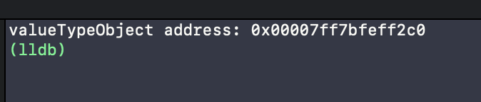
</p>

valueTypeObject의 현재 주소는 위와 같네요 현재 valueTypeObject의 주소 0x00007ff7bfeff2c0 의 메모리영역을 한번 확인해봅시다!

<p align="center">
    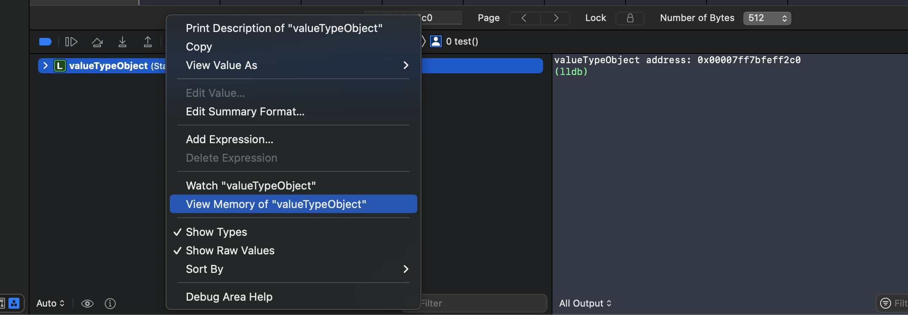
</p>

<p align="center">
    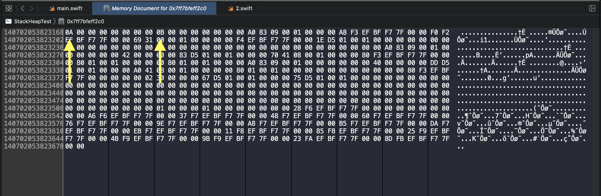
</p>

```swift
var valueTypeObject = ValueType(member1: 10, member2: 11)
```

`test()` 안에서 ValueType 인스턴스를 생성할 때 멤버변수의 값으로 10, 11을 주었으니,

0x00007ff7bfeff2c0영역에 16진수 0A, 0B가 있는걸로 미루어보아 성공적으로 Value Type Object가 생성된 것을 확인할 수 있습니다.

다음으로는 ReferenceType인스턴스를 만들어보도록 하겠습니다.

```swift
struct ValueType {
    var member1: Int
    var member2: Int
}

class ReferenceType {
    var member1: Int
    var member2: Int

    init(member1: Int, member2: Int) {
        self.member1 = member1
        self.member2 = member2
    }
}

func test() {
    var referenceTypeObject = ReferenceType(member1: 9, member2: 3)
    var valueTypeObject = ValueType(member1: 10, member2: 11)

    withUnsafePointer(to: &referenceTypeObject) {
        print("referenceTypeObject address: \($0)")
    }

    withUnsafePointer(to: &valueTypeObject) {
        print("valueTypeObject address: \($0)")
    }
}

test()
```

한번 실행해보도록 하겠습니다.

<p align="center">
    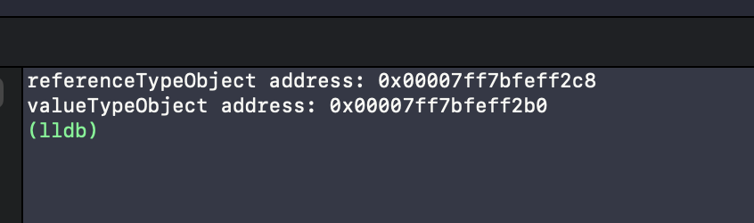
</p>
referenceTypeObject의 주소인 0x00007ff7bfeff2c8를 확인해보도록 하겠습니다.

<p align="center">
    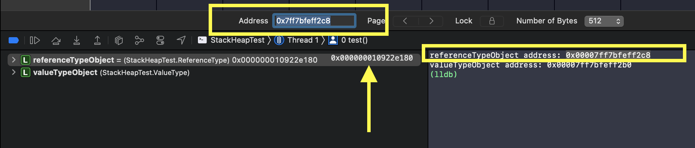
</p>

### 확인해보기 전에

ReferenceType은 참조타입이기 때문에, 주소(0x00007ff7bfeff2c8)에 접근하게 되면 referenceTypeObject Instance의 주소(0x000000010922e180) 를 가지고 있을 것입니다.

한번 확인해보도록 하겠습니다.

주소를 입력한 뒤에 메모리 영역을 확인해보면

<p align="center">
    
</p>

위에서 언급한 0x000000010922e180 주소가 메모리에 저장되어있는 것을 확인해볼 수 있습니다.

낮은 주소(80)부터 저장되어있는 것으로 미루어보아 리틀 엔디안 방식으로 주소를 저장하고 있는 것 또한 확인해볼 수 있네요!!

자 이제 그럼 해당 주소(0x10922e180)에 접근해보도록 하겠습니다.

<p align="center">
    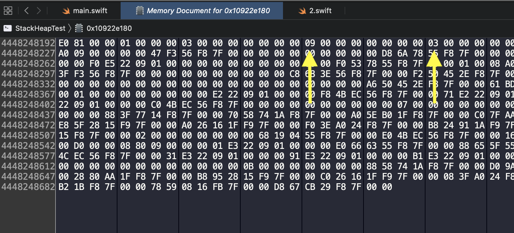
</p>

```swift
var referenceTypeObject = ReferenceType(member1: 9, member2: 3)
```

valueTypeObject와는 달리 앞에 어떠한 값들이 더 저장되어있지만, 우리가 할당한 멤버 변수 9 , 3이 잘 저장되어있는 것을 확인할 수 있습니다.

<p align="center">
    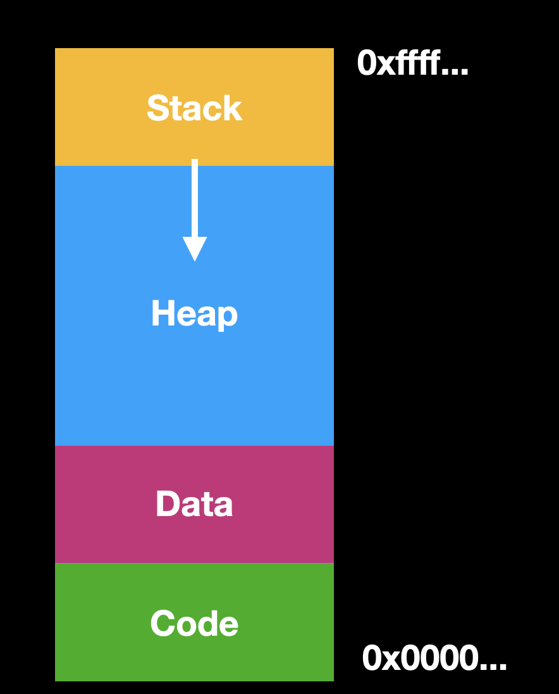
</p>

프로세스의 메모리 구조는 위와 같습니다.

높은 메모리 주소에 Stack이 위치하며 Stack보다 상대적으로 낮은 메모리주소에 Heap이 위치하는 것을 확인할 수 있습니다.

조심스럽긴 하지만

valueTypeObject 인스턴스의 주소 : 0x7ff7bfeff2b0

referenceTypeObejct 인스턴스의 주소 : 0x10922e180

위의 메모리 구조로 미루어보아 현재 valueTypeObject는 Stack에

referenceTypeObject는 Heap에 저장되었다고 예상해볼 수 있겠습니다.

저는 WWDC 2016 UnderStanding Swift Performance을 보고 난 후에 위의 결과처럼 모든 Value Type은 stack에 모든 Reference Type은 heap에 저장되는 것으로 착각하고 있었습니다.

다음 사례를 살펴보도록 하겠습니다.

```swift
import Foundation

struct ValueType {
    var member1: Int
    var member2: Int
}

class ReferenceType {
    var member1: Int
    var member2: Int
    var value: ValueType

    init(member1: Int, member2: Int) {
        self.member1 = member1
        self.member2 = member2
        self.value = ValueType(member1: member1 + 1, member2: member2 + 1)
    }
}

func test() {
    var referenceTypeObject = ReferenceType(member1: 9, member2: 3)

    withUnsafePointer(to: &referenceTypeObject) {
        print("referenceTypeObject address: \($0)")
    }

    withUnsafePointer(to: &referenceTypeObject.value) {
        print("ref1.value address: \($0)")
    }
}

test()
```

위 코드는 ReferenceType이 멤버변수로 ValueType 인스턴스를 소유하고 있는 경우입니다.

마찬가지로 한번 실행을 해보도록하겠습니다.

<p align="center">
    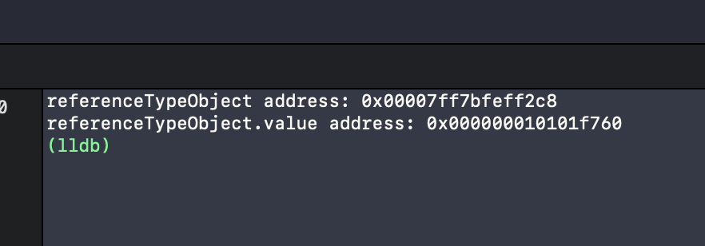
</p>

ReferenceTypeObject 변수는 0x7ff7bfeff2c8에

<p align="center">
    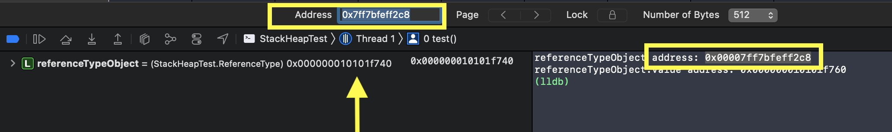
</p>

인스턴스는

<p align="center">
    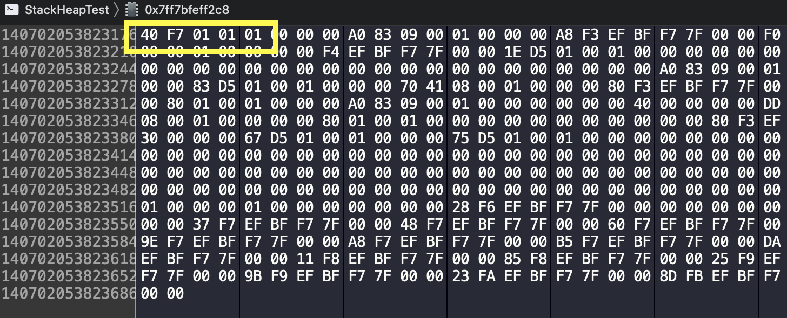
</p>

에 저장되어있을 것입니다.

인스턴스가 있는 메모리영역 0x10101f740에 접근해보도록 하겠습니다.

<p align="center">
    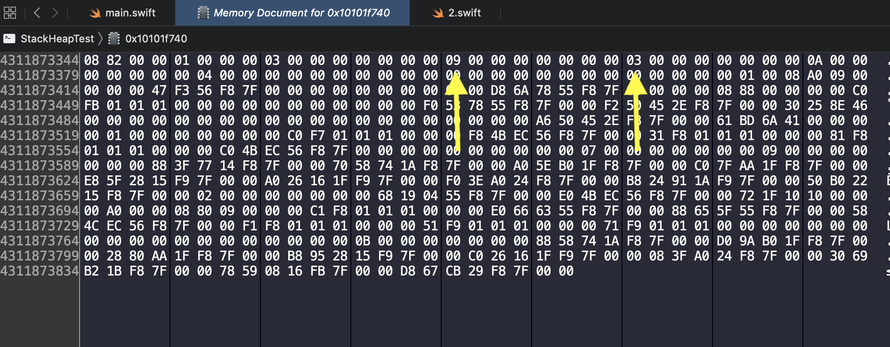
</p>

```swift
var referenceTypeObject = ReferenceType(member1: 9, member2: 3)
```

우리가 멤버변수로 주입시켜준 9, 3이 들어가있는 것을 확인할 수 있습니다.

<p align="center">
    
</p>

이제 referenceObject가 소유하고 있는 Value Type 객체의 주소에 접근해보도록 하겠습니다.

## 엇

그런데 주소를 보니,

인스턴스가 있는 메모리영역의 시작점 0x10101f740과 불과 32번지(16진수) 밖에 차이나지 않는 곳에

ValueType 인스턴스가 저장되어있네요.

한번 확인해봅시다.

<p align="center">
    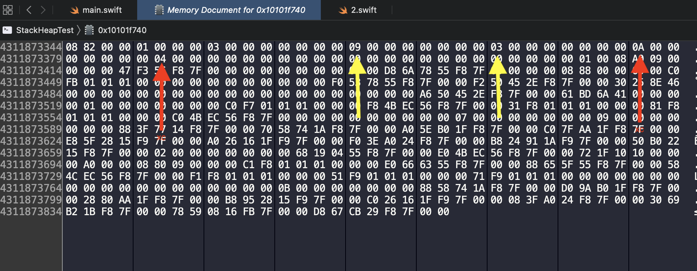
</p>

```swift
class ReferenceType {
    var member1: Int
    var member2: Int
    var value: ValueType

    init(member1: Int, member2: Int) {
        self.member1 = member1
        self.member2 = member2
        self.value = ValueType(member1: member1 + 1, member2: member2 + 1)
    }
}

var referenceTypeObject = ReferenceType(member1: 9, member2: 3)
```

ValueType을 생성해줄 때 ReferenceType의 멤버변수보다 1씩 증가하도록 멤버변수를 생성해주었으니,

현재 Value Type인 Object가 heap에 할당되어있는 것을 확인할 수 있습니다.

이를 통해 Value Type이 무조건 Stack에만 할당되는 것이 아님을 확인할 수 있습니다.

상황에 따라 Stack, Heap에 할당되는 것을 알 수 있었습니다.

결국 제가 잘못 알고있었던 것을 다시 한번 확인해볼 수 있었습니다.

사실 WWDC 2016 UnderStanding Swift Performance세션에서도 모든 ValueType이 무조건 Stack에 할당된다고 하지는 않았는데, struct와 class의 성능의 차이를 보여주는 그래프를 보며 모든 ValueType이 stack에 저장되는 줄로만 알고있었는데 이번기회를 통해 잘못된 지식을 바로 잡을 수 있었던 것 같습니다.

이외에도 Stack과 Heap메모리에 객체가 할당되는 것을 추정이 아닌, 직접적으로 확인해보고 싶어

현재 SIL과 Memory Instrument를 통해 확인해보고 있습니다만 생각보다 이 과정이 길어지네요..!!

지금 실험해보고 있는 과정을 살짝 보여드리자면 다음과 같습니다ㅎㅎ

<p align="center">
    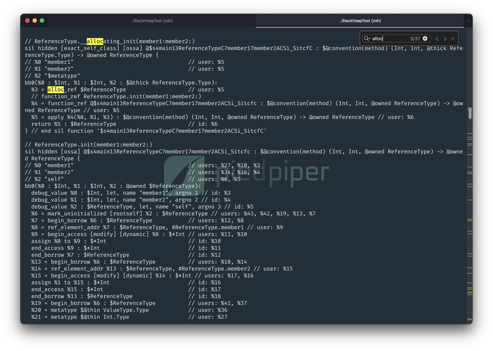
</p>

<p align="center">
    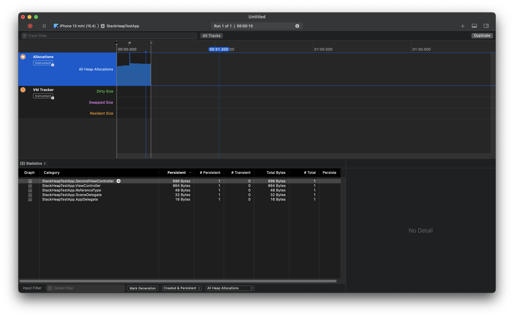
</p>

열심히 연구해보고 결과가 나오는대로 포스트를 업데이트 하도록 하겠습니다!!

감사합니다!!

_아직 모르는 것이 많고 알아가는 과정입니다. 잘못된 것이 있다면 댓글로 남겨주신다면 감사하겠습니다!_
😊

> 참고
>
> - [Value Type은 항상 스택에 저장된다고?](https://www.youtube.com/watch?v=LM1BSf25kX0)
> - [SIL(Swift Intermediate Language)을 통한 Swift debugging](https://techblog.woowahan.com/2563/)
> - [apple/swift-sil](https://github.com/apple/swift/blob/main/docs/SIL.rst#destroy-addr)
