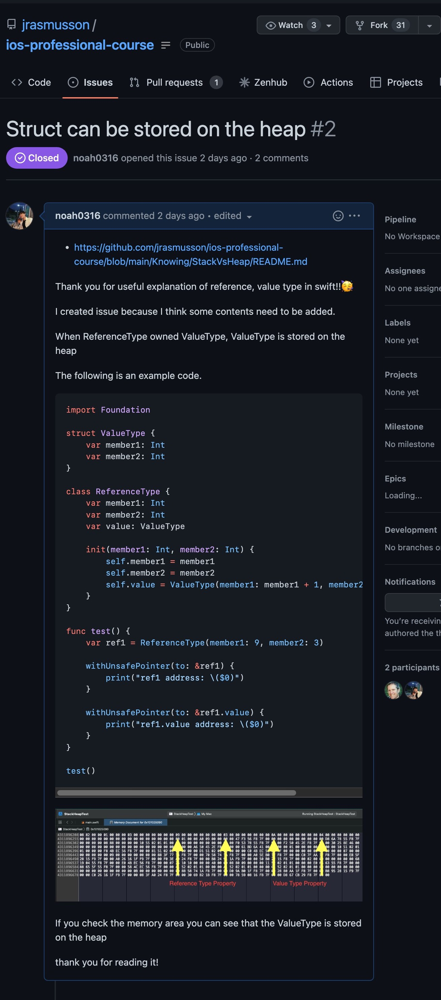
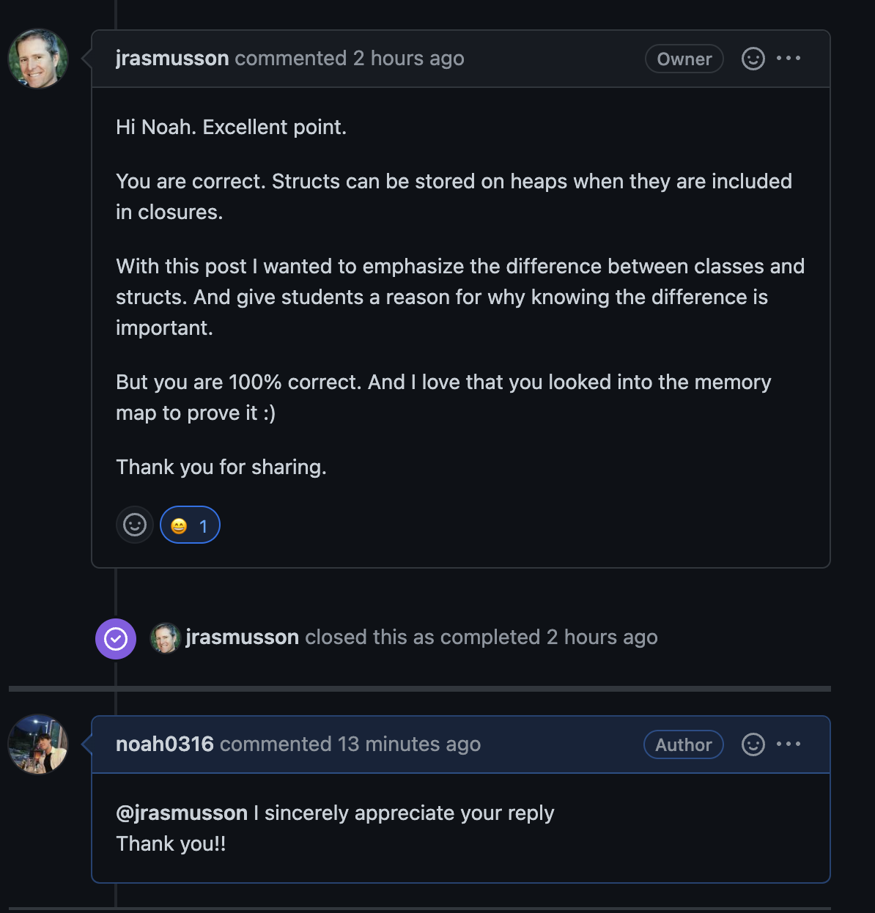

WWDC 2016 UnderStanding Swift Performance을 보고 난 후에 잘못 이해하고 있던 부분(부끄럽지만 Value Type은 무조건 Stack에만 할당되는 것으로 알고 있었습니다.)을 바로 잡기 위해 메모리 맵을 확인해보며 Value Type이 무조건 Stack에만 할당되는 것이 아님을 저번 포스트를 통해 조사해보았습니다.

### 지난번 포스트 : [Value Type은 무조건 Stack에만 할당될까?](https://noah0316.github.io/Swift/2022-06-29-value-type%EC%9D%80-%EB%AC%B4%EC%A1%B0%EA%B1%B4-stack%EC%97%90%EB%A7%8C-%ED%95%A0%EB%8B%B9%EB%90%A0%EA%B9%8C/)

조사하며 알게 된 내용을 평소 존경하는 개발자이자 전 스포티파이의 개발자이신 Jonathan Rasmusson님의 교육용 레포지토리에 같이 공부하는 **더 많은 학생들**에게 이 내용을 **공유**하고 싶어 아래와 같이 공유하였습니다.

---

    

**정말 감사하게도** 이슈를 남긴 지 얼마 되지 않아 답변을 남겨주셨고,

    

답변을 보며 앞으로 개발자로서 지녀야 할 자세에 대해 많은 생각을 했습니다.

좋은 기업에서, 또 현업에서 오래도록 경험을 쌓아오신 분이, 학생인 제 의견도 받아들여 주시는 것을 보며,

발전을 위해 서로 놓친 것을 얘기해주고 공유해주는 개발자들의 문화가 너무 멋있었고 너무 자랑스러웠습니다.

저 역시 항상 열린 마음으로 더 좋은 방향으로 나아가기 위해 동료들과 함께 끊임없이 고민하는 멋진 개발자가 되고 싶네요!

공유와 성장을 통해 하루하루 발전해 나가는 내일을 만들어 나가는 모든 분들 화이팅입니다 :)

감사합니다.

아래는 해당 이슈링크입니다:)

[https://github.com/jrasmusson/ios-professional-course/issues/2](https://github.com/jrasmusson/ios-professional-course/issues/2)

_아직 모르는 것이 많고 알아가는 과정입니다. 잘못된 것이 있다면 댓글로 남겨주신다면 감사하겠습니다!_
😊
