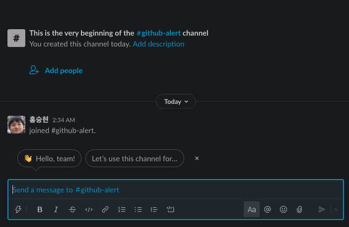
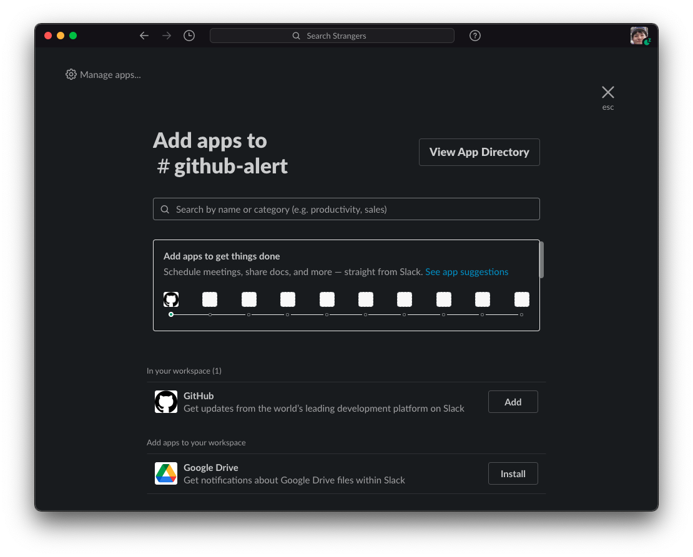

### 안녕하세요 :) Noah입니다.

친구들과 Slack을 조금 더 효율적으로 사용하기 위해 Slack에 Github을 연동하였는데, 그 과정을 나눠보려 합니다 :)

## 채널 개설하기

먼저 채널을 하나 개설합니다.

    

그 다음 Connect an app을 클릭하게 되면 다음과 같은 창이 뜨게 되는데,

    

Github을 검색하고 Slack workspace에 설치를 진행합니다.

    

설치를 진행하고, continue버튼을 클릭한 다음,

    

특정 채널 (github-alert)을 선택하고 설치를 진행합니다. Install이 진행되며,

Slack app으로 redirecting되어 다음과 같은 메시지를 받으면 workspace에 github가 설치 완료 됩니다.

    

이제 알림을 받기 원하는 레포지토리를 등록하기 위해 command를 입력해줍니다.

command : `/github subscribe owner/repository`

명령어를 입력하고 나면 해당 레포지토리에서 이벤트가 발생할때 알람을 slack을 통해 받을 수 있게 됩니다!🙂

처음 명령어를 입력한 경우 다음과 같이 Github계정과 연동 후 사용할 수 있습니다.

    

    

subscribe한 레포지토리에서 이벤트가 발생하면 slack으로 알람이오게 되어있는데,  
기본으로 설정되어있는 이벤트는 다음과 같습니다.

- `issues` - Opened or closed issues
- `pulls` - New or merged pull requests, as well as draft pull requests marked "Ready for Review"
- `statuses` - Statuses on pull requests
- `commits` - New commits on the default branch (usually `master`)
- `deployments` - Updated status on deployments
- `public` - A repository switching from private to public
- `releases` - Published releases

추가로 설정할 수 이벤트는 다음과 같습니다.

- `reviews` - Pull request reviews
- `comments` - New comments on issues and pull requests
- `branches` - Created or deleted branches
- `commits:all` - All commits pushed to any branch
- `+label:"your label"` - Filter issues, pull-requests and comments based on their labels.

branches, commits:all, reviews, comments에 대한 알림을 받고싶어 네개의 이벤트를 추가해보도록 하겠습니다.

> branches 이벤트를 활성화 시켜 브랜치 생성 제거에 대한 알람을 받고,  
> default 브랜치를 제외한 다른 브랜치의 commit 알람을 받기위해  
> branches, commits:all 이벤트를 활성화 했습니다.

명령어는 다음과 같습니다.

`/github subscribe owner/repository branches commits:all reviews comments`

    

비활성화 하기 원한다면 다음과 같은 명령어를 사용하면 됩니다.

`/github unsubscribe owner/repository branches commits:all reviews comments`

네, 여기까지 Slack, Github 연동하기였습니다!!

혹시 제가 잘못 알고 있는 부분이 있거나, 오타 혹은 궁금한 점 있으시면 댓글로 알려주시면 감사하겠습니다!!😎

> 참고
>
> - https://github.com/integrations/slack
