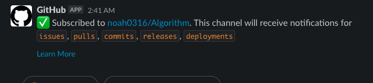

멋쟁이 사자처럼🦁 2021홈페이지 개편을 진행하며

우리는 의사소통 도구로써 Slack을 사용하기로 했다.

개발을 진행하며 Slack을 조금 더 효율적으로 사용하기 위해 Github을 연동하였는데, 그 과정을 소개하려 한다.

## 채널 개설하기

우리 개발팀은 백엔드팀과, 프론트엔드팀 이루어져있다.

물론 각각의 팀마다 채널은 개설되어있지만, 스크럼 회의에서 Github의 알람을 한 채널에서 받기로 결정하여

채널을 새로 개설하여 Github 알람 전용 채널로 만들었다.

> 백엔드, 프론트 각각의 채널이 있지만 Github 알람 채널을 하나로 합친 이유는
>
> 백엔드, 프론트 모두 자바스크립트 기반이고 다같이 Koa + React스터디를 진행하고 있기 때문에 서로 코드리뷰가 가능하고,
>
> 레포지토리에 push, review가 진행되는 것을 서로 보면서 자극(?)을 받기위해 Github 알람 채널을 하나로 합치게 되었다.

먼저 채널을 하나 개설하였다.

    

그 다음 Connect an app을 클릭하게 되면 다음과 같은 창이 뜨게 되는데,

    

Github을 검색하고 Slack workspace에 설치를 진행한다.

    

설치를 진행하고, continue버튼을 클릭한다.

    

특정 채널 (github-alert)을 선택하고 설치를 진행한다. Install이 진행되며,

Slack app으로 redirecting되어 다음과 같은 메시지를 받으면 workspace에 github가 설치 완료 된다.

    

이제 알림을 받기 원하는 레포지토리를 등록하기 위해 위에서 설명해준대로 command를 입력한다.

command : `/github subscribe owner/repository`

명령어를 입력하고 나면 해당 레포지토리에서 이벤트가 발생할때 알람을 slack을 통해 받을 수 있다.

처음 명령어를 입력한 경우 다음과 같이 Github계정과 연동 후 사용할 수 있다.

    

    

subscribe한 레포지토리에서 이벤트가 발생하면 slack으로 알람이오게 되어있는데,

기본으로 설정되어있는 이벤트는 다음과 같다.

- `issues` - Opened or closed issues
- `pulls` - New or merged pull requests, as well as draft pull requests marked "Ready for Review"
- `statuses` - Statuses on pull requests
- `commits` - New commits on the default branch (usually `master`)
- `deployments` - Updated status on deployments
- `public` - A repository switching from private to public
- `releases` - Published releases

추가로 설정할 수 이벤트는 다음과 같다.

- `reviews` - Pull request reviews
- `comments` - New comments on issues and pull requests
- `branches` - Created or deleted branches
- `commits:all` - All commits pushed to any branch
- `+label:"your label"` - Filter issues, pull-requests and comments based on their labels.

우리는 회의를 통해 branches, commits:all, reviews, comments기능을 추가하기로 하여 위 네개의 이벤트를 추가하기로 했다.

> branches 이벤트를 활성화 시켜 브랜치 생성 제거에 대한 알람을 받고,  
> default 브랜치를 제외한 다른 브랜치의 commit 알람을 받기위해  
> branches, commits:all 이벤트를 활성화 시키기로 하였다.

명령어는 다음과 같다.

`/github subscribe owner/repository branches commits:all reviews comments`

    

비활성화 하기 원한다면 다음과 같은 명령어를 사용하면 된다.

`/github unsubscribe owner/repository branches commits:all reviews comments`

> 참고 : https://github.com/integrations/slack
