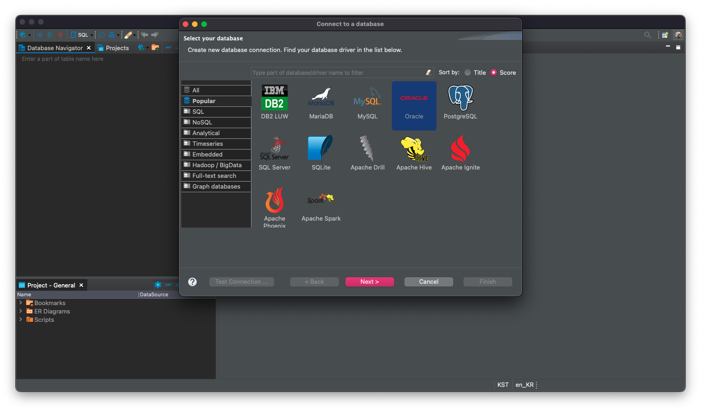
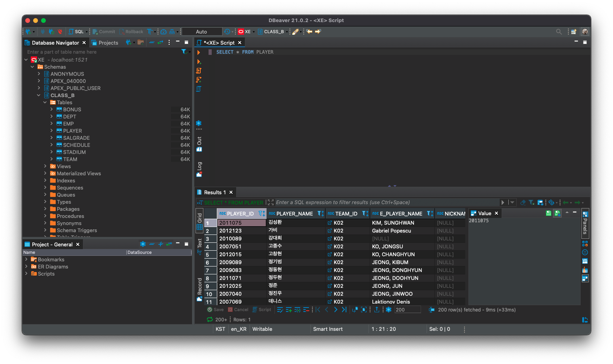

Oracle

### 안녕하세요 :) Noah입니다.

Oracle DB를 사용할 일이 생겨 Oracle DB를 Mac에서 설치하고 사용하는 과정을 소개해드리려 합니다.

이 포스트에서는 Oracle에서 제공하는 3가지 라이선스의 데이터베이스 중 몇 가지 제약사항이 있지만  
대부분의 기능을 포함하고 있어 학습용으로 적합한 Express Edition을 사용해보도록 하겠습니다.

원래는 <a href="https://www.oracle.com/database/technologies/xe-prior-releases.html" target="_blank">여기</a>
에서 Oracle Database XE을 다운받아 설치한 뒤에 사용하거나 별도의 GUI tool을 이용해 데이터베이스를 사용합니다.

### 흠... 사이트 들어가보니까 윈도우와 리눅스 밖에 없는데요?🤔

Docker

#### 먼저 Mac OS에서 Oracle DB를 사용하기 위해서는 Docker를 사용해야합니다. 🐳

Oracle DB Docker이미지를 다운받은 후에 컨테이너를 생성, 실행해 사용할 예정입니다.

Docker가 설치되어있지 않으신 분들은 <a href="https://subicura.com/2017/01/19/docker-guide-for-beginners-2.html" target="_blank">이곳</a>에 아주 잘 정리가 되어있으니 참고해주세요!!

<a href="https://github.com/oracle/docker-images/tree/main/OracleDatabase/SingleInstance/dockerfiles/11.2.0.2" target="_blank">오라클 깃허브에서 제공하는 도커파일</a>
과 `docker build` 명령어를 이용해  
이미지를 생성해 사용할 수 있지만

> 이미지는 프로세스가 실행되는 파일들의 집합(환경)입니다!

더 간단하게(~~시험기간이므로...~~)

도커 허브에서 이미 만들어져있는 도커 이미지를 pull 받아  
`run` 명령어를 이용해 컨테이너로 띄워 사용하도록 하겠습니다.

####먼저 터미널을 열어주세요:)

`docker search oracle-xe-11g` 명령어를 이용해 pull 받을 이미지를 찾아봅시다~!

많은 이미지 중 가장 평이 좋은 `jaspeen/oracle-xe-11g`를 pull받도록 하겠습니다.

`docker pull jaspeen/oracle-xe-11g` 명령어를 이용해 이미지를 pull 해줍니다.

`docker images` 명령어를 이용해 성공적으로 pull이 됐는지 확인해보도록 하겠습니다.

이제 Docker 이미지를 pull받았으니 컨테이너를 띄워보도록 하겠습니다.

`docker run --name oracle-xe-11g -d -p 8080:8080 -p 1521:1521 -v /Users/noah/Desktop/noah_dev/oracle/volume jaspeen/oracle-xe-11g`

> --name을 이용해 컨테이너의 이름을 설정해줄 수 있으며 뒤에 원하시는 이름을 설정할 수 있습니다.
>
> 저의 경우 oracle-xe-11g로 이름을 설정해 주었습니다.
>
> -d (detached mode) 백그라운드 모드로 실행하기 위해
> -d 옵션을 추가해주었습니다.
>
> -p 옵션을 추가해 컨테이너 포트를 호스트의 포트로 연결해주었습니다.
>
> -v 옵션을 추가해 컨테이너를 실수로 삭제하더라도 파일이 날아가지 않게 하기 위해
> 호스트와 컨테이너의 디렉토리를 연결하도록 하겠습니다.

#### 명령어 <a href="https://github.com/jaspeen/docker-oracle-xe-11g/blob/master/README.md" target="_blank">참고</a>

성공적으로 컨테이너가 생성되었다면 Docker desktop에 다음과 같이 되어있을 것입니다.

또는 `docker ps` 명령어를 통해 확인 가능합니다.

이제 `docker exec -it oracle-xe-11g sqlplus` 명령어를 이용해  
 Oracle Database SQL Plus를 실행해주도록 하겠습니다.

user-name에는 system을 입력하신 후에  
password에는 oracle을 입력하시면

Oracle Database 11g XE에 정상적으로 연결이됩니다.

이제 GUI를 통해 Database를 쉽게 조작해볼텐데요,  
Oracle에서 제공하는 SQL Developer(~~이건 Mac지원 해주네...~~)와 DBeaver를 이용해보도록 하겠습니다.

#### 먼저 SQL Developer를 통해 조작해보도록 하겠습니다.

좌측 사이드바의 + 버튼을 클릭해주세요.

사용자 이름은 전술한대로

사용자 이름 : system  
비밀번호 : oracle

을 입력하시면 됩니다.

위와 같이 입력이 되었다면 하단의 접속버튼을 눌러주세요.

이제 워크시트에 SQL문을 작성하고 실행할 수 있는 GUI 환경이 구축되었습니다.

DBeaver

#### 다음은 DBeaver입니다.

오라클을 선택해주세요.

다음과 같이 Database 설정칸에 SID(서비스 아이디)를 설정하신후에  
Oracle Express Edition을 뜻하는 XE로 설정하신다음

Username: system  
Password : oracle

를 입력해주세요.

이후에 자유롭게 SQL문을 이용해 사용하시면 됩니다 :)

네, 여기까지 mac에서 Oracle DB사용하기 근데 이제 docker를 곁들인.. 이었습니다!!

혹시 제가 잘못 알고 있는 부분이 있거나, 오타 혹은 궁금한 점 있으시면 댓글로 알려주시면 감사하겠습니다!!😎

> 참고
> [subicura님 블로그](https://subicura.com/2017/01/19/docker-guide-for-beginners-2.html)
>
> 이미지 출처
> https://noticon.tammolo.com/
