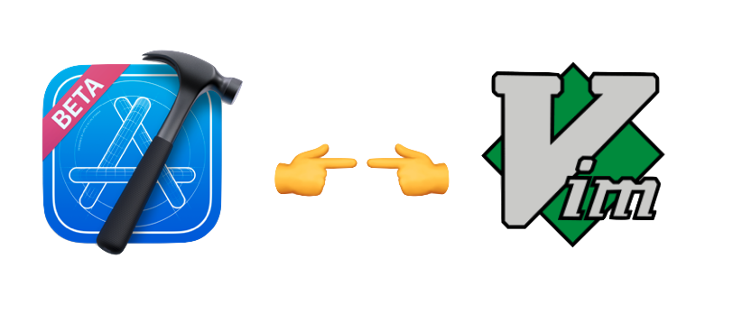
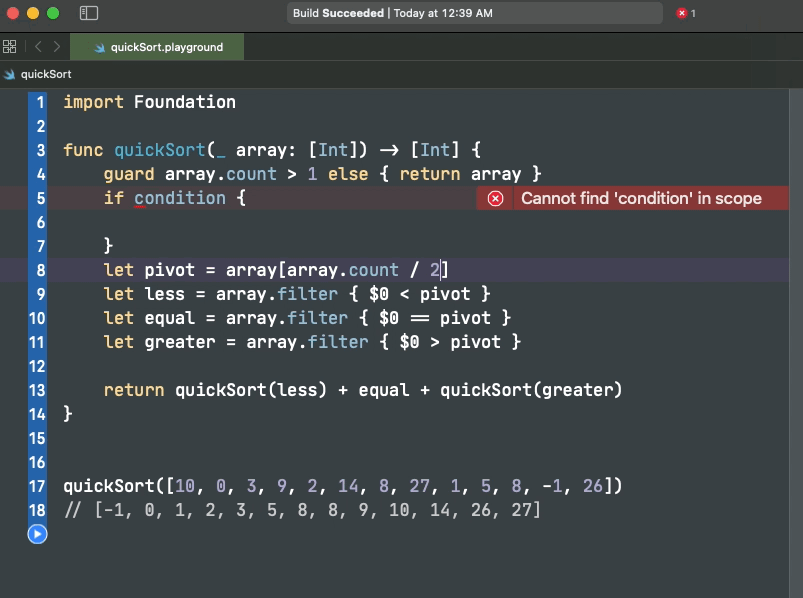
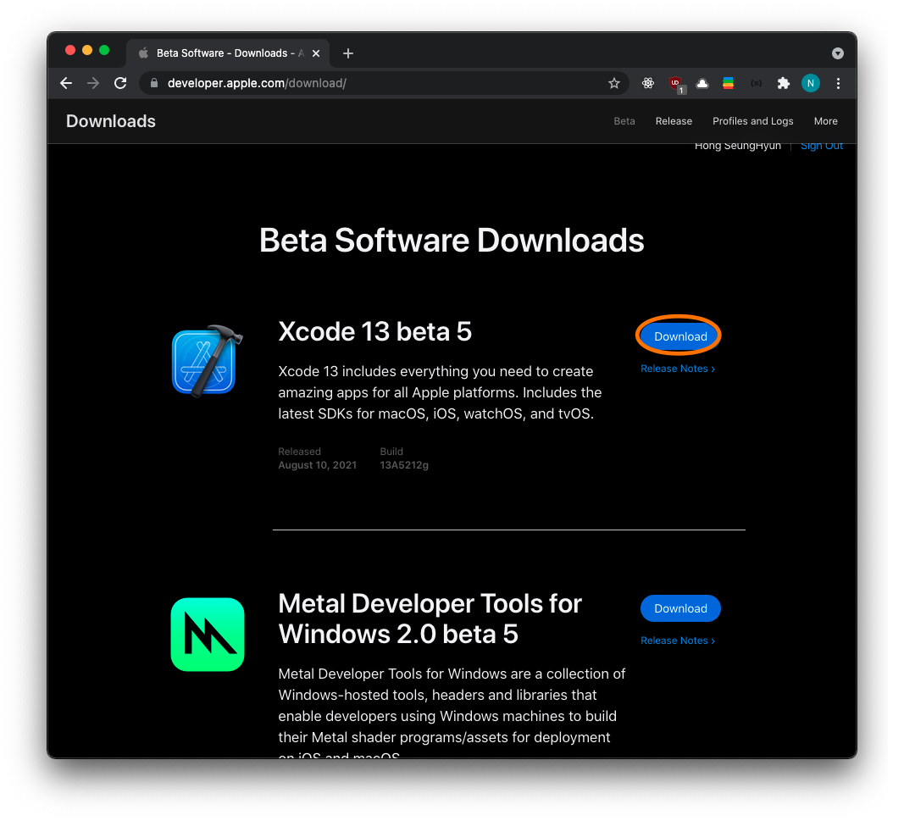
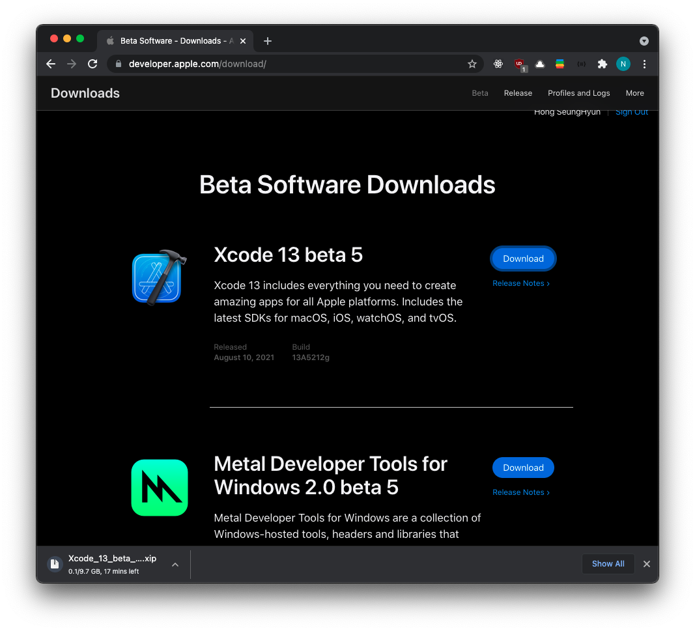
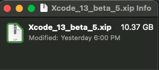
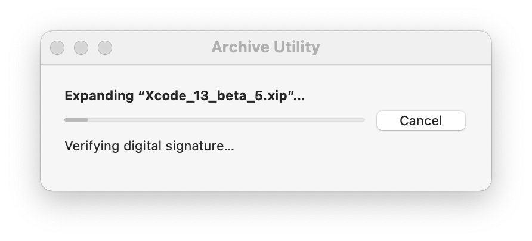
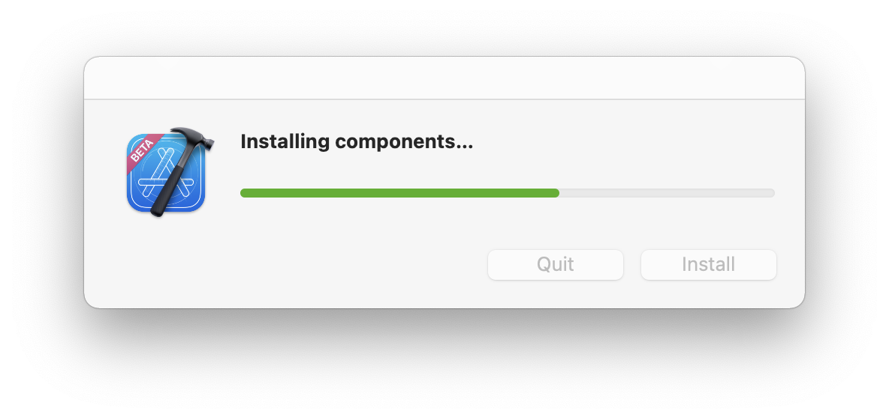
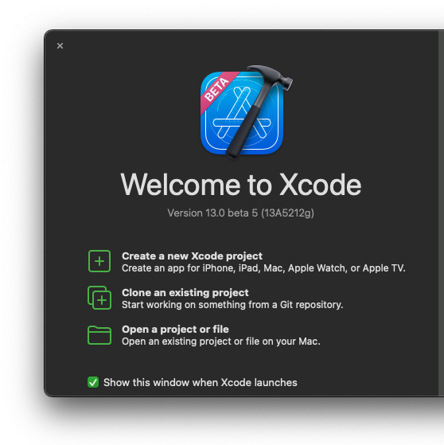
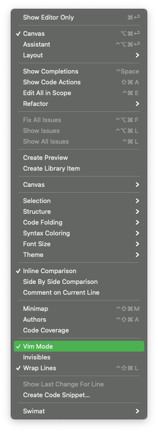

안녕하세요 Noah입니다 :)

<p align="center">

</p>

이번 **Xcode 13.0 베타**에는 새로운 기능이 추가되었는데요,

여러 기능들이 추가되었지만 그중에 단연 돋보이는 신기능은 **Vim**입니다~!!🎉🎉🎉

> Xcode13에 추가된 다양한 기능은 <a href="https://developer.apple.com/kr/xcode/" target="_blank"><u>이곳</u></a>을 참조해주세요:)

<br/>

그동안 **Xcode**에서 **Vim**을 사용하기 위해서는 <a href="https://github.com/XVimProject/" target="_blank"><u>XVim</u></a>과 같은 플러그인을 이용해 **Vim**을 사용했었는데요,

설치도 <a href="https://github.com/XVimProject/XVim2#xvim2" target="_blank"><u>문서</u></a>를 보며 따라 하면 되지만  
플러그인이 아닌 **IDE 자체**에서 지원되는 편리함을 따라올 수는 없는 것 같습니다 🤓

학부생 1학년 때 학교에 있는 **Linux 서버**에 접속해 **C**를 연습하며 처음 **Vim**을 마주한 이후로,  
**터미널**을 이용하거나, **Amazon EC2 인스턴스**에 접근할 때 이외에는 사용해본 적이 없었습니다.

**Vi** 즉, **Visual Interface**는 편집기가 지원해야 할 기능의 명세로  
**Vi**의 향상된 버전인 **Vim**을 한번 제대로 익혀두면 다른 **IDE**를 사용할 상황이 생겼을 때

각 **IDE**에 특화된 많은 단축어를 따로 외우고 있지 않아도  
**Vim**을 활용하면 편리하게 코딩할 수 있다는 점이 끌려 이번 기회에 **Vim**을 제대로 연습해 생산성을 높이고 싶어  
**Xcode 13 Beta**를 다운로드한 후 **Vim mode**를 적용하고,

> 다양한 IDE : EX) JetBrains사의 IDE, Android Studio 등등

자주 사용하는 **Vscode**에도 Vim extension을 설치해 **Vim**에 익숙해지기 위해  
노력 중입니다💪💪

아직 여러 단축키를 외우며 익숙해지는 단계에 있지만 지금까지 사용하며 느낀 점은  
평소 제가 키보드와 함께 트랙패드를 사용하며 코딩을 하는데,

단축키 몇 개를 조합하여 트랙패드를 사용하지 않고 키보드로만 코딩을 하니 아직 입문 단계라 그런지  
신세계를 경험하는 중입니다 ㅎㅎ

사용하며 좋았던 또다른 점은 **Vim**의 유용한 기능들과 함께 기존에 **Xcode**에서 사용하는  
단축키를 그대로 사용할 수 있다는 점이었습니다.

라인을 이동하는 다음과 같은 명령어도 말이죠!!

`cmd` + `opt` + `[` OR `]`

<p align="center">

</p>

사용하던 **IDE**에서 **Vim**을 사용할 수 있게 되니 기존에 사용하던 단축키와 더불어 사용하면 작업시간을 단축시킬 수 있는 장점이 있는 것 같습니다 ㅎㅎ ~~빨리 코딩하고 놀러 가자(?)~~

아직 자잘한 오류가 있긴 하지만 **Xcode**에서 **Vim**을 하루빨리 사용해 익숙해지고 싶다면

다음과 같이 베타 버전을 다운로드하여 플레이그라운드나, 간단한 프로젝트에서  
사용하여 연습하시면 좋을 것 같습니다 :)

## Xcode 13 베타 다운로드

먼저 <a href="https://developer.apple.com/download/" target="_blank"><u>Xcode beta 다운로드 페이지</u></a>에 들어갑니다.

<p align="center">

</p>

<p align="center">

</p>

계속해서 다운로드를 진행해줍니다.

다운로드가 완료되었다면 압축을 풀어주세요!

<p align="center">

</p>

**Apple** 개발자 사이트를 통해 파일을 내려받게 되면 **xip 확장자** 파일을 받게 될 것입니다.

**xip 파일** 형식은 **zip 파일**의 형식과 같이 압축파일과 비슷하지만  
압축을 해제하기 전에 먼저 파일의 변경이 없었는지 여부를 **Apple**로부터 인증을 받는  
특별한 형식이니 걱정 마세요!!

<p align="center">

</p>

압축을 해제할 때 다음과 같이 인증 과정을 거칩니다.

<p align="center">

</p>

압축해제가 완료되었다면 다음과 같이 추가적으로 필요한 컴포넌트를 설치합니다.

<p align="center">

</p>

~~설치 중 가장 설레는 순간 저만 그런가요..~~ **Touch ID**를 이용해 인증을 진행합니다.

완료되었다면 이제 다음과 같은 화면이 보일 텐데요 프로젝트 하나를 만든 다음  
**Vim**모드를 활성화시켜보겠습니다.

<p align="center">

</p>

<p align="center">

</p>

메뉴바에서 **Editor**를 클릭하신 다음

<p align="center">

</p>

**Vim Mode**를 활성화시켜주시면 됩니다.

<p align="center">

</p>

**Vim mode**가 활성화되면 위와 같이 사용이 가능합니다:)

저는 아직 **Vim**이 익숙하지 않아 실수를 자주 범했는데요

자주 하는 실수는 다음과 같았습니다 🥲

명령어가 아예 입력이 되지 않아 에러인가..?라고 생각하고 있다가 메뉴바를 보니

<p align="center">

</p>

한글이 켜져 있었고..

명령어를 사용할 때는 항상 꼭 영어로 놓고 명령어를 입력해야 함을.. 깨닫게 되었습니다ㅎㅎ 부끄럽습니다..

**Vim**을 처음 사용하시거나 이번 기회에 익숙해지실 분들은  
아래 명령어들을 자연스레 익히며 저와 같이 연습해보아요:)

## 자주 사용하는 명령어

```
1. 입력 모드

i : 커서 자리부터 쓰기

o : 다음 라인부터 쓰기

s : 커서가 가리키는 문자 지우고 새로 쓰기

a : 맨 뒤에 붙여쓰기


2. 편집시 자주 사용하는 명령어

dd : 라인 삭제

dG : 현재 라인 이후 모두 삭제

yy : 라인 복사

p : 라인 붙여 넣기

u : 되돌리기

U : 되돌리기 취소


3. 커서 이동

h, j, k, l : 좌, 하, 상, 우 이동

gg : 파일 맨 처음 라인으로 이동

G : 파일 맨 마지막 라인으로 이동

e : 단어 끝으로 이동

w : 다음 단어로 이동

b : 이전 단어로 이동

0 : 라인의 시작으로 커서 이동

$ : 라인의 마지막으로 커서 이동
{숫자}gg : 숫자에 해당하는 곳으로 커서 이동

{숫자} + h, j, k, l : 숫자만큼 이동

{숫자}w

{숫자}dd

{숫자}yy

```

여기까지 **Xcode 13**에 새로 들어온 **Vim**에 대해 소개해보았습니다 ;)

혹시 제가 잘못 알고 있는 부분이 있거나, 오타 혹은 궁금한 점 있으시면 댓글로 알려주시면 감사하겠습니다!! 😎

> 참고
>
> - [왜 Vim이 Xcode 에 들어왔을까?](https://sungdoo.dev/programming/why-xcode-supports-vim/?fbclid=IwAR1mka7iAOVwTIHxbTM3uR_llQVeNIjyIySFnjB_lEjbyjR7VEW2Zpn1Gew)
