여러분 안녕하세요 Noah입니다:)

오늘은 **SwiftLint**를 좀 더 효율적으로, **Git-Hook**과 함께 사용하는 방법에 대해 소개해보려 합니다 :)

<p align="center">
  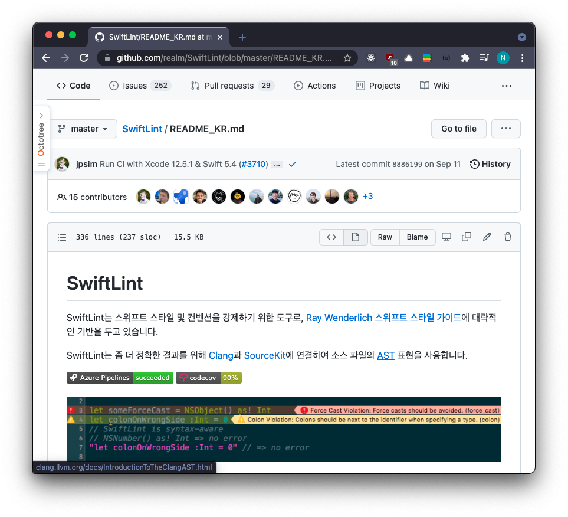
</p>

먼저 **SwiftLint**가 처음이신 분들을 위해 잠깐 설명하고 가겠습니다!!

이미 잘 사용하고 계신 분들이라면 이 부분은 Skip 하셔도 무방합니다!

우리 **Swift**는 정말 많이 들어봤는데 뒤에붙은 **lint**는 뭘까요?

위키에서 찾아보면

> **린트(lint)** 또는 **린터(linter)**는 소스 코드를 분석하여 프로그램 오류, 버그, 스타일 오류, 의심스러운 구조체에 표시(flag)를 달아놓기 위한 도구들을 가리킨다. 이 용어는 C 언어 소스 코드를 검사하는 유닉스 유틸리티에서 기원한다. -위키 백과-

라고 합니다!!

다시 말해 여러 사람이 짜는 코드를 팀의 컨벤션에 맞추어 **일관된 코드 스타일**로 작성하도록 도와주는 도구인데요!!

대표적인 컨벤션 몇 개의 링크는 다음과 같습니다!

<a href="https://github.com/raywenderlich/swift-style-guide" target="_blank">Ray Wenderlich Swift Style Guide</a>

<a href="https://github.com/StyleShare/swift-style-guide" target="_blank">Style Share Swift Style Guide</a>

<a href="https://google.github.io/swift/" target="_blank">Google Swift Style Guide</a>

자, 흥미가 좀 생기시나요?!

**SwiftLint**를 이번 기회에 처음 알게 되셨다면 이 <a href="https://github.com/realm/SwiftLint" target="_blank">링크</a>에 방문해보시는 것을 추천해 드립니다 :)

## SwiftLint

자, 다시 돌아와서 여러분은 **SwiftLint** 어떻게 사용하고 계시나요?

<p align="center">
  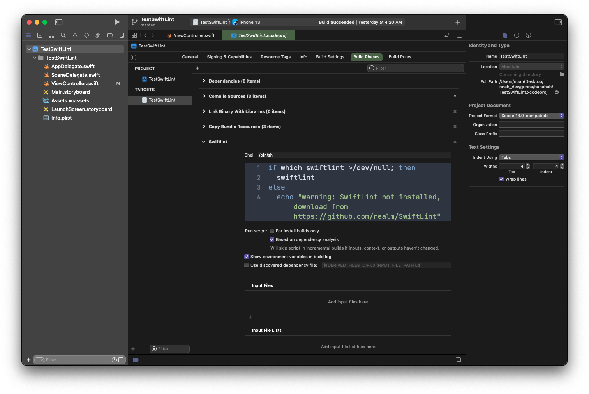
</p>

대부분 **Xcode**에서 프로젝트의 Build Phases에

**쉘 스크립트**를 작성한 다음,

**프로젝트 빌드** 시에 경고, 혹은 에러를 띄워 프로젝트에 적용하는데요!

> 다른 방법으로 사용하고 계신다면 어떻게 사용하고 계시는지 알려주시면 감사하겠습니다 😎

> 지금은 파일이 작아 **SwiftLint**로 인한 **빌드 시간** 증가가 체감이 되지 않지만  
> 프로젝트가 정말 정말 커진 후에 **SwiftLint**를 돌리게 된다면(파일을 모두 파싱해야 하기 때문에)  
> **빌드 시간** 역시 길어지겠죠?

<p align="center">
  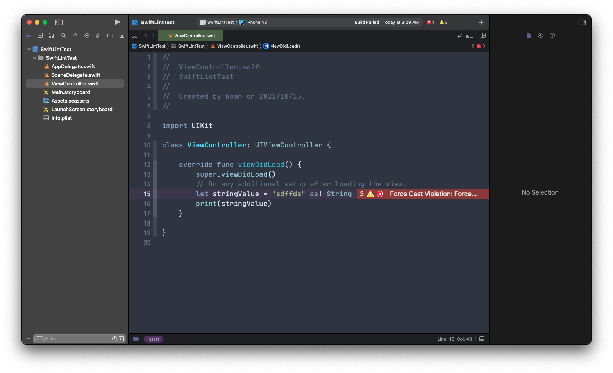
</p>

현재 **force_cast**에 대해 **error**를 내도록

**.swiftlint.yml**파일에서 설정해주었다고 가정해 보겠습니다.

그렇다면 **error**를 내뿜고 빌드가 진행되지 않겠죠?!

만약에 빌드가 간단한 코드라고 생각해 빌드를 돌려보지 않고,  
(만약의 만약의 상황...)

이를 수정 후에 이를 그대로 커밋한다면? 설마 커밋이 될까요?  
(에이.. 커밋 되면 곤란...)

<p align="center">
  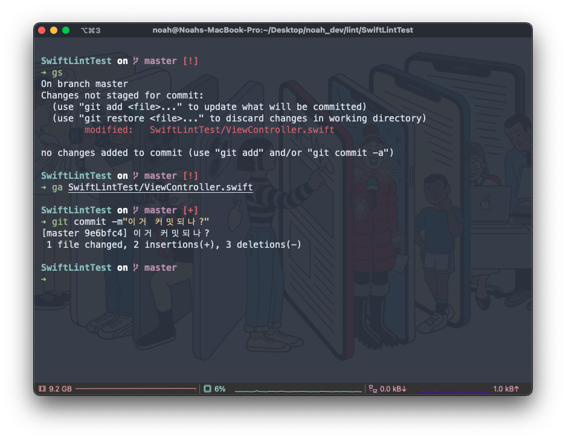
</p>

아.. 그대로 커밋이 되고 마네요🥲

> 물론 autocorrection option도 있지만 ⇒ 원치 않은 변경을 하지 않기 위해  
> 팀에서 꺼두었다고 가정하겠습니다 :)

### **"이를 막을 방법 어디 없을까요?"**

오늘은 **위와 같은 상황을 예방**하면서도 **SwiftLint**를 적용하는 색다른 방법에 대해 소개해보려 합니다 🤓

> ~~많은 삽질을 했습니다...⛏️~~

먼저 이를 위해서는 **Git-Hook**에 대해 알아야 하는데요,

**Git-Hook**에 대해 알아봅시다.

## Git-Hook

<p align="center">
  
  <center>Git-Hook</center>
</p>

먼저 `git init` 명령어를 통해 파일을 형상 관리를 하기 시작하면

<p align="center">
  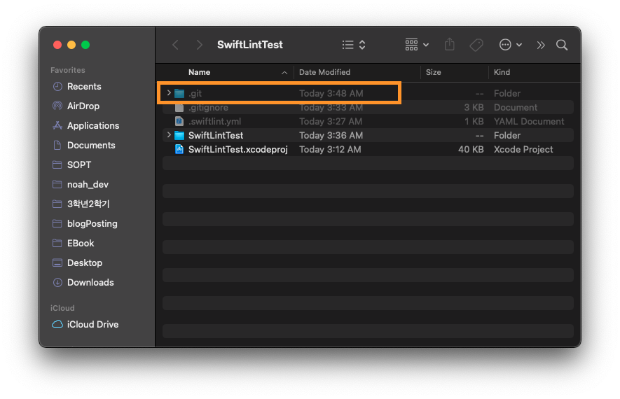
</p>

`.git`이라는 폴더가 생기게 되는데요 이 폴더에 들어가 봅시다.

<p align="center">
  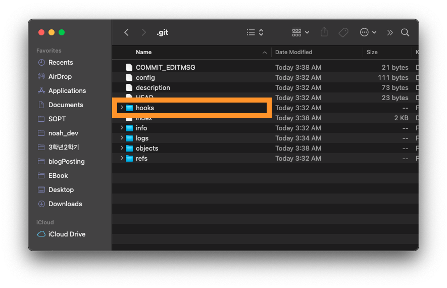
</p>

`.git` 파일에는 파일을 형상 관리하기 위한 설정 파일들이 많이 들어있습니다.

그중에서 우리는 **Git-Hook**에 대해 알아본다고 했는데 이 친구, 뭔가 수상하지 않나요?

한번 들어가 봅시다.

<p align="center">
  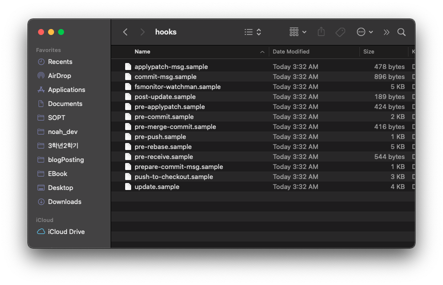
</p>

### "처음 보는 파일들이 되게 많은데요?🤔"

당황할 필요 전혀 없습니다!!  
(~~제가 첨에 보고 뭐지...하고 당황해서 ㅎㅎ~~)

자, **hook**을 한국말로 하면 뭘까요?

### "아 왜 갑자기 영어 물어보세요..."

그래서 준비했습니다.

<p align="center">
  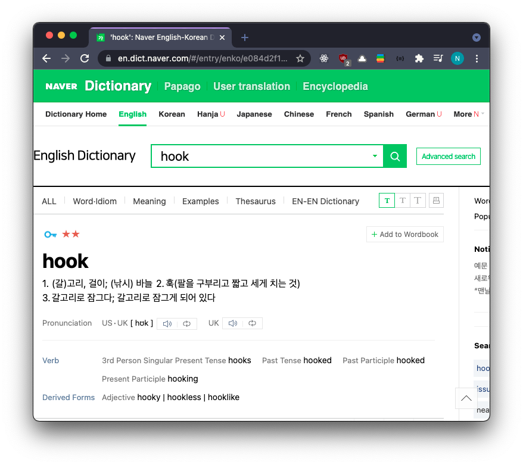
</p>

**hook**은 갈고리를 의미하는데요, 다시 이 사진을 볼까요?

<p align="center">
  
  <center>Git-Hook</center>
</p>

**Git**에 낚싯바늘이 걸려있죠?

**Git-Hook**은 **Git**을 이용하는 특정 시점에 나타나는 이벤트를 낚아채서 특정 스크립트를 사용할 수 있게 해주는데요,

이 말인즉슨, **Git**을 이용하는 특정시점에 나타나는 이벤트를 낚아채서 사용자가 원하는  
특정 작업을 실행할 수 있게 해 줍니다.

위에 파일이 13개 정도 되니, 감지할 수 있는 이벤트가 13개나 되나 봅니다.

### "그래서 우리가 하고 싶은 게 뭔데요?"

<p align="center">
  
</p>

우리는 위와 같이 **SwiftLint**의 **rule**을 만족하지 않으면 commit이 되지 않게 하여 일관된 코드를 유지하기를 바랐습니다.

자 commit이 되지 않게 하려면 **commit 직전에 호출**할 수 있는 스크립트를 찾아야 하는데요,

그때 사용할 수 있는 스크립트가 `pre-commit`이라는 스크립트입니다.

<p align="center">
  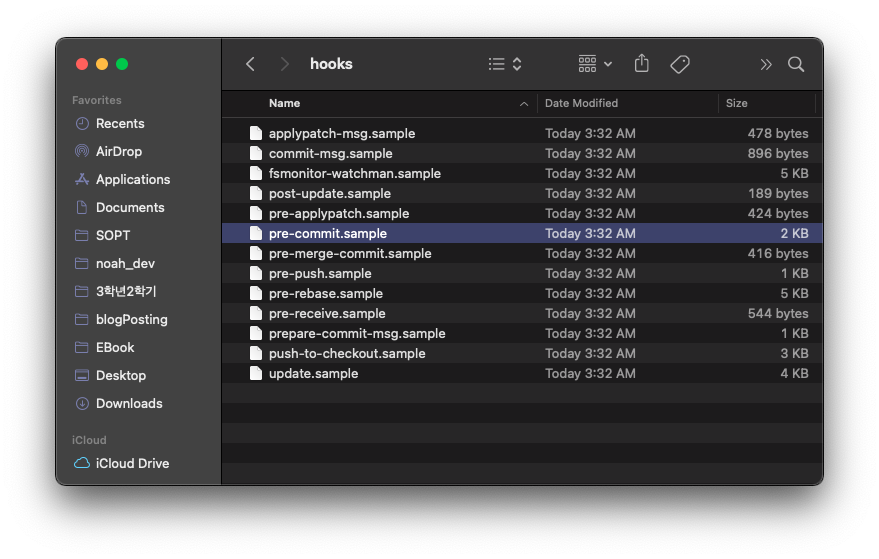
</p>

### "그렇다면 특정 이벤트에 항상 이 스크립트가 실행되고 있는 건가요?"

⇒ 그렇지 않습니다. `.sample` 이라는 확장자를 지우게 되면 그때 부터 스크립트 사용이 가능합니다.

우리는 이 `pre-commit`이라는 스크립트의 `.sample`이라는 확장자를 지워 스크립트를 활성화한 후에

쉘 스크립트 코드를 작성하여 **SwiftLint**를 통과하지 못하면  
commit이 되지 않게 할 예정입니다.

자 먼저 스크립트를 활성화해봅시다!

<p align="center">
  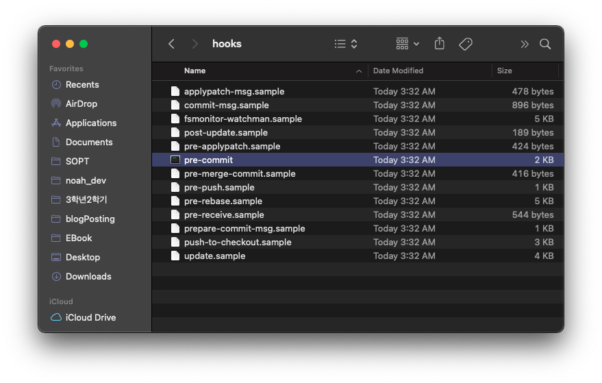
</p>

아이콘이 바뀌는 모습을 확인할 수 있습니다.

안의 내용을 볼까요?

<p align="center">
  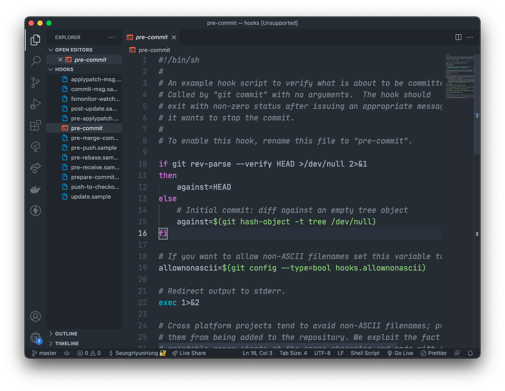
</p>

일단 코드 내용을 다 지우고, 이 스크립트가 실행되는지 확인하기 위해 내용을 바꿔봅시다.

<p align="center">
  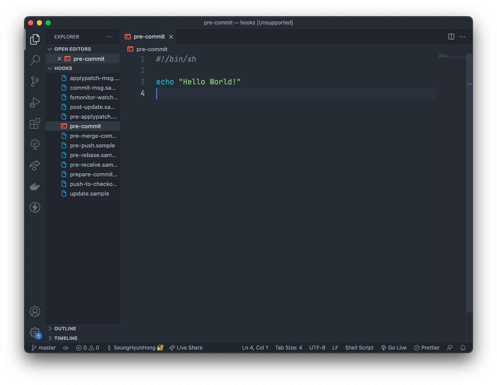
</p>

커밋이 될 때 이 스크립트가 호출되니 터미널에는 Hello World! 라는 문자열이 찍혀야 할 것입니다.

<p align="center">
  
</p>

**<center> 잘 출력이 되네요!! </center>**
<br/>

아직 **SwiftLint**를 적용한 후에

커밋을 막는 작업을 해주지 않았기에 커밋은 그대로 진행되고 있습니다.

<p align="center">
  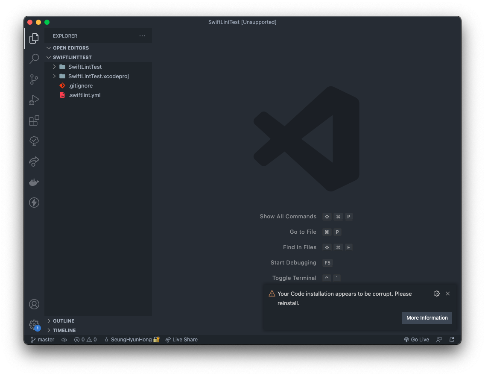
</p>

## 엇 그런데..

"`.git`파일은 형상 관리에서 무시되는데요?"

#### "🤔 그렇다면 이 스크립트는 형상 관리를 별도로 하고 팀원 각자가 따로 적용해야 하나요?"

이러한 고민을 해결하기 위해 Git 2.9 버전부터 `프로젝트/.githooks` 폴더를 만든 후에

**hook** 이벤트가 발생했을 때 이곳 스크립트를 사용 경로를 설정해주면

`git`을 이용한 형상 관리가 가능해집니다.

<p align="center">
  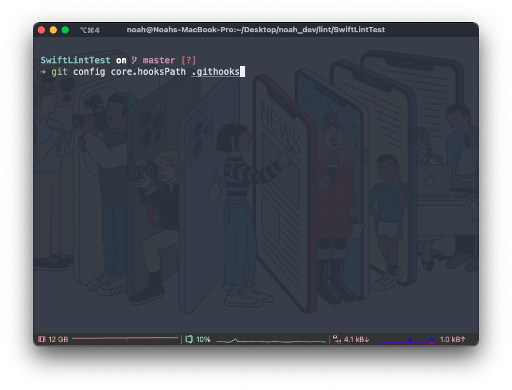
</p>

`git config core.hooksPath .githooks`

이 명령어를 이용해 **hook** 경로를 변경해줍니다.

<p align="center">
  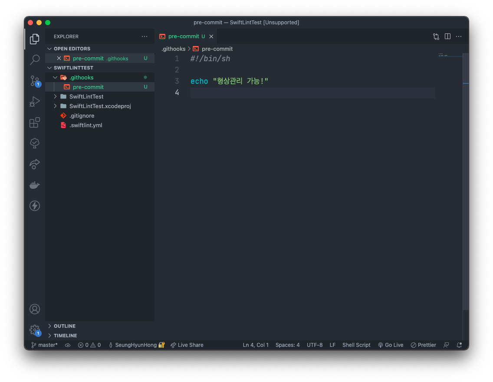
</p>

그렇다면 커밋을 할 때 이곳의 스크립트가 호출되어야겠죠?

<p align="center">
  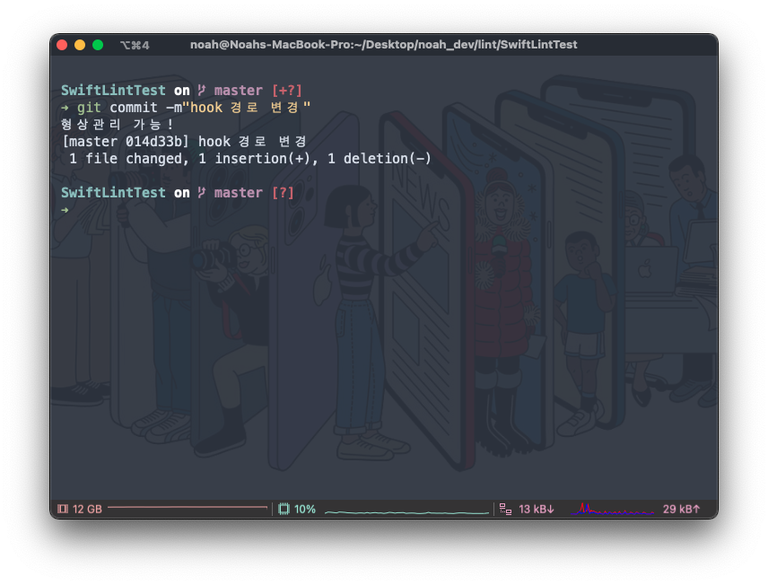
</p>

### 잘 호출이 되네요!! 이곳에서 스크립트를 작성하면 되겠어요 ㅎㅎㅎ

### 자 이제, 핵심입니다!!

## Swiftlint + Git-hook

이제 이곳에서 스크립트로 **SwiftLint rule**을 통과하지 못하면 커밋이 되지 않게 막을 건데요,

열심히 삽질하며 작성한 쉘 스크립트를 넣어줍시다!!

```bash
#!/bin/sh
# written by Noah
LINT=$(which swiftlint)

if [[ -e "${LINT}" ]]; then
	echo "🚀  SwiftLint 시작..."
	echo "🔍  lint 적용 경로: $(pwd)"
else
	echo "SwiftLint가 존재하지 않습니다, 공식문서를 확인해주세요. 🌐 https://github.com/realm/SwiftLint"
	exit 1
fi

normalfiles=$(git diff --stat --cached)
targets=$(git diff --stat --cached --diff-filter=d --name-only $(git for-each-ref --format='%(upstream:short)' $(git symbolic-ref -q HEAD)) | grep -F ".swift")

if [ -n "$normalfiles" -a -z "$targets" ]; then
  printf "✨ 고생하셨습니다👏 👏 👏\n"
  exit 0

elif [ -z "${normalfiles}" ]; then
  printf "🏷️  Staging Area 파일이 없습니다"
  printf "\n ✔ git add를 먼저 진행해주세요:)"
  exit 1

elif [ -z "$targets" ]; then
  printf "🏷️  Staging Area swift 파일이 없습니다"
  printf "\n ✔ git add를 먼저 진행해주세요:)"
  exit 1
fi

# lint rule 정의 파일
RESULT=$($LINT lint --quiet --config .swiftlint.yml)

if [ "$RESULT" == '' ]; then
	printf "✨  SwiftLint 적용을 완료했습니다!! 고생하셨습니다:)\n"
else
	echo ""
	printf "✔ SwiftLint Failed 아래 내용을 확인해주세요:\n"
  while read -r line; do
    FILEPATH=$(echo $line | cut -d : -f 1)
    L=$(echo $line | cut -d : -f 2)
    C=$(echo $line | cut -d : -f 3)
    TYPE=$(echo $line | cut -d : -f 4 | cut -c 2-)
    MESSAGE=$(echo $line | cut -d : -f 5 | cut -c 2-)
    DESCRIPTION=$(echo $line | cut -d : -f 6 | cut -c 2-)
    if [ $TYPE == 'warning' ]; then
      printf "\n 🚧  $TYPE\n"
      # warning 타입은 오류메시지만 표시하고 커밋을 허용하고 싶다면 line 40~42 주석 해제.
      # printf "    $FILEPATH:$L:$C\n"
      # printf "    📌  $MESSAGE: - $DESCRIPTION\n"
      # exit 0
    elif [ $TYPE == 'error' ]; then
      printf "\n 🚨  $TYPE\n"
    fi
    printf "    ✔ $FILEPATH:$L:$C\n"
    printf "    📌 $MESSAGE: - $DESCRIPTION\n"
  done <<< "$RESULT"

  printf "\n 🚑  커밋실패!! Swiftlint rule에 맞게 코드를 변경해주세요:)\n"
  exit 1
fi
```

### 이번 기회 덕분에

쉘 스크립트 공부하며 배웠습니다ㅎㅎ

<p align="center">
  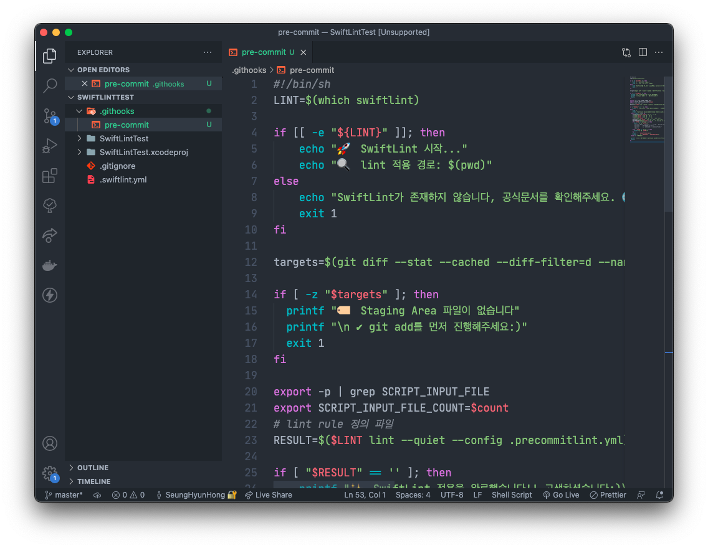
</p>

이제 커밋이 되지 않나 한번 확인해볼까요..?(두근)

<p align="center">
  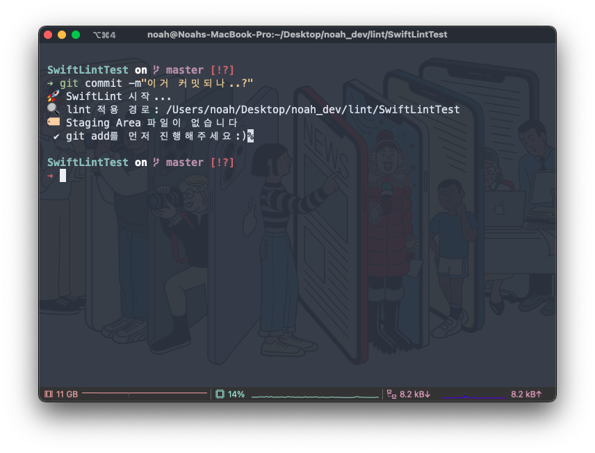
</p>

오 커밋이 되지 않았습니다!!
근데 메시지를 확인해보니 add를 먼저 해주어야겠네요!!  
(~~미안하다..이거 보여줄려고 어그로 끌었다...~~)

<p align="center">
  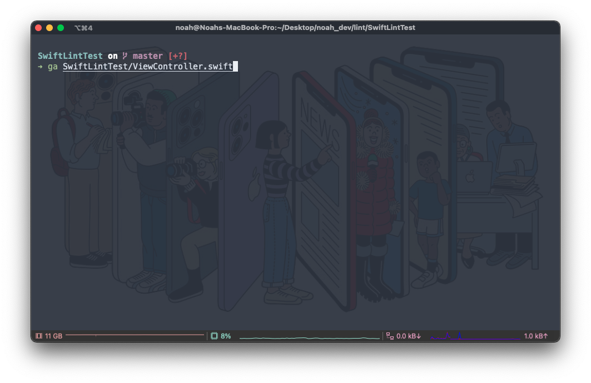
</p>

`git add` 를 해준뒤에 커밋을 해볼까요?  
(과연...)

## 오!

<p align="center">
  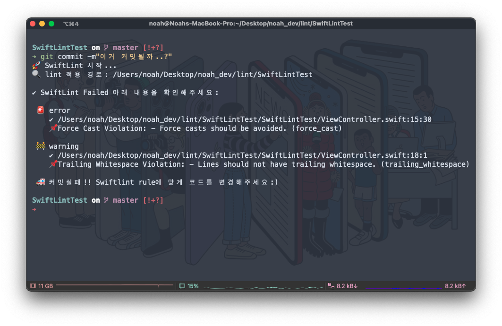
</p>

커밋이 진행되지 않았네요!!! 우리가 하려던 작업이 완료되었어요!!

과연 수정사항을 반영 후에는 커밋이 잘 될까요?

한번 해당 라인을 수정한 후에 커밋이 되는지 봅시다!!

<p align="center">
  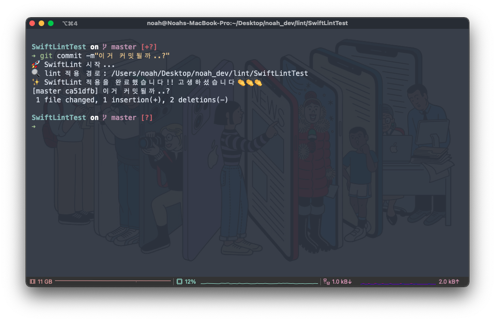
</p>

고생했다는 메시지까지..

rule을 어긴 부분을 수정하면 커밋이 잘 되는 것까지 잘 확인했습니다!!

## 이렇게 사용합니다!

아까 위에서 **SwiftLint**를 사용하는 경우를 봤을 때

> 지금은 파일이 작아 **SwiftLint**로 인한 **빌드 시간** 증가가 체감이 되지 않지만  
> 프로젝트가 정말 정말 커진 후에 **SwiftLint**를 돌리게 된다면(파일을 모두 파싱해야 하기 때문에)  
> **빌드 시간** 역시 길어지겠죠?

라고 했던 부분 기억하시나요?

**빌드** 시에는 빌드 시간을 줄여야 하니,

`.swiftlint.yml`에서 필수라고 생각하는 **rule을 가볍게** 가져가고,

커밋을 할 때는 부가적인 rule을 추가하여

rule을 빡세게 적용하면 빌드할 때 **SwiftLint**를 적용하는 시간을 줄일 수 있겠죠?

**pre-commit**의 스크립트를 약간 수정해주면 되는데요,

먼저 별도의 **rule**을 만들어줍시다.

<p align="center">
  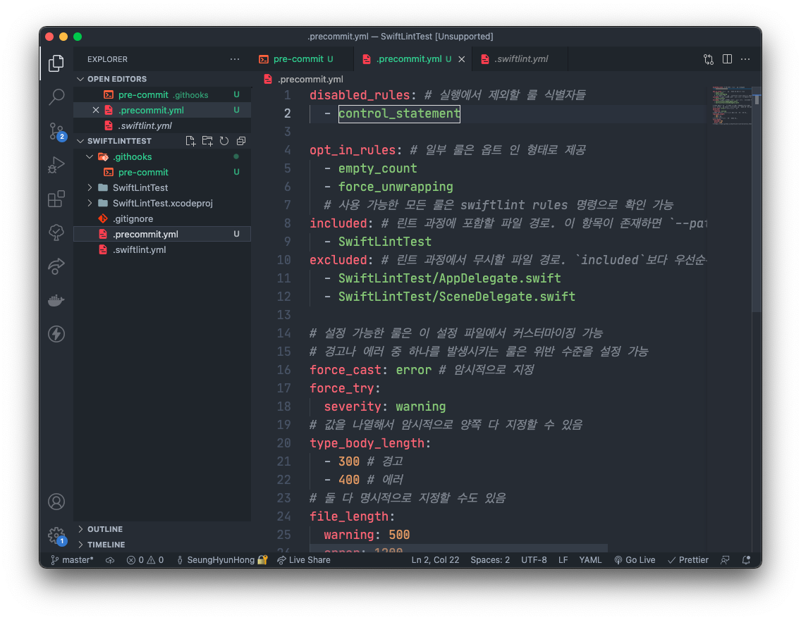
</p>

파일 이름은 `.precommit.yml` 로 하겠습니다. (~~근데 이제 rule을 곁들인~~)

자 아까 스크립트에서 이 부분을 변경해주면 되는데요,

**이 부분을**

```bash
# lint rule 정의 파일
RESULT=$($LINT lint --quiet --config .swiftlint.yml)
```

**이렇게**

```bash
# lint rule 정의 파일
RESULT=$($LINT lint --quiet --config .precommit.yml)

```

### pre-commit

```bash
#!/bin/sh
# written by Noah
LINT=$(which swiftlint)

if [[ -e "${LINT}" ]]; then
	echo "🚀  SwiftLint 시작..."
	echo "🔍  lint 적용 경로: $(pwd)"
else
	echo "SwiftLint가 존재하지 않습니다, 공식문서를 확인해주세요. 🌐 https://github.com/realm/SwiftLint"
	exit 1
fi

normalfiles=$(git diff --stat --cached)
targets=$(git diff --stat --cached --diff-filter=d --name-only $(git for-each-ref --format='%(upstream:short)' $(git symbolic-ref -q HEAD)) | grep -F ".swift")

if [ -n "$normalfiles" -a -z "$targets" ]; then
  printf "✨ 고생하셨습니다👏 👏 👏\n"
  exit 0

elif [ -z "${normalfiles}" ]; then
  printf "🏷️  Staging Area 파일이 없습니다"
  printf "\n ✔ git add를 먼저 진행해주세요:)"
  exit 1

elif [ -z "$targets" ]; then
  printf "🏷️  Staging Area swift 파일이 없습니다"
  printf "\n ✔ git add를 먼저 진행해주세요:)"
  exit 1
fi

# lint rule 정의 파일
RESULT=$($LINT lint --quiet --config .precommit.yml)

if [ "$RESULT" == '' ]; then
	printf "✨  SwiftLint 적용을 완료했습니다!! 고생하셨습니다:)\n"
else
	echo ""
	printf "✔ SwiftLint Failed 아래 내용을 확인해주세요:\n"
  while read -r line; do
    FILEPATH=$(echo $line | cut -d : -f 1)
    L=$(echo $line | cut -d : -f 2)
    C=$(echo $line | cut -d : -f 3)
    TYPE=$(echo $line | cut -d : -f 4 | cut -c 2-)
    MESSAGE=$(echo $line | cut -d : -f 5 | cut -c 2-)
    DESCRIPTION=$(echo $line | cut -d : -f 6 | cut -c 2-)
    if [ $TYPE == 'warning' ]; then
      printf "\n 🚧  $TYPE\n"
      # warning 타입은 오류메시지만 표시하고 커밋을 허용하고 싶다면 line 40~42 주석 해제.
      # printf "    $FILEPATH:$L:$C\n"
      # printf "    📌  $MESSAGE: - $DESCRIPTION\n"
      # exit 0
    elif [ $TYPE == 'error' ]; then
      printf "\n 🚨  $TYPE\n"
    fi
    printf "    ✔ $FILEPATH:$L:$C\n"
    printf "    📌 $MESSAGE: - $DESCRIPTION\n"
  done <<< "$RESULT"

  printf "\n 🚑  커밋실패!! Swiftlint rule에 맞게 코드를 변경해주세요:)\n"
  exit 1
fi
```

<p align="center">
  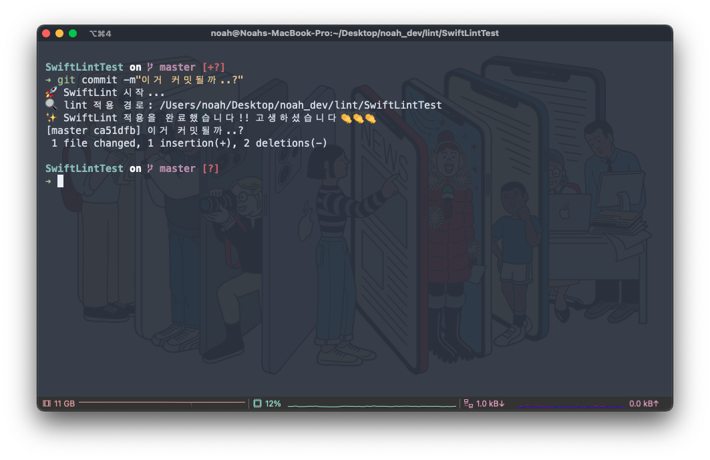
</p>

이제 팀의 rule에서 벗어난 무분별한 커밋을 방지하여,

**일관된 코드 스타일**을 적용해볼까요?

커밋을 올바르게 완성하고 고생하셨습니다👏👏👏 박수도 많이 받구요 ㅎㅎㅎ

여기까지 **SwiftLint** 힙하게 사용하기였습니다!

다들 환절기 감기 조심하세요!

감사합니다:)

혹시 제가 잘못 알고 있는 부분이 있거나, 오타 혹은 궁금한 점 있으시면 댓글로 알려주시면 감사하겠습니다!! 😎

> 이미지 출처
>
> - [Git-Hook](https://medium.com/weekly-webtips/how-to-create-and-run-git-hooks-d395ec60d0d)

> 참고
>
> - [awesome-git-hooks](https://github.com/aitemr/awesome-git-hooks/tree/master/pre-commit)
> - [우아한형제들 기술블로그](https://techblog.woowahan.com/2641/)
