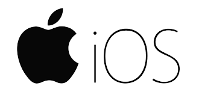
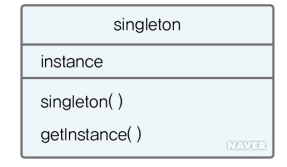
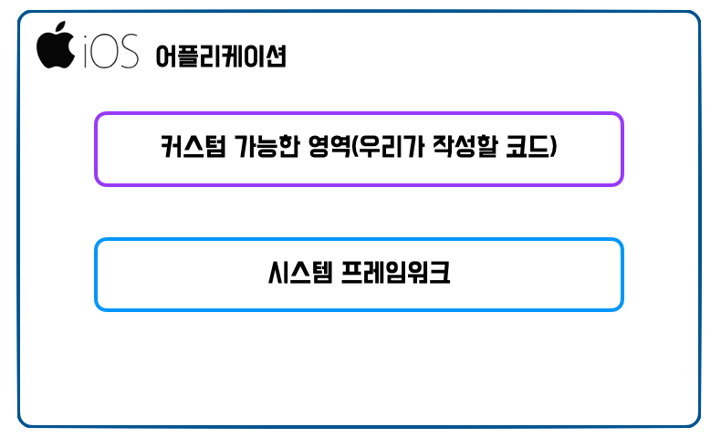
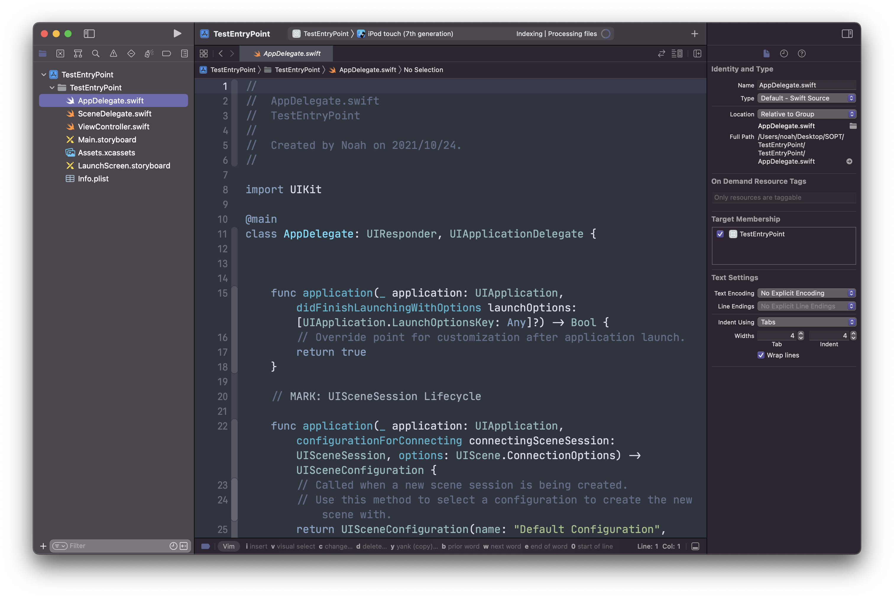
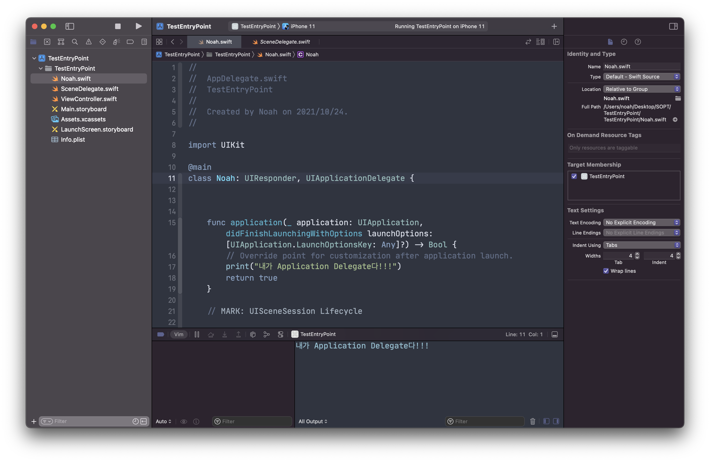
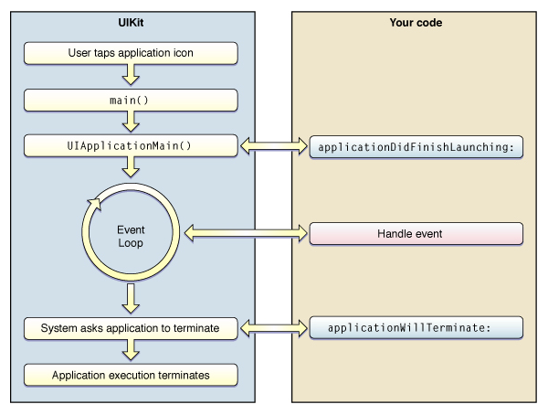
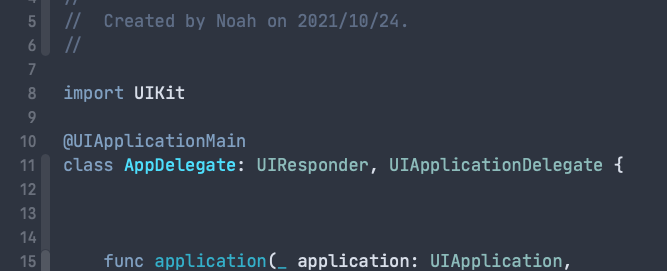
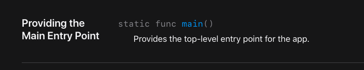
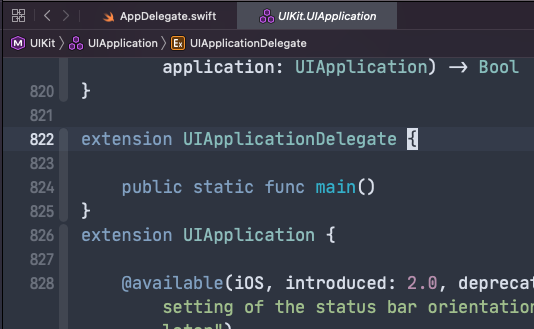
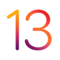

<p align="center">
  
</p>

안녕하세요 Noah입니다 :) 오늘은 **iOS** 어플리케이션의 **진입점(Entry Point)** 에 대해 알아보며,

기본적인 앱의 구조에 대해 살펴보도록 하겠습니다😃

## Entry Point (진입점)

> 프로그램 실행은 프로그래밍 언어나 운영체제 등에 의해 정의된 관용명을 통한,  
> 지정된 이름으로 시작될 수 있다. 많은 언어에서(특히 C) 이 지정된 이름은 `main`이라고 불리는 함수이다.  
> 결과적으로 엔트리 포인트는 **main 함수**라고 불린다. - 위키백과 -

C를 자주 접해 보신 분이라면 `main()` 함수가 익숙하실 텐데요,

프로그램의 시작 포인트가 되는 부분을 **Entry Point**(진입점)라고 합니다.

자바에서는 스태틱 메소드인 `main()`이 **Entry Point**로 사용되고 있으며, react 프로젝트의 경우 src/index.js가 **Entry Point**로 사용되고 있습니다.

그럼 우리가 공부하고 있는 **iOS** 어플리케이션에서는 어디가 **Entry Point**일까요?

이를 알아보기에 앞서 이해를 돕기 위해 **iOS** 어플리케이션을 개발하기 위해 사용하는 언어  
**Swift** 이전에 사용했던,

**Objective-C**의 예를 살펴보도록 하겠습니다.

**Objective-C**는 C언어에 뿌리를 두고 있기 때문에,  
**Objective-C**로 만들어진 iOS 어플리케이션의 **Entry Point** 역시 `main()` 함수입니다.

**Objective-C**로 만들어진 **iOS** 어플리케이션에서 `main()` 함수가 하는 일은 다음과 같습니다.

## **iOS** 어플리케이션에서 `main()`함수가 하는 일

`main()`함수는 AppDelegate 클래스를 이용해 `UIApplicationMain()`함수를 호출하고, 결과로 `UIApplication` 객체를 반환합니다.

여기서 `UIApplication` 객체는 도대체 어떤일을 하는 객체일까요?

### 애플 개발자 문서를 한번 찾아봅시다!

> Every iOS app has exactly one instance of `UIApplication`  
> (or, very rarely, a subclass of `UIApplication`).  
> When an app launches, the system calls the `UIApplicationMain(_:_:_:_:)` function. Among its other tasks, this function creates a singleton `UIApplication` object that you access using `shared`.  
> -apple developer documentation

> 모든 iOS app은 단 한 개의 UIApplication 인스턴스가 있습니다.  
> (또는 매우 드물게, UIApplication의 하위클래스)  
> 앱이 시작되면 시스템은 `UIApplicationMain(_:_:_:_:)`함수를 호출합니다.  
> 이 함수는 다른 task 중에서 singleton `UIApplication` 객체를 만들고,  
> `shared` 클래스 메소드를 이용해 접근합니다.  
> -애플 개발자 문서

<p align="center">

</p>
이게 무슨 말일까요?

<p align="center">
  
</p>

### 먼저 **singleton**이란,

이름만 들어도 무시무시한 **Gang of Four**형님들의 **디자인 패턴**에 나오는 소프트웨어 디자인 패턴입니다.

> Singleton Pattern
> singleton 패턴은 객체의 생성과 관련된 패턴으로서 특정 클래스의 객체가 오직 한 개만 존재하도록 보장한다. 즉 클래스의 객체를 하나로 제한한다. 프로그램에서 이런 개념이 필요할 때는 언제일까? 프린터 드라이버의 예를 들어보자.

> 여러 컴퓨터에서 프린터 한 대를 공유하는 경우, 한 대의 컴퓨터에서 프린트하고 있을 때 다른 컴퓨터가 프린트 명령을 내려도 현재 프린트하는 작업을 마치고 그다음 프린트를 해야지 두 작업이 섞여 나오면 문제가 될 것이다. 즉 여러 클라이언트(컴퓨터)가 동일 객체(공유 프린터)를 사용하지만 한 개의 객체(프린트 명령을 받은 출력물)가 유일하도록 상위 객체가 보장하지 못한다면 singleton 패턴을 적용해야 한다. 이처럼 동일한 자원이나 데이터를 처리하는 객체가 불필요하게 여러 개 만들어질 필요가 없는 경우에 주로 사용한다.
> [네이버 지식백과 singleton 패턴](https://terms.naver.com/entry.naver?docId=3532960) (쉽게 배우는 소프트웨어 공학, 2015. 11. 30., 김치수)

모든 **iOS** 어플리케이션은 '단 한 개'의 `UIApplication` 인스턴스를 가지는데요,  
(인스턴스를 편의상 객체로 표현하겠습니다.)

UIApplication 객체는 앱의 본체라고 할 수 있는 객체입니다.  
또한 **iOS** 어플리케이션에서 생성되는 객체가 1개임을 보장받는 싱글톤 객체이며,

`UIApplication` 객체는 이벤트 루프나, 앱 동작을 관리할 뿐 아니라,  
**iOS**에서 실행되는 앱의 중앙 컨트롤 타워 격의 역할을 합니다.

자 그러면 `UIApplication` 객체를 생성하는 `UIApplciationMain(_:_:_:_)` 함수에 대해 알아볼까요?

## UIApplciationMain()

```swift
func UIApplicationMain(_ argc: Int32,
                       _ argv: UnsafeMutablePointer<UnsafeMutablePointer<CChar>?>,
                       _ principalClassName: String?,
                       _ delegateClassName: String?) -> Int
```

### 파라미터

> - `argc`  
>   The count of arguments in `argv`; this usually is the corresponding parameter to `main`.

> - `argv`  
>   A variable list of arguments; this usually is the corresponding parameter to `main`.

> - **`principalClassName`**  
>    The name of the `UIApplication` class or subclass.  
>   If you specify`nil`,`UIApplication` is assumed.

> - **`delegateClassName`**  
>   The name of the class from which the application delegate is instantiated. If `principalClassName` designates a subclass of `UIApplication`, you may designate the subclass as the delegate; the subclass instance receives the application-delegate messages. Specify `nil` if you load the delegate object from your application’s main nib file.
>
> -apple developer documentation

`UIApplciationMain(_:_:_:_)` 함수는 총 4개의 파라미터를 가지는데요,

우리는 main에 해당하는 파라미터인 `argc`, `argv`보다는

`principalClassName`, `delegateClassName` 에 집중해 살펴보도록 하겠습니다.

### principalClassName

---

`principalClassName` 은 `UIapplication` 의 하위클래스입니다.

**nil**을 지정할 경우, `UIApplication` 으로 가정됩니다.

`principalClassName` 은 `UIApplication`을 서브클래싱 하는 경우 지정해주는데요,

중대한 목적이 있다면 서브 클래싱을 하지만 하기도 어렵고,  
굳이 할 필요성을 아직까진 느끼지 못해 필요성을 느끼게 된다면 포스팅을 통해 한번 알아보도록 하겠습니다.

### delegateClassName

---

`delegateClassName` 은 **Application Delegate**가 인스턴스화 되는 클래스의 이름입니다.  
(밑에서 알아볼 테니 지금은 넘어가셔도 됩니다!)

`principalClassName` 이 `UIApplication` 의 하위 클래스를 지정하는 경우,  
해당 하위 클래스를 **delegate**로 지정할 수 있습니다.

하위클래스 인스턴스는 **application-delegate** 메시지를 받습니다.
앱의 main nib file에서 **delegate** 객체를 load 하는 경우 nil을 지정합니다.

자 그럼 `delegateClassName`는

**Application Delegate**가 인스턴스 화 되는 클래스의 이름이라고 하는데요,

### Application Delegate가 뭘까요?

---

<p align="center">
  
</p>

**iOS** 어플리케이션은 기본적으로

우리가 **건드릴 수 있는** 영역과 우리가 **건드릴 수 없는** 시스템 프레임워크 영역으로 분리됩니다.

우리는 커스텀 가능한 영역에서 코드를 작성해  
우리가 원하는 기능과 유저 인터페이스를 구현해 우리만의 어플리케이션을 만들 수 있습니다.  
⇒ 이 부분이 바로 우리가 하는 작업이죠!

우리가 만들 앱은 다양한 기능이 있을 테지만
**시스템**에서 **일어나는 일**들을 알 수 없으면  
우리가 **원하는 기능을 구현**할 수 없겠죠?  
⇒ 예를 들면 앱이 **launch** 되는 시점, **종료**되는 시점을 알 수 없다던가.. ,등등

**시스템**에서 일어나는 일들을 알 수 없다면 우리가 만들 앱에 상당한 제약이 많이 생기겠죠??

그럼 우리가 만들 앱에서 시스템에서 일어나는 일들을 알아내기 위해선 어떻게 해야 할까요?

뭔가 생각나지 않으시나요? 아까 위에서 우리 봤었죠..? 그죠..? 하하

다시 가져와 봤습니다 ^\_\_^

> `UIApplication` 객체는 이벤트 루프나, 앱 동작을 관리할 뿐 아니라, iOS에서 실행되는 앱의 중앙 컨트롤 타워 격의 역할을 합니다.

### Application Delegate

---

`UIApplication`객체는 핵심적인 일을 담당하고 있어 하는 일이 많기도 하고,  
아무 곳에나 잘못 접근하면 어플리케이션에 치명적인 문제가 생기겠죠?

그래서`UIApplication` 은 `UIApplication` 으로 부터 약간의 권한을 부여받은  
**Application Delegate**라는 대리인을 내세워 커스텀 코드와 시스템과의 상호작용을 담당하게 합니다.

다음 그림을 보면 이해가 더 잘 가실 거예요!!

<p align="center">
  
</p>

그림을 보면 **커스텀 객체**인 **Application Delegate**가 `UIApplication`으로 부터 이벤트를 받고,

application 내의 다양한 요소들과 상호작용하는 모습을 볼 수 있네요!!

우리는 Application Delegate를 통해 시스템의 다양한 이벤트를 우리의 코드와 상호작용시킬 수 있습니다!!

<p align="center">
  
</p>

우리 이제 **Application Delegate**라는 친구가 어떤 역할을 하는지 알았죠?

## 자 다시 본론으로 돌아와서

`UIApplication` 객체를 생성하는 `UIApplciationMain(_:_:_:_)` 함수에서

`UIApplication` 객체에서 **Application Delegate**가 인스턴스 화 되는 클래스의 이름을 `delegateClassName`이라고 했는데요 ,

그 클래스가 바로

우리가 **iOS** 프로젝트를 생성할 때마다 있었던 바로

<p align="center">
  
</p>

요 친구입니다. `AppDelegate`

`main()` 함수가 실행되어 `UIApplciationMain(_:_:_:_)` 함수를 호출해

`UIApplication` 객체를 생성할 때 **"내가 권한을 위임받고 싶은 친구는 이친구야~"** 하고  
**AppDelegate Class**를 `UIApplication` 객체와 연결해주는 것입니다.

### 이 친구의 이름을 한번 바꿔볼까요?

<p align="center">
  
</p>

**AppDelegate**라고 되어있던 클래스의 이름을 **Noah**로 바꾸고,

```swift
func application(_ application: UIApplication, didFinishLaunchingWithOptions launchOptions: [UIApplication.LaunchOptionsKey: Any]?) -> Bool {
		// Override point for customization after application launch.
		print("내가 Application Delegate다!!!")
		return true
	}
```

이곳에 `print("내가 Application Delegate다!!!")`를 추가해주었는데요,

이 함수는 앱의 실행 완료 직전에 호출되는 메소드인데요,

콘솔 부분에 정상적으로 `내가 Application Delegate다!!!` 라는 메시지가  
정상적으로 호출되는 것을 확인할 수 있습니다.

### 위 상황을 다시 복습해보면

여기서는 `main()` 함수가 실행되어 `UIApplciationMain(_:_:_:_)` 함수를 호출해

`UIApplication` 객체를 생성할 때 **"내가 권한을 위임받고 싶은 친구는 Noah라는 친구야~"** 하고

**Noah Class**를 **Application Delegate**로 `UIApplication` 객체와 연결해주는 것입니다.

자 정리해보면 다음과 같습니다.

### iOS 어플리케이션의 실행과정

---

<p align="center">
  
</p>

1. 앱이 실행되어 `main()` 함수가 실행된다.
2. `main()` 함수에서 UIKit의 `UIApplciationMain(_:_:_:_)` 함수를 호출한다.
3. `UIApplicationMain()` 함수는 `UIApplication` 객체를 생성하는 역할을 한다.
4. `UIApplication` 객체는 info.plist 파일을 바탕으로 앱에 필요한 데이터와 객체를 로드한다.
5. **AppDelegate** 객체를 생성하고, `UIApplication` 객체와 연결한다.
6. 이벤트 루프를 만드는 등 실행에 필요한 준비를 진행한다.
7. 실행 완료 직전, **AppDelegate**의 `application(_:didFinishLaunchingWithOptions:)` 메소드를 호출한다.

자 그러면,

### Swift로 iOS 어플리케이션을 개발할 때는 어떨까요?

---

Swift는 `main()` 함수가 따로 없죠?

따라서 Swift 5.3 버전 이전까지는 **Application Delegate**역할을 할 클래스에

`@UIApplicationMain` 라는 프로퍼티 래퍼를 작성해

**iOS** 시스템이 어플리케이션을 실행할 때 이 **프로퍼티 래퍼**를 찾아  
해당 클래스를 **Application Delegate**로 지정했었습니다.

이렇게 말이죠.

<p align="center">
  
</p>

위의 iOS 어플리케이션의 실행과정 1~5번까지의 과정을 `@UIApplicationMain` **프로퍼티 래퍼** 표기로 대체합니다.

## Swift 5.3 부터는

[Swift 5.3 @main attribute 추가](https://github.com/apple/swift-evolution/blob/master/proposals/0281-main-attribute.md)

`@main`이라는 attribute가 생겼는데요,

> 원래 Swift로 만들어진 프로젝트는 `@UIApplicationMain` 혹은 `@NSApplicationMain`  
> 말고는 따로 진입점을 명시할 수 없고 최상단에 적힌 코드가 동작하는 방식이었습니다.

**Swift 5.3**부터는 `@main`이라는 **attribute**를 통해 **Swift 프로그램의 진입점**을 지정할 수 있게 되었습니다.

**class**나 **struct** 에 `@main` 이 명시된 경우  
`static func main()` 메서드가 실제 진입점이 되고,  
(그렇다면 `static func main()`을 작성해주어야겠죠?)

이와 마찬가지로

`UIAppDelegate` 내부에 들어가 보면

<p align="center">
  
</p>

<p align="center">
  
</p>

다음과 같이 `static func main()`이 구현되어 있는 이곳이 진입점이 되어 **iOS** 어플리케이션의 실행과정 1~5번까지의 과정을 수행합니다.

## Scene Delegate



**iOS 13**부터는

**Scene Delegate**라는 개념이 도입되었는데요,  
이에 대해서는 **Application Life-Cycle** 관련 포스트에서 풀어보도록 하겠습니다!!

자, 여기까지 **iOS** 어플리케이션의 **Entry Point**에 대해 알아보았습니다!

다들 잘 이해가 가셨길 바라면서, 다음에는 **Application**의 **Life-Cycle**을 톺아보도록 하겠습니다!

날씨가 춥습니다, 다들 감기조심하세요!! 😷

혹시 제가 잘못 알고 있는 부분이 있거나, 오타 혹은 궁금한 점 있으시면 댓글로 알려주시면 감사하겠습니다!! 😎

> 이미지 출처
>
> - [MBC 무한도전](https://www.imbc.com/broad/tv/ent/challenge/main.html)
> - [Apple Developer Documentation](https://developer.apple.com/documentation/)

> 참고
>
> - [Apple Developer Documentation](https://developer.apple.com/documentation/)
> - [What does @main do in Swift 5.3?](https://useyourloaf.com/blog/what-does-main-do-in-swift-5.3/)
> - [꼼꼼한 재은씨의 Swift 기본편](http://www.yes24.com/Product/Goods/60638047)
